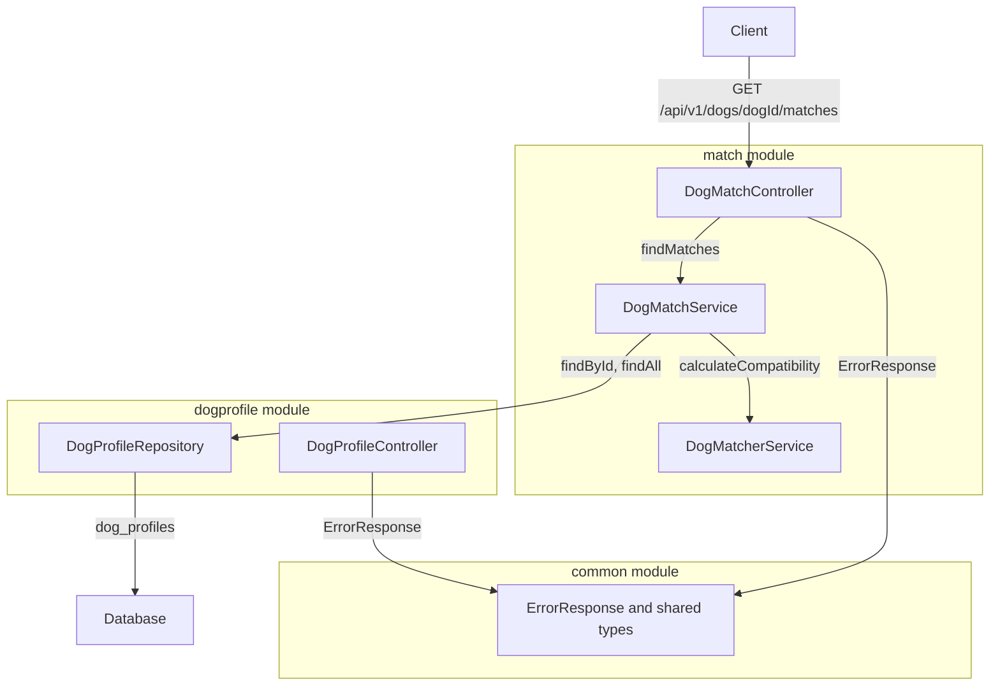
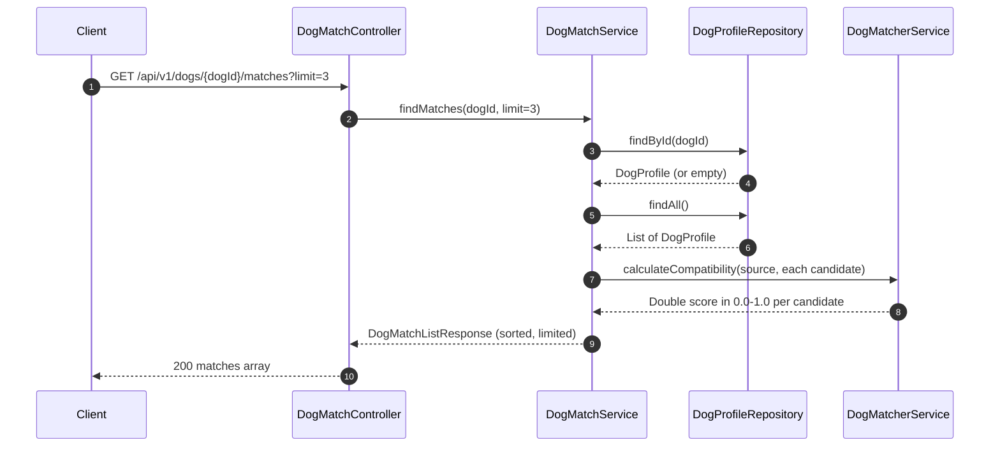

# Design Document — Dog Match Retrieval

## Overview

This feature delivers ranked compatibility matches for a given dog profile to dog owners and API consumers. It exposes
`GET /api/v1/dogs/{dogId}/matches?limit={limit}` and returns the top-N profiles from the persisted dog pool, ordered by a compatibility score in
`[0.0, 1.0]` computed by `DogMatcherService`.

The `DogMatcherService` is relocated from the root `service/` package into the new
`match/` feature module, making the slice fully self-contained. The root `service/` package (containing
`DogMatcherService` and the non-persistent `Dog` data class) is removed.
`ErrorResponse` and any other cross-cutting model classes are moved to a new
`common/` module. No new database tables or migrations are required — the endpoint reads from the existing
`dog_profiles` table via `DogProfileRepository`.

### Goals

- Expose a stable, validated GET endpoint for ranked dog match retrieval
- Relocate `DogMatcherService` into the `match/` feature module (vertical slice compliance)
- Fix the `DogMatcherService` algorithm (same-breed scoring, different-gender bonus, preference cap)
- Delete the root `service/` package; establish a `common/` module for shared cross-cutting types
- Return compatibility scores as `Double` in `[0.0, 1.0]`

### Non-Goals

- Swipe history filtering (deferred — requirements OQ-1)
- Geolocation-based candidate filtering (out of scope v1 — PRD F-04)
- Confirmed mutual-match logic (separate feature — PRD F-05)
- Pagination beyond the `limit` cap of 10

---

## Architecture

### Existing Architecture Analysis

The `DogMatcherService` currently lives in `com.ai4dev.tinderfordogs.service` alongside a local non-persistent
`Dog` data class; it is not referenced by any controller or other service. The `dogprofile/` module owns the
`DogProfile` JPA entity and `DogProfileRepository`. `ErrorResponse` lives in
`dogprofile.model` but is cross-cutting. Both gaps are resolved in this feature.

### Architecture Pattern & Boundary Map

Selected pattern: **Vertical Slice Extension** — new `match/` module follows the same
`presentation / service / model` split as `dogprofile/`; `DogMatcherService` is relocated into the slice;
`DogProfileRepository` is injected across module boundaries (accepted monolith pattern); shared types live in `common/`.



**Steering compliance
**: Presentation → Service only; Repository layer in owning module; no direct DB access from controllers.

### Technology Stack

| Layer      | Choice / Version                  | Role in Feature                                     |
|------------|-----------------------------------|-----------------------------------------------------|
| Backend    | Spring Boot 4.0.2, Kotlin 2.2     | REST controller, service, validation                |
| Validation | Jakarta Validation + `@Validated` | `limit` constraint enforcement on controller params |
| Data       | Spring Data JPA, PostgreSQL       | Read candidate profiles from `dog_profiles`         |
| Logging    | kotlin-logging-jvm 7.0.13         | Structured logging per NFR-O1                       |

No new dependencies are introduced.

---

## System Flows



Error branches: missing `dogId` → `DogNotFoundException` → 404; invalid `limit` → `ConstraintViolationException` → 400.

---

## Requirements Traceability

| Requirement | Summary                            | Components                              | Interfaces        |
|-------------|------------------------------------|-----------------------------------------|-------------------|
| 1.1         | GET endpoint returns ranked list   | `DogMatchController`, `DogMatchService` | API Contract      |
| 1.2         | `limit` defaults to 1              | `DogMatchController`                    | API Contract      |
| 1.3         | Returns at most `limit` results    | `DogMatchService`                       | Service Interface |
| 1.4         | Exclude requesting dog             | `DogMatchService`                       | Service Interface |
| 1.5         | Include compatibility score        | `DogMatchService`, `DogMatcherService`  | Service Interface |
| 1.6         | Include dog profile fields         | `DogMatchEntry`                         | Data Model        |
| 2.1         | 404 for unknown dogId              | `DogMatchService`, `DogMatchController` | Error Handling    |
| 2.2–2.4     | 400 for invalid limit              | `DogMatchController`                    | Error Handling    |
| 3.1         | Rank by compatibility score        | `DogMatchService`, `DogMatcherService`  | Service Interface |
| 3.2         | Deterministic secondary sort by id | `DogMatchService`                       | Service Interface |
| 3.3         | Empty list when no candidates      | `DogMatchService`                       | Service Interface |
| 3.4         | No swipe exclusion                 | `DogMatchService` (no filter applied)   | —                 |
| 4.1–4.3     | Response structure                 | `DogMatchListResponse`, `DogMatchEntry` | Data Model        |
| 5.1–5.2     | Module co-location                 | `match/` package structure              | —                 |

---

## Components and Interfaces

### Summary

| Component              | Layer        | Intent                                              | Req Coverage              | Key Dependencies                                      |
|------------------------|--------------|-----------------------------------------------------|---------------------------|-------------------------------------------------------|
| `DogMatchController`   | presentation | REST entry point; validates inputs; maps exceptions | 1.1, 1.2, 2.1–2.4         | `DogMatchService` (P0)                                |
| `DogMatchService`      | service      | Orchestrates fetch, score, sort, limit              | 1.3–1.6, 3.1–3.4, 4.1–4.3 | `DogProfileRepository` (P0), `DogMatcherService` (P0) |
| `DogMatcherService`    | service      | Computes pairwise compatibility score               | 1.5, 3.1                  | `DogProfile` model (P0)                               |
| `DogMatchListResponse` | model        | Wrapper DTO `{ matches: [...] }`                    | 4.2–4.3                   | —                                                     |
| `DogMatchEntry`        | model        | Per-match DTO with profile fields + score           | 1.6, 4.3                  | —                                                     |
| `DogNotFoundException` | model        | Domain exception for unknown dogId                  | 2.1                       | —                                                     |
| `ErrorResponse`        | common.model | Shared error DTO reused by all controllers          | 2.1–2.4                   | —                                                     |

---

### Common Module

#### ErrorResponse (moved from `dogprofile.model`)

`ErrorResponse` is not specific to dog profile creation — it is a cross-cutting concern used by every controller in the application. It is relocated to
`com.ai4dev.tinderfordogs.common.model`.

```kotlin
// package: com.ai4dev.tinderfordogs.common.model
data class ErrorResponse(val code: String, val message: String)
```

Both `DogProfileController` and `DogMatchController` import from `common.model`. The import in
`dogprofile` is updated as part of this feature.

---

### Presentation Layer

#### DogMatchController

| Field        | Detail                                                                                    |
|--------------|-------------------------------------------------------------------------------------------|
| Intent       | Receives GET requests; delegates to `DogMatchService`; maps exceptions to error responses |
| Requirements | 1.1, 1.2, 2.1, 2.2, 2.3, 2.4                                                              |

**Responsibilities & Constraints**

- Annotated `@Validated` to activate constraint validation on method parameters
- `limit` defaults to `1`; validated as `@Min(1) @Max(10)`; type mismatch handled as 400
- `dogId` is a `UUID` path variable; invalid UUID format returns 400
- No business logic — delegates entirely to `DogMatchService`

**Dependencies**

- Outbound: `DogMatchService` — match retrieval (P0)
- External model: `ErrorResponse` from `common.model` (P0)

**Contracts**: API [x]

##### API Contract

| Method | Endpoint                       | Query Params                   | Response                   | Errors                                      |
|--------|--------------------------------|--------------------------------|----------------------------|---------------------------------------------|
| GET    | `/api/v1/dogs/{dogId}/matches` | `limit: Int [1–10], default 1` | `200 DogMatchListResponse` | `400 VALIDATION_ERROR`, `404 DOG_NOT_FOUND` |

**Exception handlers** (local `@ExceptionHandler`):

| Exception                             | HTTP Status | Response Code      |
|---------------------------------------|-------------|--------------------|
| `DogNotFoundException`                | 404         | `DOG_NOT_FOUND`    |
| `ConstraintViolationException`        | 400         | `VALIDATION_ERROR` |
| `MethodArgumentTypeMismatchException` | 400         | `VALIDATION_ERROR` |

**Implementation Notes**

- Uses `ErrorResponse` from `common.model` (same pattern as `DogProfileController` after migration)

---

### Service Layer

#### DogMatchService

| Field        | Detail                                                                       |
|--------------|------------------------------------------------------------------------------|
| Intent       | Fetches all candidate profiles, computes scores, sorts, and trims to `limit` |
| Requirements | 1.3, 1.4, 1.5, 1.6, 3.1, 3.2, 3.3, 3.4, 4.1, 4.2, 4.3                        |

**Responsibilities & Constraints**

- Throws `DogNotFoundException` when `dogId` has no matching profile
- Excludes the requesting dog from the candidate list (filter by `id`)
- Applies primary sort: `compatibilityScore` descending; secondary sort: `id` ascending (deterministic)
- Takes the first `limit` elements after sorting

**Dependencies**

- Inbound: `DogMatchController` — request delegation (P0)
- Outbound: `DogProfileRepository` — load source and candidate profiles (P0)
- Outbound: `DogMatcherService` — pairwise score computation (P0)

**Contracts**: Service [x]

##### Service Interface

```kotlin
interface DogMatchService {
    fun findMatches(dogId: UUID, limit: Int): DogMatchListResponse
}
```

- Preconditions: `dogId` is non-null; `limit` in `[1, 10]` (enforced by caller)
- Postconditions: returns `DogMatchListResponse` with 0–`limit` entries sorted by score desc
- Invariants: requesting dog never appears in result list

**Implementation Notes**

-
`DogProfileRepository.findAll()` loads the full table; acceptable for MVP scale; revisit with pagination if row count exceeds ~10 000
- `calculateCompatibility` returns `Double` in `[0.0, 1.0]`; used as-is in `DogMatchEntry.compatibilityScore`

---

#### DogMatcherService (relocated and corrected)

| Field        | Detail                                                           |
|--------------|------------------------------------------------------------------|
| Intent       | Computes a pairwise compatibility score between two dog profiles |
| Requirements | 1.5, 3.1                                                         |

**Responsibilities & Constraints**

- Relocated from `com.ai4dev.tinderfordogs.service` to `com.ai4dev.tinderfordogs.match.service`
- Operates on `DogProfile` (replaces the legacy non-persistent `Dog` data class)
- Returns a `Double` in `[0.0, 1.0]` (raw score divided by 100)
- Algorithm corrections applied (see below):
    - **Same-breed bonus**: `score += 25.0` (was a no-op: `score + 25.0`)
    - **Different-gender bonus**: `score += 15.0` when
      `source.gender != candidate.gender` (was same-gender, inverted intent)
    - **Preference overlap**: `score += minOf(commonPreferences * 10, 30)` (capped at 30; was uncapped)
- Structured for extension: additional
  `DogProfile` fields (temperament, energy level, preferences) can be incorporated without changing the method signature

**Score composition** (max possible = 100):

| Factor        | Condition             | Points |
|---------------|-----------------------|--------|
| Age proximity | diff < 2 years        | 30     |
| Age proximity | diff 2–4 years        | 20     |
| Age proximity | diff ≥ 5 years        | 10     |
| Breed match   | same breed            | 25     |
| Gender        | different gender      | 15     |
| Preferences   | common tags × 10, max | 30     |

**Dependencies**

- Inbound: `DogMatchService` — pairwise scoring (P0)
- External model: `DogProfile` from `dogprofile.model` (P0)

**Contracts**: Service [x]

##### Service Interface

```kotlin
interface DogMatcherService {
    fun calculateCompatibility(source: DogProfile, candidate: DogProfile): Double
}
```

- Postconditions: result in `[0.0, 1.0]`

---

### Model Layer

#### DogMatchListResponse

```kotlin
data class DogMatchListResponse(
    val matches: List<DogMatchEntry>
)
```

#### DogMatchEntry

```kotlin
data class DogMatchEntry(
    val id: UUID,
    val name: String,
    val breed: String,
    val size: DogSize,
    val age: Int,
    val gender: DogGender,
    val bio: String?,
    val compatibilityScore: Double   // 0.0–1.0
)
```

#### DogNotFoundException

```kotlin
class DogNotFoundException(dogId: UUID) : RuntimeException("Dog not found: $dogId")
```

---

## Data Models

### Domain Model

No new aggregates. The `DogProfile` entity (owned by
`dogprofile/`) is consumed read-only. The compatibility score is a computed value — it is not persisted.

### Logical Data Model

Reads from `dog_profiles` (existing table). No new columns, indexes, or tables required.

### Data Contracts & Integration

**Response payload** (`200 OK`):

```json
{
    "matches": [
        {
            "id": "uuid",
            "name": "Rex",
            "breed": "Labrador",
            "size": "LARGE",
            "age": 3,
            "gender": "MALE",
            "bio": "Friendly dog",
            "compatibilityScore": 0.75
        }
    ]
}
```

**Error payload** (`400` / `404`):

```json
{
    "code": "DOG_NOT_FOUND",
    "message": "Dog not found: <uuid>"
}
```

---

## Error Handling

### Error Categories and Responses

| Category      | Trigger                     | HTTP | Code               | Notes                                             |
|---------------|-----------------------------|------|--------------------|---------------------------------------------------|
| Not Found     | `dogId` absent from DB      | 404  | `DOG_NOT_FOUND`    | Thrown by `DogMatchService`, caught in controller |
| Validation    | `limit < 1` or `limit > 10` | 400  | `VALIDATION_ERROR` | `ConstraintViolationException` from `@Validated`  |
| Type Mismatch | `limit` is non-integer      | 400  | `VALIDATION_ERROR` | `MethodArgumentTypeMismatchException`             |

### Monitoring

Log at `INFO` level on each successful call: `dogId`, `limit`, result count, duration (ms). Log at `WARN` on
`DogNotFoundException`.

---

## Testing Strategy

### Unit Tests (`DogMatchServiceTest`)

- Returns top-N profiles ordered by score descending
- Excludes the requesting dog from results
- Returns empty list when no other profiles exist
- Throws `DogNotFoundException` for unknown `dogId`

### Unit Tests (`DogMatcherServiceTest`)

- Score is in `[0.0, 1.0]` for all input combinations
- Same-breed dogs score higher than different-breed dogs (all else equal)
- Different-gender dogs score higher than same-gender (all else equal)
- Preference overlap capped: 3+ common tags give same score as 3 tags

### Controller Tests (`DogMatchControllerTest` — `@WebMvcTest`)

- `GET /api/v1/dogs/{dogId}/matches` → 200 with `matches` array
- Omitted `limit` defaults to 1
- `limit=0` → 400 `VALIDATION_ERROR`
- `limit=11` → 400 `VALIDATION_ERROR`
- `limit=abc` → 400 `VALIDATION_ERROR`
- Unknown `dogId` → 404 `DOG_NOT_FOUND`

---

## Architecture Options Considered

### Option 1: Extend the `dogprofile` module

**Advantages:**

- No new package; `DogProfileRepository` is already local to the module
- Fewer files to create; faster initial implementation
- No cross-module repository dependency
  **Disadvantages:**
-
`dogprofile` module accumulates both profile CRUD and discovery/ranking concerns — violates single-responsibility; measured by increasing number of unrelated classes in one package
-
`DogMatcherService` (ranking logic) would be buried inside a profile management module, making future extraction impossible without a rename
- Integration tests for matching would require loading the full profile module context

### Option 2: New `match` module with cross-module repository access (Recommended)

**Advantages:**

- Clear vertical slice: matching logic is isolated and independently evolvable
- `DogMatcherService` relocation fulfils Requirement 5.1 and follows the project's module pattern
- `DogProfileRepository` is injected, not wrapped — no extra abstraction for a monolith
  **Disadvantages:**
- `DogMatchService` has a compile-time dependency on
  `dogprofile.repository` — coupling that would require an anti-corruption layer if modules become microservices
- Cross-module model reference (`DogProfile` in `match.service`) — if `DogProfile` changes,
  `DogMatcherService` must be updated
- Two modules reference the same `dog_profiles` table — requires discipline to avoid write operations from `match`

### Option 3: New `match` module with service-to-service API

**Advantages:**

- Strict module encapsulation: `match` depends only on a `DogProfileService` interface, not on the repository
- Future-proof: if `dogprofile` becomes a remote service, only the adapter changes
- Cleaner testability: `DogMatchService` tests mock a service, not a repository
  **Disadvantages:**
- Requires adding `findAll(): List<DogProfile>` to
  `DogProfileService` — a method that does not belong to profile creation/management semantics; adds ~1 method and 1 test to an unrelated service
- Over-engineered for a monolith MVP: the interface boundary adds indirection with no observable benefit at current scale
- Deferred: revisit if `dogprofile` and `match` are extracted to separate services

**Recommendation:
** Option 2 — the cross-module repository pattern is idiomatic for a Spring Boot monolith, fulfils all requirements, and keeps the implementation footprint minimal.

---

## Architecture Decision Record

- **Status**: Proposed
- **Context**: `DogMatcherService` resides in the root `service/` package, operates on a non-persistent
  `Dog` data class, and contains three algorithm bugs. `ErrorResponse` lives in
  `dogprofile.model` despite being cross-cutting. The new endpoint requires matching logic to be co-located in its own module and shared types to have a neutral home.
- **Decision**: Relocate `DogMatcherService` to `match.service`; update its signature to accept
  `DogProfile`; fix algorithm; keep `/ 100` so scores remain in `[0.0, 1.0]`; move `ErrorResponse` to
  `common.model`; delete root `service/` package.
- **Consequences**:
    - ✔ `match/` is a fully self-contained vertical slice; no matching logic outside the module
    - ✔ `ErrorResponse` is importable by any future controller without pulling in a domain-specific module
    - ✔ Algorithm corrections produce deterministic, correctly bounded scores
    - ✘ `DogMatcherService` imports `DogProfile` from
      `dogprofile.model` — cross-module model dependency; any structural change to `DogProfile` cascades here
    - ✘ `DogProfileController` import must be updated from `dogprofile.model.ErrorResponse` to
      `common.model.ErrorResponse`
- **Alternatives**: Keep in root `service/` (rejected: module boundary violation); keep `ErrorResponse` in
  `dogprofile` (rejected: forces `match` to import from an unrelated domain module)
- **References**: requirements.md §5.1–5.2, NFR-C3; `research.md` §DogMatcherService — current state

---

## Corner Cases

### Integration failure modes

- **`DogProfileRepository.findAll()` returns only the source dog**: filtered out → empty
  `matches` list with HTTP 200 — requirement 3.3 satisfied
- **`DogProfileRepository.findById()` returns empty**: `DogMatchService` throws
  `DogNotFoundException`; controller returns 404
- **Database unavailable**:
  `DataAccessException` propagates unhandled → HTTP 500; acceptable for MVP (no circuit breaker needed at current scale)

### Security edge cases

- No authentication in this iteration (NFR-C1); no privilege escalation vector
- `dogId` path variable parsed as `UUID` by Spring; malformed UUIDs cause
  `MethodArgumentTypeMismatchException` → 400 before any service call
