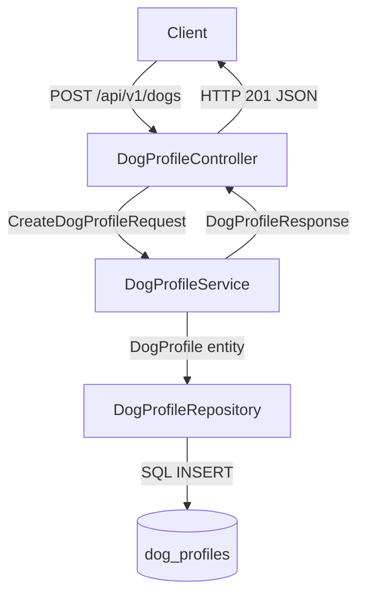
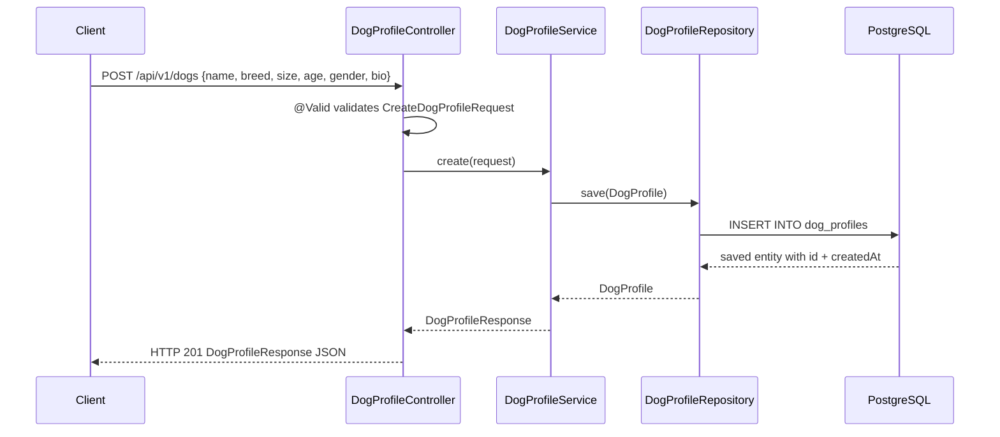
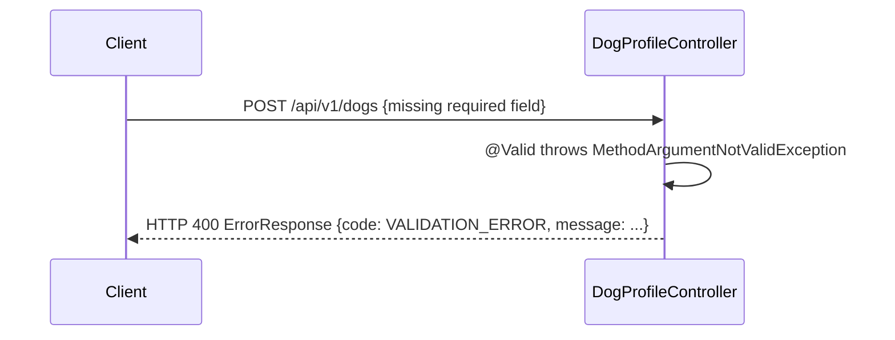

# Technical Design — dog-profile-creation

## Overview

This document describes the technical design for the `POST /api/v1/dogs` endpoint, which creates and persists a dog profile on the Tinder4Dogs platform. A dog profile is the core matchable entity: it stores identity and characteristic fields (name, breed, size, age, gender, bio) and is persisted in PostgreSQL via JPA.

This is the first JPA entity in the codebase. The feature follows the existing vertical-slice module pattern and introduces Bean Validation for the first time.

**Target users**: Any caller (no authentication required for this iteration).

---

## Goals & Non-Goals

**Goals**:
- Accept a POST request with dog profile data, validate it, persist it, and return HTTP 201 with the created profile.
- Introduce the first JPA entity and repository following project conventions.
- Provide actionable 400 validation errors.

**Non-Goals**:
- Authentication or authorisation (deferred).
- One-profile-per-owner enforcement (deferred).
- Photo upload (separate endpoint).
- Breed validation against a predefined list (deferred).

---

## Requirements Traceability

| Requirement | Design Element |
|-------------|---------------|
| 1.1 POST with required fields → 201 | `DogProfileController.create()` + `@ResponseStatus(CREATED)` |
| 1.2 Accept name, breed, size, age, gender, bio fields | `CreateDogProfileRequest` data class |
| 1.3 Persist and return unique ID | `DogProfileRepository.save()` → `DogProfileResponse.id` |
| 2.1 Missing required field → 400 | `@field:NotBlank` / `@field:NotNull` + `@ExceptionHandler(MethodArgumentNotValidException)` |
| 2.2 Age outside 0–30 → 400 | `@field:Min(0) @field:Max(30)` |
| 2.3 Invalid size enum → 400 | Spring deserialization error → 400 |
| 2.4 Invalid gender enum → 400 | Spring deserialization error → 400 |
| 2.5 name/breed > 100 chars → 400 | `@field:Size(max=100)` |
| 2.6 bio > 500 chars → 400 | `@field:Size(max=500)` |
| 2.7 bio optional, stored as null | `bio: String? = null` (no `@NotNull`) |
| 3.1 201 body with id, name, breed, size, age, gender, bio, createdAt | `DogProfileResponse` |
| 3.2 400 body with code + message | `ErrorResponse(code, message)` |
| 3.3 Content-Type: application/json | Spring MVC default for `@RestController` |

---

## Architecture

### Pattern

Vertical slice module (`dogprofile/`) with three layers: `presentation/` → `service/` → `model/`. Matches the existing `support/` and `ai/finetuning/` modules. No cross-module dependencies introduced.

### Boundary Map



---

## Technology Stack & Alignment

| Layer | Technology | Rationale |
|-------|-----------|-----------|
| HTTP | Spring WebMVC `@RestController` | Existing pattern in all controllers |
| Validation | Jakarta Bean Validation (`spring-boot-starter-validation`) | Already in pom.xml; first use |
| Persistence | Spring Data JPA `JpaRepository` | Configured in pom.xml; Kotlin all-open plugin handles proxy |
| DB | PostgreSQL via Hibernate | Existing `application.yaml` datasource |
| Mapping | Manual (extension function `DogProfile.toResponse()`) | Sufficient for one entity; no MapStruct overhead |

---

## System Flows

### Happy Path — Profile Created



### Validation Failure — Missing Field



---

## Components & Interfaces

### Summary

| Component | Layer | Responsibility |
|-----------|-------|---------------|
| `DogProfileController` | presentation | HTTP routing, validation trigger, error mapping |
| `DogProfileService` | service | Business logic, entity construction, persistence orchestration |
| `DogProfileRepository` | service | Spring Data JPA CRUD interface |
| `DogProfile` | model | JPA entity — persistent state |
| `CreateDogProfileRequest` | model | Validated inbound DTO |
| `DogProfileResponse` | model | Outbound DTO |
| `ErrorResponse` | model | Structured error payload |
| `DogSize` | model | Enum: SMALL, MEDIUM, LARGE, EXTRA_LARGE |
| `DogGender` | model | Enum: MALE, FEMALE |

---

### `DogProfileController`

**Package**: `com.ai4dev.tinderfordogs.dogprofile.presentation`

**Responsibilities**:
- Map `POST /api/v1/dogs` to `DogProfileService.create()`
- Activate Bean Validation via `@Valid`
- Return HTTP 201 with `DogProfileResponse`
- Handle `MethodArgumentNotValidException` → HTTP 400 `ErrorResponse`

**Interface**:
```
POST /api/v1/dogs
  Body: CreateDogProfileRequest (JSON)
  Success: 201 DogProfileResponse
  Error:   400 ErrorResponse
```

---

### `DogProfileService`

**Package**: `com.ai4dev.tinderfordogs.dogprofile.service`

**Responsibilities**:
- Construct `DogProfile` entity from request
- Delegate persistence to `DogProfileRepository`
- Map saved entity to `DogProfileResponse`
- Log creation event (OBS-01)

**Interface**:
```kotlin
fun create(request: CreateDogProfileRequest): DogProfileResponse
```

---

### `DogProfileRepository`

**Package**: `com.ai4dev.tinderfordogs.dogprofile.service`

**Responsibilities**: Standard JPA CRUD via Spring Data.

**Interface**:
```kotlin
interface DogProfileRepository : JpaRepository<DogProfile, Long>
```

---

## Data Models

### Domain Model

`DogProfile` has: identity (`id`), descriptive fields (`name`, `breed`, `size`, `age`, `gender`, `bio`), and audit (`createdAt`).

### Physical Model — `dog_profiles` table

| Column | Type | Constraints |
|--------|------|-------------|
| `id` | BIGSERIAL | PK, NOT NULL |
| `name` | VARCHAR(100) | NOT NULL |
| `breed` | VARCHAR(100) | NOT NULL |
| `size` | VARCHAR(20) | NOT NULL (enum string) |
| `age` | INTEGER | NOT NULL |
| `gender` | VARCHAR(10) | NOT NULL (enum string) |
| `bio` | VARCHAR(500) | NULLABLE |
| `created_at` | TIMESTAMPTZ | NOT NULL |

Schema is managed by **Liquibase** (`ddl-auto: none`).
Migration: `src/main/resources/db/changelog/migrations/001-create-dog-profiles.sql` (Liquibase formatted SQL, `dbms: postgresql`).

### Data Contracts

**`CreateDogProfileRequest`**

| Field | Type | Validation |
|-------|------|-----------|
| `name` | `String` | `@NotBlank`, `@Size(max=100)` |
| `breed` | `String` | `@NotBlank`, `@Size(max=100)` |
| `size` | `DogSize?` | `@NotNull` |
| `age` | `Int?` | `@NotNull`, `@Min(0)`, `@Max(30)` |
| `gender` | `DogGender?` | `@NotNull` |
| `bio` | `String?` | `@Size(max=500)`, optional |

**`DogProfileResponse`**

| Field | Type |
|-------|------|
| `id` | `Long` |
| `name` | `String` |
| `breed` | `String` |
| `size` | `DogSize` |
| `age` | `Int` |
| `gender` | `DogGender` |
| `bio` | `String?` |
| `createdAt` | `Instant` |

---

## Error Handling

| Scenario | Exception | HTTP Status | Response |
|----------|-----------|-------------|---------|
| Missing/invalid field | `MethodArgumentNotValidException` | 400 | `ErrorResponse(code="VALIDATION_ERROR", message="<field>: <reason>")` |
| Invalid enum value | `HttpMessageNotReadableException` | 400 | Spring default (acceptable for this iteration) |
| DB error | `DataAccessException` | 500 | Spring default |

---

## Testing Strategy

| Test | Scope | Approach |
|------|-------|---------|
| `DogProfileControllerTest` | `@WebMvcTest` | Happy path 201; missing field 400; invalid enum 400; age=31 → 400; age=-1 → 400; bio optional |
| `DogProfileServiceTest` | Unit | Mock repository; verify field mapping; verify null bio |

**Manual verification**:
```bash
curl -X POST http://localhost:8081/api/v1/dogs \
  -H 'Content-Type: application/json' \
  -d '{"name":"Rex","breed":"Labrador","size":"LARGE","age":3,"gender":"MALE"}'
# Expected: HTTP 201 with id and createdAt
```
