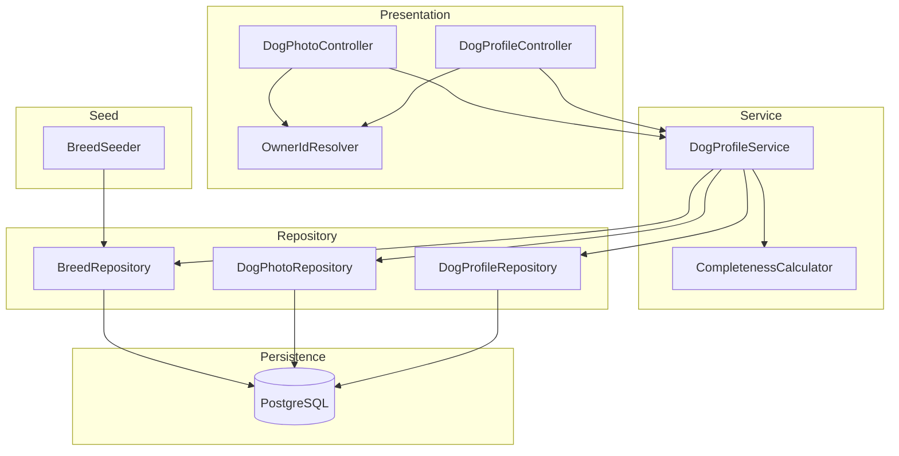
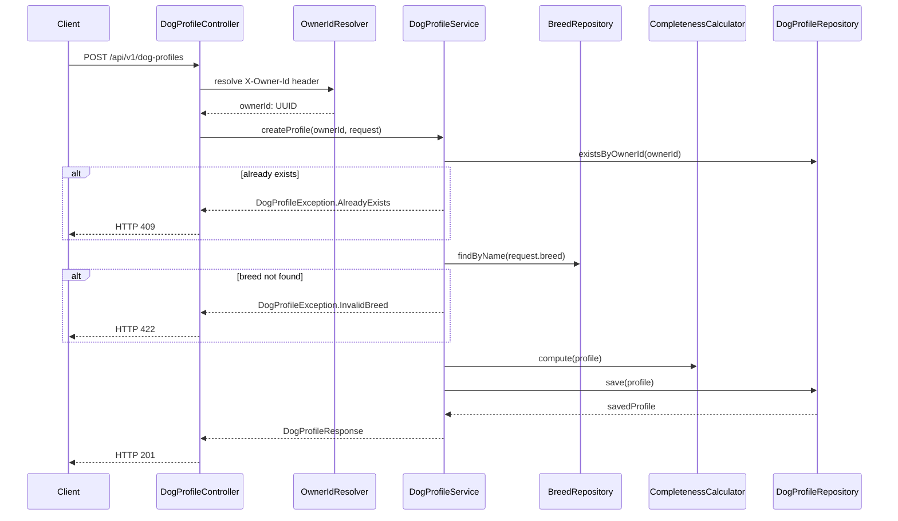
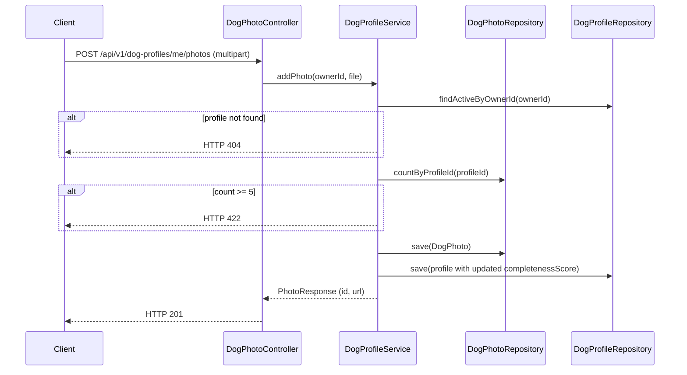
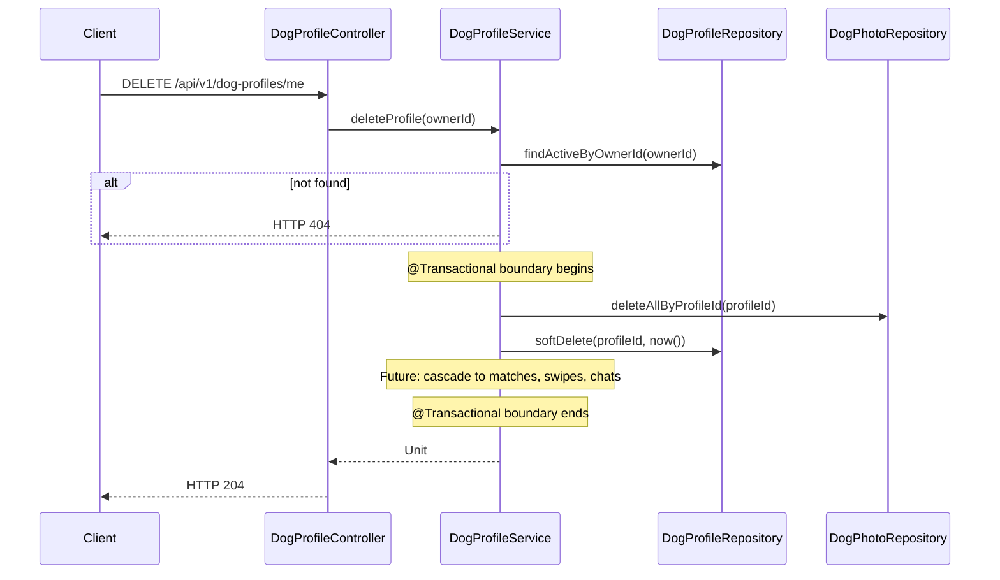
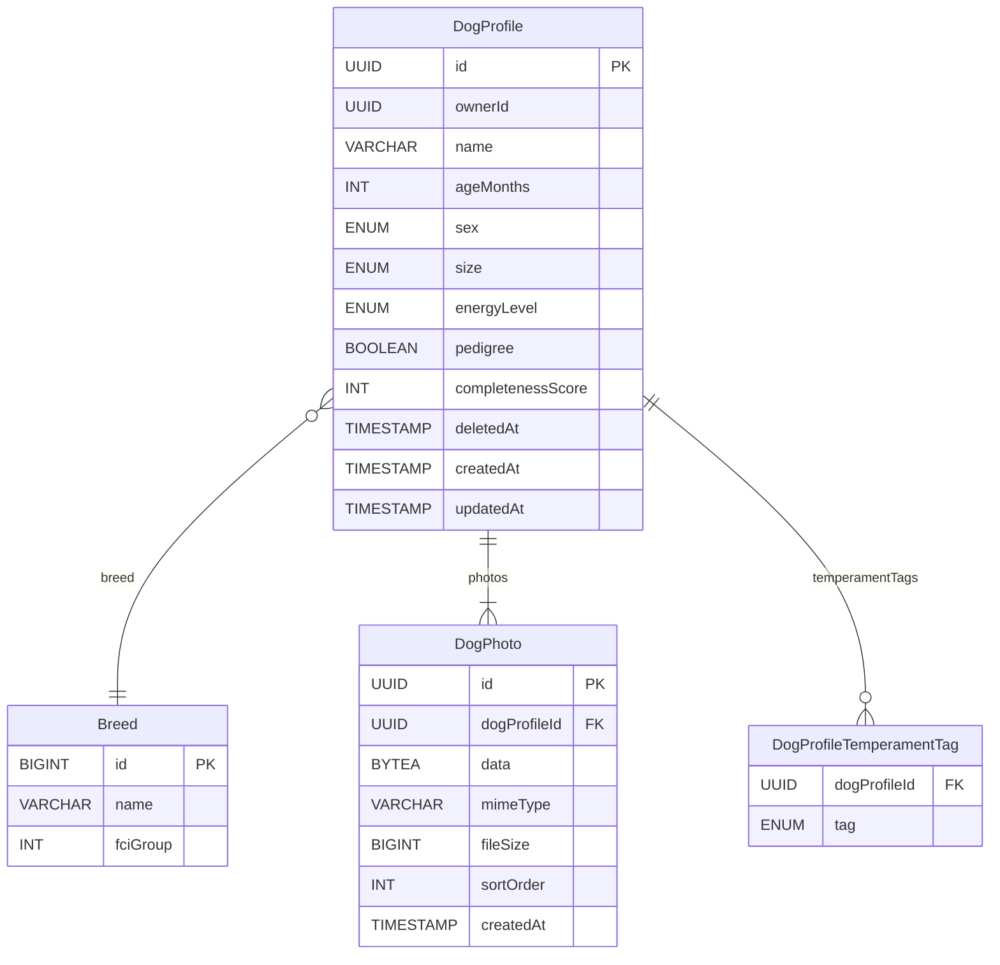

# Design Document — Dog Profile

## Overview

The Dog Profile feature introduces the first persistent domain entity in the Tinder4Dogs platform. It delivers a full CRUD API for dog profiles — including structured attribute management, photo upload/retrieval via DB blob, breed validation against a reference table, and a completeness-score nudging mechanism — enabling the swipe and matching engine to operate on rich, validated profile data.

Owners interact with their own profile through owner-scoped endpoints; the swipe/matching layer consumes public-only profile views that never expose exact location coordinates. This feature introduces the first JPA entity layer, Spring Data repositories, and the `dogprofile/` vertical-slice module.

**Users:** Dog owners (Casual Owner, Breeder personas) create and maintain a single dog profile per account.
**Impact:** Adds a persistent `dog_profiles` table, `dog_photos` (bytea blobs), `breeds` (reference), and a `dog_profile_temperament_tags` element-collection table. All downstream matching and swipe features depend on the data produced here.

### Goals

- Provide a validated, richly-typed dog profile entity persisted in PostgreSQL
- Enforce controlled vocabularies (breed list, temperament tags, enums) at the service boundary
- Compute and surface a `completenessScore` to drive the ≥70% full-profile completion metric
- Support GDPR-compliant soft- and hard-deletion with full cascade to future match/chat/swipe data

### Non-Goals

- User authentication and JWT issuance (F-01 — separate feature; MVP uses `X-Owner-Id` header)
- Multi-dog profiles per owner (post-MVP premium tier)
- External object storage for photos (DB blob chosen for MVP)
- Match, swipe, and chat cascade logic beyond schema-level FK constraints (dependent features not yet implemented)
- Push notifications or calendar integration

---

## Requirements Traceability

| Requirement | Summary | Components | Interfaces | Flows |
|-------------|---------|------------|------------|-------|
| 1.1–1.7 | Profile creation with mandatory/optional fields, one-per-owner | DogProfileService, DogProfileController, BreedRepository | POST /api/v1/dog-profiles | Create Profile Flow |
| 2.1–2.8 | Photo upload/delete as BYTEA blob, min 1, max 5 | DogProfileService, DogPhotoController | POST/DELETE /api/v1/dog-profiles/me/photos | Photo Upload Flow |
| 3.1–3.5 | Owner full view vs. public view; no exact coords | DogProfileService, DogProfileController | GET /api/v1/dog-profiles/me, GET /api/v1/dog-profiles/{id} | — |
| 4.1–4.5 | Partial/full update with mandatory-field protection | DogProfileService, DogProfileController | PATCH /api/v1/dog-profiles/me | — |
| 5.1–5.6 | Soft-delete with cascade; hard-delete within 30 days | DogProfileService, DogProfileController | DELETE /api/v1/dog-profiles/me | Delete & Cascade Flow |
| 6.1–6.7 | Field validation, enum guards, breed lookup, transactional writes | DogProfileService, CompletenessCalculator, BreedRepository | All write endpoints | — |
| 7.1–7.5 | Completeness score 0–100, missingFields nudge, dedicated endpoint | CompletenessCalculator, DogProfileController | GET /api/v1/dog-profiles/me/completeness | — |

---

## Architecture

### Architecture Pattern & Boundary Map



**Architecture Integration**:
- Pattern: vertical slice (`dogprofile/` module) with `model/`, `service/`, `repository/`, `presentation/` sub-packages — extends the existing `support/` module convention with an added `repository/` layer
- `OwnerIdResolver` reads `X-Owner-Id` header; replaced by JWT claim resolver at F-01 without touching service layer (NFR-09 compliance)
- `CompletenessCalculator` is a pure service with no I/O dependencies; fully unit-testable
- `BreedSeeder` runs at application startup (`CommandLineRunner`) via idempotent upsert
- AI/domain boundary: `dogprofile/` has no dependency on `ai/` packages; matching AI can consume profile DTOs via `service/`

### Technology Stack

| Layer | Choice / Version | Role in Feature |
|-------|------------------|-----------------|
| Backend | Kotlin 2.2 + Spring Boot 4.0.2 WebMVC | REST controllers, service logic |
| Persistence | Spring Data JPA + Hibernate 6 | Entity mapping, repositories |
| Database | PostgreSQL | `dog_profiles`, `dog_photos`, `breeds` tables |
| Schema Migrations | `org.springframework.boot:spring-boot-starter-liquibase` | Versioned, traceable DDL migrations in `db/changelog/` |
| Photo Storage | PostgreSQL `bytea` (mapped as `ByteArray` in Kotlin) | Binary blob per photo record |
| Logging | kotlin-logging-jvm | Structured log entries per operation |
| Telemetry | OpenTelemetry (OTEL) via `micrometer-tracing-bridge-otel` + `opentelemetry-exporter-otlp` | Distributed traces, metrics, and structured logs exported via OTLP |

**New dependencies**:
- `org.springframework.boot:spring-boot-starter-liquibase` — schema migrations
- `io.micrometer:micrometer-tracing-bridge-otel` — Micrometer → OTEL bridge (included via Spring Boot actuator)
- `io.opentelemetry:opentelemetry-exporter-otlp` — OTLP exporter to any OTEL collector (Grafana, Jaeger, etc.)

`spring.jpa.hibernate.ddl-auto` must be set to `validate`. (included transitively via `spring-boot-starter-data-jpa` when declared explicitly in `pom.xml`). `spring.jpa.hibernate.ddl-auto` must be set to `validate` (Hibernate validates entity-to-schema alignment but does not mutate the schema).

---

## System Flows

### Create Profile Flow



### Photo Upload Flow



### Delete & Cascade Flow



---

## Components and Interfaces

### Component Summary

| Component | Layer | Intent | Req Coverage | Key Dependencies | Contracts |
|-----------|-------|--------|--------------|-----------------|-----------|
| DogProfileController | Presentation | REST CRUD for owner-scoped profile operations | 1, 3, 4, 5, 7 | DogProfileService (P0), OwnerIdResolver (P0) | API |
| DogPhotoController | Presentation | Photo upload, delete, retrieve | 2 | DogProfileService (P0), OwnerIdResolver (P0) | API |
| OwnerIdResolver | Presentation | Resolves owner identity from request header | All write/read ops | — | Service |
| DogProfileService | Service | Core business logic: create, read, update, delete, validate | 1–7 | DogProfileRepository (P0), DogPhotoRepository (P0), BreedRepository (P0), CompletenessCalculator (P0) | Service |
| CompletenessCalculator | Service | Pure function: computes completeness score 0–100 from profile state | 7 | — | Service |
| BreedSeeder | Service | Seeds `breeds` table at startup via idempotent upsert; runs after Liquibase migrations complete | 6.5 | BreedRepository (P0) | Batch |
| DogProfileRepository | Repository | Spring Data JPA for `dog_profiles` | 1–5 | PostgreSQL (P0) | — |
| DogPhotoRepository | Repository | Spring Data JPA for `dog_photos` | 2 | PostgreSQL (P0) | — |
| BreedRepository | Repository | Spring Data JPA for `breeds` reference table | 6.5 | PostgreSQL (P0) | — |

---

### Presentation Layer

#### DogProfileController

| Field | Detail |
|-------|--------|
| Intent | Owner-scoped REST operations: create, read own, read public, update, delete, completeness |
| Requirements | 1.1–1.7, 3.1–3.5, 4.1–4.5, 5.1–5.6, 7.4 |

**Contracts**: API [x]

##### API Contract

| Method | Endpoint | Request | Response | Errors |
|--------|----------|---------|----------|--------|
| POST | /api/v1/dog-profiles | `CreateDogProfileRequest` | `DogProfileResponse` (201) | 409 (duplicate), 422 (validation) |
| GET | /api/v1/dog-profiles/me | — | `DogProfileResponse` (200) | 404 |
| GET | /api/v1/dog-profiles/me/completeness | — | `CompletenessResponse` (200) | 404 |
| PATCH | /api/v1/dog-profiles/me | `UpdateDogProfileRequest` | `DogProfileResponse` (200) | 403, 422 |
| DELETE | /api/v1/dog-profiles/me | — | 204 | 403, 404, 500 |
| GET | /api/v1/dog-profiles/{id} | — | `PublicDogProfileResponse` (200) | 404 |

**Implementation Notes**:
- All write endpoints inject `ownerId: UUID` via `OwnerIdResolver` (header `X-Owner-Id`)
- GET `/{id}` returns `PublicDogProfileResponse` — exact coordinates are never mapped into this DTO
- Exception-to-HTTP mapping is handled by a `@ControllerAdvice` `DogProfileExceptionHandler`

---

#### DogPhotoController

| Field | Detail |
|-------|--------|
| Intent | Photo lifecycle: upload (multipart), retrieve binary, delete |
| Requirements | 2.1–2.8 |

**Contracts**: API [x]

##### API Contract

| Method | Endpoint | Request | Response | Errors |
|--------|----------|---------|----------|--------|
| POST | /api/v1/dog-profiles/me/photos | `MultipartFile` | `PhotoResponse` (201) | 413, 415, 422 |
| GET | /api/v1/dog-profiles/me/photos/{photoId} | — | `ResponseEntity<ByteArray>` + `Content-Type` header | 401, 404 |
| DELETE | /api/v1/dog-profiles/me/photos/{photoId} | — | 204 | 403, 422 (last photo) |

**Implementation Notes**:
- MIME type validated from `MultipartFile.contentType` before persistence; reject if not `image/jpeg` or `image/png`
- File size validated from `MultipartFile.size` before reading bytes; reject if > 10 MB (10_485_760 bytes)
- Photo retrieval sets `Content-Type` from stored `mimeType` field; authentication check ensures requester is the profile owner or any authenticated user (public read for swipe)

---

#### OwnerIdResolver

| Field | Detail |
|-------|--------|
| Intent | Spring `HandlerMethodArgumentResolver` that reads `X-Owner-Id` header and injects `UUID` into controller methods |
| Requirements | All authenticated operations |

**Contracts**: Service [x]

##### Service Interface

```kotlin
interface OwnerIdResolver : HandlerMethodArgumentResolver {
    // Resolves @OwnerId-annotated UUID parameters from X-Owner-Id request header
    // Returns UUID or throws MissingOwnerIdException (HTTP 401) if header absent
}
```

**Implementation Notes**:
- Replaced by JWT principal resolver when F-01 (auth) is implemented; no service-layer changes required
- A custom `@OwnerId` annotation marks the injection point in controller method signatures

---

### Service Layer

#### DogProfileService

| Field | Detail |
|-------|--------|
| Intent | Orchestrates all profile business logic: CRUD, validation, photo management, cascade delete, completeness update |
| Requirements | 1.1–7.5 |

**Contracts**: Service [x]

##### Service Interface

```kotlin
interface DogProfileService {
    suspend fun createProfile(ownerId: UUID, request: CreateDogProfileRequest): DogProfileResponse
    suspend fun getOwnProfile(ownerId: UUID): DogProfileResponse
    suspend fun getPublicProfile(profileId: UUID): PublicDogProfileResponse
    suspend fun updateProfile(ownerId: UUID, request: UpdateDogProfileRequest): DogProfileResponse
    suspend fun deleteProfile(ownerId: UUID)
    suspend fun addPhoto(ownerId: UUID, file: MultipartFile): PhotoResponse
    suspend fun deletePhoto(ownerId: UUID, photoId: UUID)
    suspend fun getCompleteness(ownerId: UUID): CompletenessResponse
}
```

- **Preconditions**: `ownerId` must be a valid UUID present in requests header; `request` fields validated by `@Valid` before service is invoked
- **Postconditions**: All write operations update `updatedAt`; `completenessScore` recomputed on every mutating operation
- **Invariants**: At most one active (non-deleted) profile per `ownerId`; photo count in [1, 5] at all times for a non-draft profile

**Dependencies**:
- Inbound: `DogProfileController`, `DogPhotoController`
- Outbound: `DogProfileRepository` — persistence (P0); `DogPhotoRepository` — photo persistence (P0); `BreedRepository` — breed validation (P0); `CompletenessCalculator` — score computation (P0)

**Implementation Notes**:
- All mutating methods annotated `@Transactional`; delete cascades photos first, then soft-deletes profile in one transaction
- `findActiveByOwnerId` helper filters `deletedAt IS NULL` to respect soft-delete
- Breed lookup cached via first-level Hibernate cache; no extra caching layer needed for MVP

---

#### CompletenessCalculator

| Field | Detail |
|-------|--------|
| Intent | Pure, stateless function that computes `completenessScore` and `missingFields` from a `DogProfile` entity |
| Requirements | 7.1–7.5 |

**Contracts**: Service [x]

##### Service Interface

```kotlin
interface CompletenessCalculator {
    fun compute(profile: DogProfile): CompletenessResult
}

data class CompletenessResult(
    val score: Int,             // 0–100
    val missingFields: List<String>  // human-readable labels of unfilled optional fields
)
```

**Score Formula** (5 factors × 20 points):

| Factor | Condition | Points |
|--------|-----------|--------|
| Size | `size != null` | 20 |
| Temperament tags | `temperamentTags.isNotEmpty()` | 20 |
| Energy level | `energyLevel != null` | 20 |
| Pedigree declared | `pedigree != null` (non-default) | 20 |
| Photos richness | `photos.size >= 3` | 20 |

**Implementation Notes**:
- No I/O; fully unit-testable without Spring context
- `missingFields` uses human-readable labels (e.g., `"Size"`, `"At least one temperament tag"`) per NFR-U02

---

### Repository Layer

#### DogProfileRepository

```kotlin
interface DogProfileRepository : JpaRepository<DogProfile, UUID> {
    fun existsByOwnerIdAndDeletedAtIsNull(ownerId: UUID): Boolean
    fun findByOwnerIdAndDeletedAtIsNull(ownerId: UUID): DogProfile?
    fun findByIdAndDeletedAtIsNull(id: UUID): DogProfile?
}
```

#### DogPhotoRepository

```kotlin
interface DogPhotoRepository : JpaRepository<DogPhoto, UUID> {
    fun countByDogProfileId(profileId: UUID): Int
    fun deleteAllByDogProfileId(profileId: UUID)
    fun findByIdAndDogProfileOwnerId(photoId: UUID, ownerId: UUID): DogPhoto?
}
```

#### BreedRepository

```kotlin
interface BreedRepository : JpaRepository<Breed, Long> {
    fun findByNameIgnoreCase(name: String): Breed?
}
```

---

## Data Models

### Domain Model

- **Aggregate Root**: `DogProfile` — owns photos and temperament tags; referenced by future Match, Swipe, and Chat aggregates
- **Entities**: `DogProfile`, `DogPhoto`
- **Reference Entity**: `Breed` (lookup table, not part of the aggregate)
- **Value Objects / Enums**: `Sex`, `Size`, `EnergyLevel`, `TemperamentTag` (controlled vocabulary)
- **Invariants**:
  - A `DogProfile` must always have at least one photo (enforced at write time)
  - `temperamentTags` is a subset of `TemperamentTag` enum; size ≤ 10
  - Only one active profile per `ownerId`



### Physical Data Model

All DDL is managed by **Liquibase** using plain **SQL changesets** (no XML, YAML, or JSON dialects). Migrations live in `src/main/resources/db/changelog/` using the following structure:

```
db/changelog/
  db.changelog-master.xml           ← master include list (XML only for the root orchestrator)
  migrations/
    001-create-breeds.sql
    002-create-dog-profiles.sql
    003-create-dog-photos.sql
    004-create-dog-profile-temperament-tags.sql
```

Each `.sql` file uses Liquibase formatted SQL (`--liquibase formatted sql`, `--changeset author:id`) and includes a `--rollback` block for every `CREATE TABLE`. `spring.jpa.hibernate.ddl-auto=validate` ensures Hibernate confirms entity-to-table alignment at startup without modifying the schema.

**`dog_profiles`**

| Column | Type | Constraints |
|--------|------|-------------|
| id | UUID | PK, default gen_random_uuid() |
| owner_id | UUID | NOT NULL, UNIQUE WHERE deleted_at IS NULL |
| name | VARCHAR(50) | NOT NULL |
| breed_id | BIGINT | NOT NULL, FK → breeds(id) |
| age_months | INT | NOT NULL, CHECK (1–240) |
| sex | VARCHAR(10) | NOT NULL |
| size | VARCHAR(15) | NULLABLE |
| energy_level | VARCHAR(10) | NULLABLE |
| pedigree | BOOLEAN | DEFAULT false |
| completeness_score | INT | NOT NULL DEFAULT 0 |
| deleted_at | TIMESTAMP | NULLABLE |
| created_at | TIMESTAMP | NOT NULL DEFAULT now() |
| updated_at | TIMESTAMP | NOT NULL DEFAULT now() |

Indexes: `(owner_id) WHERE deleted_at IS NULL` (partial unique), `(deleted_at)` for hard-deletion scheduler.

**`dog_photos`**

| Column | Type | Constraints |
|--------|------|-------------|
| id | UUID | PK |
| dog_profile_id | UUID | NOT NULL, FK → dog_profiles(id) ON DELETE CASCADE |
| data | BYTEA | NOT NULL |
| mime_type | VARCHAR(20) | NOT NULL |
| file_size | BIGINT | NOT NULL |
| sort_order | INT | NOT NULL DEFAULT 0 |
| created_at | TIMESTAMP | NOT NULL DEFAULT now() |

**`breeds`**

| Column | Type | Constraints |
|--------|------|-------------|
| id | BIGINT | PK, SERIAL |
| name | VARCHAR(100) | NOT NULL, UNIQUE |
| fci_group | INT | NULLABLE |

**`dog_profile_temperament_tags`** (Hibernate `@ElementCollection`)

| Column | Type | Constraints |
|--------|------|-------------|
| dog_profile_id | UUID | FK → dog_profiles(id), NOT NULL |
| tag | VARCHAR(20) | NOT NULL |
| PK | (dog_profile_id, tag) | composite |

### Data Contracts & Integration

**`CreateDogProfileRequest`**

```kotlin
data class CreateDogProfileRequest(
    @field:NotBlank @field:Size(max = 50) val name: String,
    @field:NotBlank val breed: String,
    @field:Min(1) @field:Max(240) val ageMonths: Int,
    val sex: Sex,
    val size: Size? = null,
    val temperamentTags: Set<TemperamentTag> = emptySet(),
    val energyLevel: EnergyLevel? = null,
    val pedigree: Boolean? = null,
)
```

**`UpdateDogProfileRequest`** — all fields nullable; null = unchanged

```kotlin
data class UpdateDogProfileRequest(
    @field:Size(max = 50) val name: String? = null,
    val breed: String? = null,
    @field:Min(1) @field:Max(240) val ageMonths: Int? = null,
    val sex: Sex? = null,
    val size: Size? = null,
    val temperamentTags: Set<TemperamentTag>? = null,
    val energyLevel: EnergyLevel? = null,
    val pedigree: Boolean? = null,
)
```

**`DogProfileResponse`** (owner view — full)

```kotlin
data class DogProfileResponse(
    val id: UUID,
    val ownerId: UUID,
    val name: String,
    val breed: String,
    val ageMonths: Int,
    val sex: Sex,
    val size: Size?,
    val temperamentTags: Set<TemperamentTag>,
    val energyLevel: EnergyLevel?,
    val pedigree: Boolean,
    val photos: List<PhotoSummary>,
    val completenessScore: Int,
    val missingFields: List<String>,
    val createdAt: Instant,
    val updatedAt: Instant,
)
```

**`PublicDogProfileResponse`** (third-party view — no coordinates, no ownerId)

```kotlin
data class PublicDogProfileResponse(
    val id: UUID,
    val name: String,
    val breed: String,
    val ageMonths: Int,
    val sex: Sex,
    val size: Size?,
    val temperamentTags: Set<TemperamentTag>,
    val energyLevel: EnergyLevel?,
    val pedigree: Boolean,
    val photos: List<PhotoSummary>,
    val approximateDistanceKm: Double?,  // populated by future geolocation service; null until F-04
)
```

**`CompletenessResponse`**

```kotlin
data class CompletenessResponse(
    val profileId: UUID,
    val completenessScore: Int,
    val missingFields: List<String>,
)
```

**`PhotoSummary`** (embedded in profile responses)

```kotlin
data class PhotoSummary(
    val id: UUID,
    val url: String,  // /api/v1/dog-profiles/me/photos/{id}
    val sortOrder: Int,
)
```

**`PhotoResponse`** (returned after upload)

```kotlin
data class PhotoResponse(
    val id: UUID,
    val url: String,
    val mimeType: String,
    val fileSize: Long,
)
```

**`ApiError`** (all 4xx responses)

```kotlin
data class ApiError(
    val field: String?,    // null for non-field errors
    val message: String,
    val code: String,      // e.g. "DUPLICATE_PROFILE", "INVALID_BREED", "PHOTO_LIMIT_EXCEEDED"
)
```

---

## Error Handling

### Error Strategy

Fail-fast at the controller boundary via `@Valid` Bean Validation; business-rule violations thrown as typed exceptions from the service layer and mapped to HTTP responses by a `@ControllerAdvice` handler.

### Error Categories and Responses

| Exception | HTTP | `code` | Trigger |
|-----------|------|--------|---------|
| `DogProfileAlreadyExistsException` | 409 | `DUPLICATE_PROFILE` | 1.3 — second profile for same owner |
| `DogProfileNotFoundException` | 404 | `PROFILE_NOT_FOUND` | 3.3, 4.1, 5.1 |
| `InvalidBreedException` | 422 | `INVALID_BREED` | 6.5 — breed not in reference table |
| `PhotoLimitExceededException` | 422 | `PHOTO_LIMIT_EXCEEDED` | 2.2 — attempt to add 6th photo |
| `LastPhotoRemovalException` | 422 | `LAST_PHOTO_REMOVAL` | 2.5 — delete last photo |
| `OwnerMismatchException` | 403 | `FORBIDDEN` | 4.3, 5.3 — non-owner mutation |
| `MissingOwnerIdException` | 401 | `MISSING_OWNER_ID` | `X-Owner-Id` header absent |
| `ConstraintViolationException` (Bean Validation) | 422 | `VALIDATION_ERROR` | Field-level `@Valid` failures |
| Unhandled `Exception` | 500 | `INTERNAL_ERROR` | Unexpected failures |

### Monitoring

All telemetry is emitted via **OpenTelemetry** using the Micrometer OTEL bridge and exported via OTLP.

**Traces**
- Each inbound HTTP request automatically produces a root span via Spring Boot auto-instrumentation (`spring-boot-starter-actuator` + OTEL bridge)
- Service methods for create, update, delete, addPhoto, and deletePhoto are wrapped in child spans using `@WithSpan` (OTEL instrumentation annotation) or manual `Tracer.spanBuilder()`
- Span attributes: `dog_profile.owner_id`, `dog_profile.profile_id`, `dog_profile.operation`

**Metrics** (via Micrometer `MeterRegistry` → OTEL exporter)
- `dog_profile.create.total` — counter, tags: `result` (success/error)
- `dog_profile.update.total` — counter, tags: `result`
- `dog_profile.delete.total` — counter, tags: `result`
- `dog_profile.photo.upload.total` — counter, tags: `result`
- `dog_profile.completeness_score` — histogram, tag: none (distribution of scores across profiles)
- `dog_profile.photo.size_bytes` — histogram (file sizes at upload time)

**Structured Logs**
- All service operations emit structured log entries at `INFO` with MDC fields `ownerId`, `profileId`, `operation` — automatically correlated to the active trace via the OTEL log bridge
- 4xx/5xx responses logged at `WARN`/`ERROR` with `ownerId`, exception class, and OTEL `trace_id` for cross-signal correlation

---

## Testing Strategy

### Unit Tests

- `CompletenessCalculatorTest` — all combinations of filled/unfilled optional fields; boundary cases (0/3/5 photos, 0/1 tags)
- `DogProfileServiceTest` — MockK mocks for all repositories; test each branch of create/update/delete including duplicate-owner guard, breed-not-found, photo-limit, last-photo removal
- `BreedSeederTest` — verify idempotent seed: no duplicates on double-run
- `OwnerIdResolverTest` — present header → UUID; absent header → `MissingOwnerIdException`

### Integration Tests

- `DogProfileControllerIT` (`@WebMvcTest`) — full request/response cycle for POST, GET me, PATCH, DELETE; verify HTTP status codes and response body shape
- `DogPhotoControllerIT` — multipart upload (valid JPEG, invalid MIME, oversized), photo delete (last photo guard)
- `DogProfileRepositoryIT` (`@DataJpaTest`) — partial-unique index (one active per owner), soft-delete filter, breed FK constraint
- `BreedRepositoryIT` — seed + `findByNameIgnoreCase` lookup

### Performance

- Photo retrieval endpoint: verify P95 < 3s for 10 MB blob under simulated concurrent load (5 parallel requests)
- Profile GET P95 < 200ms with 1000 seeded profiles (JMeter or `@SpringBootTest` + RestAssured)

---

## Security Considerations

- **Owner isolation**: every write/delete operation verifies `profile.ownerId == resolvedOwnerId`; mismatch → HTTP 403
- **Photo access**: photo retrieval endpoint requires a valid `X-Owner-Id` (or future JWT); unauthenticated requests → HTTP 401
- **Exact location never exposed**: `PublicDogProfileResponse` has no coordinates field; `approximateDistanceKm` is populated only by F-04 (Geolocation), which handles privacy rounding at its own boundary
- **Known MVP gap**: `X-Owner-Id` is unverified; document in API readme and restrict to internal network until F-01 ships

---

## Performance & Scalability

- **Photo blob reads**: `DogPhoto.data` loaded lazily (`@Basic(fetch = FetchType.LAZY)`) — profile queries do not pull photo bytes unless the photo endpoint is called
- **Temperament tags**: `@ElementCollection` with `FetchType.EAGER` is acceptable for max 10 items; no separate round-trip needed on profile load
- **Breed lookup**: first-level Hibernate cache covers repeated lookups within a request; no second-level cache added in MVP
- **Soft-delete filter**: partial index `WHERE deleted_at IS NULL` on `(owner_id)` keeps active-profile queries fast as deleted rows accumulate
