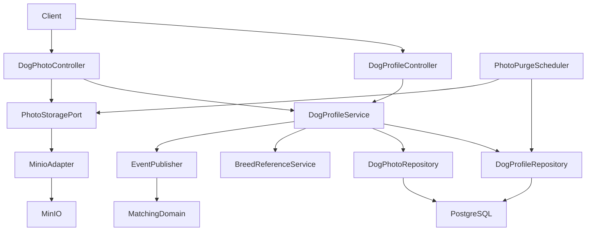
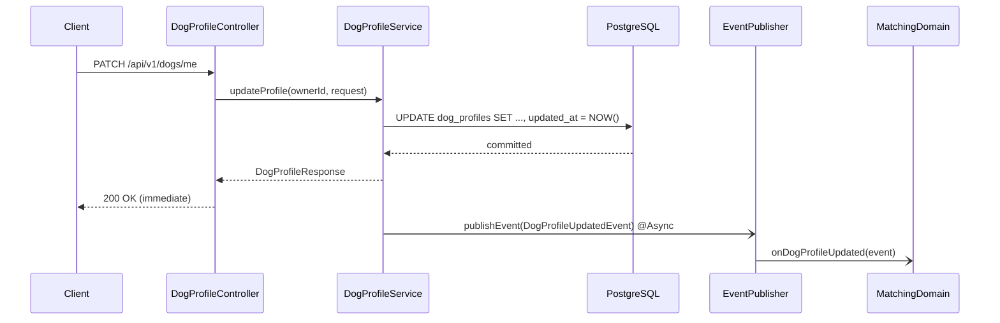
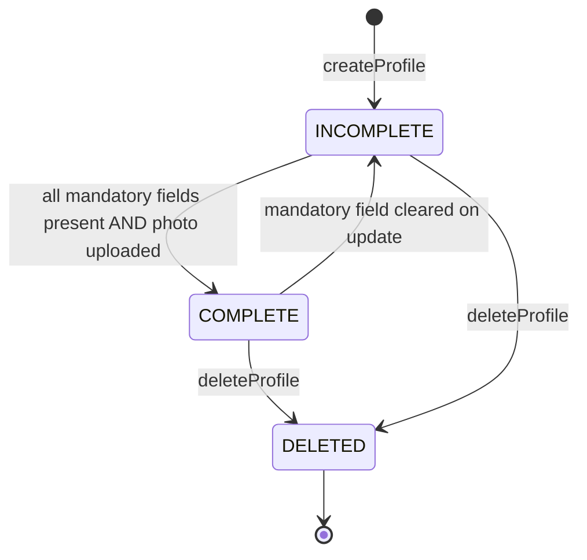
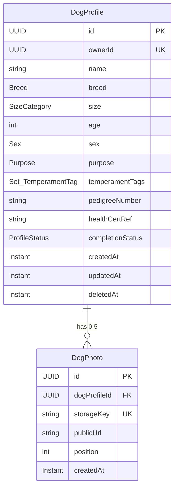

# Technical Design — Dog Profile

---

## Overview

The **Dog Profile** feature introduces the `dogprofile` domain to PawMatch — a greenfield domain within the existing Spring Boot monolith. It provides the persistent aggregate that drives compatibility scoring, the matching feed, and post-match communication. Without a complete dog profile an owner cannot access any matchmaking functionality.

**Purpose**: Enable owners to create, manage, and delete a single dog profile including breed, age, sex, purpose, temperament tags, and photos. Size is derived automatically from breed via a controlled enum.

**Users**: All authenticated owners (casual owners, breeders).

**Impact**: Introduces a new `dogprofile/` domain package, two JPA entities (`DogProfileEntity`, `DogPhotoEntity`), MinIO S3 photo storage integration, and domain event publication for downstream compatibility-score recalculation.

### Goals

- Full CRUD lifecycle for a single dog profile per owner account
- Photo upload/delete against local MinIO (S3-compatible), max 5 photos
- Profile-completion gate enforced before matching feed access
- Async `DogProfileUpdatedEvent` / `DogProfileDeletedEvent` for downstream scoring

### Non-Goals

- Multi-dog profiles per account (v2)
- Auth/JWT implementation (prerequisite feature, separate domain)
- Matching feed, chat, or compatibility scoring (consume events from this domain)
- Liquibase migration strategy (follow-up task; current `ddl-auto: update` stays for dev)

---

## Architecture

### Existing Architecture Context

The codebase follows a domain-driven layered monolith: `<domain>/model/ → service/ → presentation/`. No dog-profile persistence exists today — `match.model.Dog` is a transient in-memory data class and will be superseded by this domain. Spring Security and AWS SDK v2 are absent from `pom.xml` and must be added.

### Architecture Pattern & Boundary Map

Selected pattern: **Layered domain module** — consistent with existing `match/` and `support/` domains. The one architectural exception is the `PhotoStoragePort` interface (a single outbound port) to keep photo storage swappable without touching service logic.



Key decisions captured in `research.md`:
- `PhotoStoragePort` interface decouples MinIO from the service; allows unit testing without storage infrastructure.
- `ApplicationEventPublisher` + `@Async` delivers domain events with zero additional broker infrastructure.
- `Breed` Kotlin enum with embedded `sizeCategory` provides compile-time breed validation and size derivation in one construct.

### Technology Stack

| Layer | Choice / Version | Role in Feature |
|-------|-----------------|-----------------|
| Backend | Spring Boot 4.0.4, Kotlin 2.2.21 | REST controllers, service logic, JPA persistence |
| Persistence | Spring Data JPA + Hibernate (PostgreSQL) | `DogProfileEntity`, `DogPhotoEntity` CRUD + soft delete |
| Object Storage | AWS SDK v2 `S3Client` (new dep) | Photo upload/delete against local MinIO |
| Async Events | Spring `ApplicationEventPublisher` + `@Async` | Domain events for score recalculation |
| Validation | Spring Boot Validation (Bean Validation) | Request validation at controller boundary |
| Auth | Spring Security (new dep — prerequisite) | JWT principal injection (`ownerId` from `sub` claim) |
| Scheduling | Spring `@Scheduled` | 30-day hard photo purge after soft delete |

New Maven dependencies required (details in implementation task):
- `software.amazon.awssdk:s3` (AWS SDK v2)
- `org.springframework.boot:spring-boot-starter-security`

---

## Architecture Options Considered

### Option 1: Layered Domain Module (selected)

**Advantages:**
1. Directly mirrors the existing `match/` and `support/` domain structure — zero onboarding overhead and no codebase divergence for reviewers.
2. JPA entities, repositories, and services slot into `dogprofile/` without touching any existing domain or shared global package, keeping blast radius minimal.
3. Spring's `@Transactional`, Bean Validation, and `@Scheduled` annotations work out-of-the-box; no adapter boilerplate is required to wire the feature end-to-end.

**Disadvantages:**
1. Business rules (completion evaluation, ownership checks) reside in `DogProfileService` rather than on the aggregate root — domain logic leaks into the service layer (anemic-model risk).
2. Unit-testing service logic requires a running Spring context or careful manual constructor wiring because domain classes carry JPA annotations.
3. If the matching feed requires a denormalized read model (e.g., precomputed compatibility scores embedded in the profile), a second read entity must be layered into this same domain package, increasing coupling.

---

### Option 2: Hexagonal (Ports & Adapters)

**Advantages:**
1. Domain core is fully free of infrastructure annotations; `DogProfileService` is testable with a plain JVM instantiation in milliseconds — no Spring context startup.
2. Swapping MinIO for AWS S3 in staging or production requires only a new `S3PhotoStorageAdapter` class; no changes to domain or presentation layers.
3. Inbound and outbound port contracts are explicit, forcing controllers and schedulers to depend on abstractions rather than concrete implementation classes.

**Disadvantages:**
1. Requires four additional adapter classes for this domain alone (`DogProfilePersistenceAdapter`, `DogPhotoPersistenceAdapter`, `MinioPhotoStorageAdapter`, and an inbound controller adapter) with no hexagonal precedent in the codebase to justify the overhead.
2. Two developers unfamiliar with ports-and-adapters must ramp up before they can contribute to or review this domain — a measurable onboarding cost for a small team.
3. Existing controllers use Kotlin `suspend` functions and `RestClient`-based HTTP clients; a hexagonal boundary around a single domain creates an inconsistency that is difficult to enforce across the rest of the codebase.

---

### Option 3: CQRS (Command / Query Responsibility Segregation)

**Advantages:**
1. A dedicated read model can precompute `completionStatus` and photo counts, eliminating N+1 queries when the matching feed loads hundreds of profiles concurrently.
2. Separate write and read models let the write side optimize for strong consistency (transactional, normalized) while the read side optimizes for speed (denormalized, potentially cached).
3. The domain events (`DogProfileUpdatedEvent`, `DogProfileDeletedEvent`) already required for compatibility scoring align naturally with a CQRS event-sourced update pipeline — no additional event infrastructure needed beyond what this design already specifies.

**Disadvantages:**
1. For a single-entity domain at v1 scale, CQRS adds at least two projections and an event bus with no observable latency benefit — `GET /api/v1/dogs/{id}` meets the 200 ms p95 target (NFR-P01) with a plain indexed PostgreSQL query.
2. Synchronizing write and read models introduces an eventual consistency window on the profile-completion gate; during that window the matching feed could grant access to an incomplete profile, directly violating requirement 4.2.
3. No event bus infrastructure (Kafka, Axon, or equivalent) exists in the current stack; introducing one is at minimum one additional integration sprint with no v1 deadline justification.

---

**Recommendation:** **Option 1 — Layered Domain Module.** The single `PhotoStoragePort` interface borrows the one hexagonal abstraction worth keeping from Option 2 without adopting its full overhead. CQRS is deferred until matching-feed latency measurements under real load prove it necessary.

---

## Architecture Decision Record

See: `docs/adr/ADR-001-layered-domain-module.md`

---

## System Flows

### Photo Upload

```mermaid
sequenceDiagram
    participant Client
    participant DogPhotoController
    participant DogProfileService
    participant PhotoStoragePort
    participant MinIO
    participant DB as PostgreSQL

    Client->>DogPhotoController: POST /api/v1/dogs/me/photos
    DogPhotoController->>DogProfileService: validatePhotoLimit(ownerId)
    DogProfileService->>DB: SELECT COUNT FROM dog_photos WHERE profile_id
    DB-->>DogProfileService: count
    DogPhotoController->>PhotoStoragePort: upload(profileId, file)
    PhotoStoragePort->>MinIO: putObject(bucket, key, bytes)
    MinIO-->>PhotoStoragePort: ETag confirmed
    PhotoStoragePort-->>DogPhotoController: StoredPhoto(key, url)
    DogPhotoController->>DogProfileService: addPhoto(profileId, key, url)
    DogProfileService->>DB: INSERT dog_photos; UPDATE completion_status
    DogProfileService-->>DogPhotoController: DogProfileResponse
    DogPhotoController-->>Client: 201 Created
```

If MinIO fails after `putObject` succeeds but before DB insert: `PhotoStoragePort` rolls back the object and returns `StorageFailure`; no DB record is created (2.5, NFR-R01).

### Profile Update with Async Event



### Profile Lifecycle States



---

## Requirements Traceability

| Requirement | Summary | Components | Key Interface |
|-------------|---------|------------|---------------|
| 1.1 | Create profile — mandatory fields | `DogProfileController`, `DogProfileService`, `DogProfileRepository` | `DogProfileService.createProfile` |
| 1.2 | Reject duplicate profile | `DogProfileService`, `DogProfileRepository` | DB UNIQUE on `owner_id`; `DuplicateProfile` error |
| 1.3 | Field validation | `DogProfileController` (Bean Validation) | `CreateDogProfileRequest` constraints |
| 1.4 | Associate with one owner | `DogProfileService` | `owner_id` stored on entity |
| 1.5 | Derive size from breed | `BreedReferenceService`, `DogProfileService` | `BreedReferenceService.deriveSize` |
| 1.6 | Optional health/breeding fields | `DogProfileService`, `DogProfileRepository` | nullable columns in entity |
| 2.1 | Upload photo to MinIO | `DogPhotoController`, `PhotoStoragePort`, `DogProfileService` | `PhotoStoragePort.upload` |
| 2.2 | Validate format + size | `DogPhotoController` | `MultipartFile` validation |
| 2.3–2.4 | Enforce 1–5 photo limit | `DogProfileService` | `DogProfileService.addPhoto` |
| 2.5 | Atomic photo delete | `DogProfileService`, `PhotoStoragePort` | `DogProfileService.deletePhoto` |
| 2.6 | Incomplete flag without photo | `DogProfileService` | `ProfileStatusResponse.missingFields` |
| 3.1–3.4 | Fixed tag vocabulary + validation | `TemperamentTag` enum, `DogProfileController` | enum deserialization rejects unknowns |
| 3.5 | Full-replacement tag update | `DogProfileService` | `updateProfile` replaces tag set atomically |
| 4.1–4.4 | Completion gate + status endpoint | `DogProfileService`, `DogProfileController` | `DogProfileService.getProfileStatus` |
| 5.1–5.3 | Profile retrieval | `DogProfileController`, `DogProfileService` | `DogProfileService.getProfile` |
| 6.1–6.2 | Update + ownership check | `DogProfileService` | `updateProfile`; `Forbidden` error |
| 6.3 | Async domain event on update | `DogProfileService`, `EventPublisher` | `DogProfileUpdatedEvent` |
| 6.4 | Revert to INCOMPLETE | `DogProfileService` (internal) | `evaluateCompletionStatus()` |
| 7.1 | Soft delete + schedule purge | `DogProfileService`, `PhotoPurgeScheduler` | `deleteProfile`; `@Scheduled` |
| 7.2 | Cascade match invalidation | `EventPublisher` → Matching domain | `DogProfileDeletedEvent` |
| 7.3 | Forbid cross-owner delete | `DogProfileService` | `Forbidden` error |
| 7.4 | 404 after soft delete | `DogProfileRepository` | `@SQLRestriction("deleted_at IS NULL")` |

---

## Components and Interfaces

### Summary Table

| Component | Layer | Intent | Req Coverage | Key Dependencies | Contracts |
|-----------|-------|--------|--------------|-----------------|-----------|
| `DogProfileController` | Presentation | Profile CRUD + tag/breed reference endpoints | 1, 4, 5, 6, 7 | `DogProfileService` (P0) | API |
| `DogPhotoController` | Presentation | Photo upload/delete endpoints | 2 | `DogProfileService`, `PhotoStoragePort` (P0) | API |
| `DogProfileService` | Domain | Aggregate root logic; completion, events | All | `DogProfileRepository`, `BreedReferenceService`, `EventPublisher` (P0) | Service, Event |
| `PhotoStoragePort` | Domain (port) | Abstraction over object storage | 2, 7 | `MinioPhotoStorageAdapter` (P0) | Service |
| `MinioPhotoStorageAdapter` | Infrastructure | MinIO S3 write/delete | 2, 7 | `S3Client` (P0) | — |
| `BreedReferenceService` | Domain | Breed validation + size derivation | 1.5, 3.x | `Breed` enum (P0) | Service |
| `DogProfileRepository` | Persistence | JPA access to `dog_profiles` | All | PostgreSQL (P0) | — |
| `DogPhotoRepository` | Persistence | JPA access to `dog_photos` | 2, 7 | PostgreSQL (P0) | — |
| `PhotoPurgeScheduler` | Background | Hard-delete photos 30 days after soft delete | 7.1 | `DogProfileRepository`, `PhotoStoragePort` (P1) | Batch |
| `MinioConfig` | Config | `S3Client` Spring bean | 2, 7 | MinIO env vars (P0) | — |
| `AsyncConfig` | Config | Enables `@Async` dispatcher | 6.3 | — | — |

---

### Domain Layer

#### DogProfileService

| Field | Detail |
|-------|--------|
| Intent | Aggregate root service — owns profile lifecycle, completion evaluation, and domain event publication |
| Requirements | 1.1–1.6, 2.3–2.6, 3.3–3.5, 4.1–4.4, 5.1–5.3, 6.1–6.4, 7.1–7.4 |

**Responsibilities & Constraints**
- Single source of truth for profile state and `ProfileStatus` transitions
- Owns completion evaluation logic: `COMPLETE` iff mandatory fields present AND `photos.size >= 1`
- Publishes domain events **after** DB commit, never before
- Transaction boundary: each public method is `@Transactional`

**Dependencies**
- Outbound: `DogProfileRepository` — profile persistence (P0)
- Outbound: `DogPhotoRepository` — photo record persistence (P0)
- Outbound: `BreedReferenceService` — breed validation + size derivation (P0)
- Outbound: `ApplicationEventPublisher` — async domain events (P1)

**Contracts**: Service [x] / Event [x]

##### Service Interface

```kotlin
interface DogProfileService {
    fun createProfile(ownerId: UUID, request: CreateDogProfileRequest): DogProfileResponse
    fun getProfile(profileId: UUID): DogProfileResponse
    fun getOwnProfile(ownerId: UUID): DogProfileResponse
    fun updateProfile(ownerId: UUID, request: UpdateDogProfileRequest): DogProfileResponse
    fun deleteProfile(ownerId: UUID)
    fun getProfileStatus(ownerId: UUID): ProfileStatusResponse
    fun addPhoto(ownerId: UUID, storedPhoto: StoredPhoto): DogProfileResponse
    fun deletePhoto(ownerId: UUID, photoId: UUID): DogProfileResponse
}
```

- Preconditions: `ownerId` is a valid, authenticated principal UUID
- Postconditions: returned `DogProfileResponse` always reflects the current persisted state
- Invariants: `dog_profiles.owner_id` is unique; `dog_photos` count ≤ 5 per profile

##### Event Contract

```kotlin
data class DogProfileUpdatedEvent(
    val profileId: UUID,
    val ownerId: UUID,
    val changedFields: Set<String>,
    val correlationId: String
)

data class DogProfileDeletedEvent(
    val profileId: UUID,
    val ownerId: UUID,
    val correlationId: String
)
```

- Published: `DogProfileUpdatedEvent` on breed/temperament-tag changes (6.3); `DogProfileDeletedEvent` on soft delete (7.2)
- Delivery: Spring `ApplicationEventPublisher` + `@Async` listener — at-most-once, best-effort
- Ordering: no ordering guarantee; consumers must be idempotent

**Implementation Notes**
- Integration: emit `DogProfileUpdatedEvent` only when `changedFields` contains `"breed"` or `"temperamentTags"` to avoid unnecessary recalculations
- Validation: `evaluateCompletionStatus()` called after every mutation; never expose `DELETED` profiles via `getProfile` (throw `NotFound`)
- Risks: event lost on JVM crash — see research.md Decision 2 for mitigation rationale

---

#### BreedReferenceService

| Field | Detail |
|-------|--------|
| Intent | Validates breed names against the controlled `Breed` enum and derives size category |
| Requirements | 1.5, 1.3, 6.3 |

**Contracts**: Service [x]

##### Service Interface

```kotlin
interface BreedReferenceService {
    fun resolve(breedName: String): Breed
    fun listAll(): List<Breed>
}
```

- Preconditions: `breedName` is a non-blank string
- Postconditions: returns `Breed` enum with embedded `sizeCategory`
- Throws: `DogProfileError.InvalidBreed` if `breedName` does not match any `Breed` enum value (case-insensitive)

---

#### PhotoStoragePort

| Field | Detail |
|-------|--------|
| Intent | Outbound port abstracting object storage; implemented by `MinioPhotoStorageAdapter` |
| Requirements | 2.1, 2.5, 7.1 |

**Contracts**: Service [x]

##### Service Interface

```kotlin
interface PhotoStoragePort {
    fun upload(profileId: UUID, filename: String, contentType: String, bytes: ByteArray): StoredPhoto
    fun delete(storageKey: String)
}

data class StoredPhoto(val storageKey: String, val publicUrl: String)
```

- `upload`: if the `putObject` call to MinIO fails, throws `DogProfileError.StorageFailure`; caller (controller) does not persist any DB record in that case
- `delete`: if MinIO delete fails, throws `StorageFailure`; caller rolls back DB record update (2.5)

**Implementation Notes**
- `MinioPhotoStorageAdapter` uses `S3Client.putObject` / `deleteObject` with `pathStyleAccessEnabled(true)`
- Storage key convention: `dog-profiles/{profileId}/photos/{UUID}.{ext}`
- Risks: no rollback if DB commit succeeds but MinIO delete fails — see 2.5 error strategy

---

### Presentation Layer

#### DogProfileController

| Field | Detail |
|-------|--------|
| Intent | REST endpoints for profile CRUD, status, and reference data |
| Requirements | 1, 3.2, 4.4, 5, 6, 7 |

**Contracts**: API [x]

##### API Contract

| Method | Endpoint | Request | Response | Errors |
|--------|----------|---------|----------|--------|
| POST | `/api/v1/dogs` | `CreateDogProfileRequest` | `DogProfileResponse` 201 | 400, 409 |
| GET | `/api/v1/dogs/{id}` | — | `DogProfileResponse` 200 | 401, 404 |
| GET | `/api/v1/dogs/me` | — | `DogProfileResponse` 200 | 401, 404 |
| GET | `/api/v1/dogs/me/status` | — | `ProfileStatusResponse` 200 | 401 |
| PATCH | `/api/v1/dogs/me` | `UpdateDogProfileRequest` | `DogProfileResponse` 200 | 400, 401, 403 |
| DELETE | `/api/v1/dogs/me` | — | 204 No Content | 401, 403 |
| GET | `/api/v1/dogs/breeds` | — | `List<BreedResponse>` 200 | — |
| GET | `/api/v1/dogs/temperament-tags` | — | `List<String>` 200 | — |

---

#### DogPhotoController

| Field | Detail |
|-------|--------|
| Intent | REST endpoints for photo upload and deletion |
| Requirements | 2 |

**Contracts**: API [x]

##### API Contract

| Method | Endpoint | Request | Response | Errors |
|--------|----------|---------|----------|--------|
| POST | `/api/v1/dogs/me/photos` | `multipart/form-data` (file) | `DogProfileResponse` 201 | 400, 401, 422, 502 |
| DELETE | `/api/v1/dogs/me/photos/{photoId}` | — | `DogProfileResponse` 200 | 401, 403, 404, 502 |

Validation at controller boundary:
- Content-Type must be `image/jpeg`, `image/png`, or `image/webp`
- File size must not exceed 5 MB; reject with 400 before calling storage

---

### Background Jobs

#### PhotoPurgeScheduler

| Field | Detail |
|-------|--------|
| Intent | Hard-deletes MinIO objects and DB photo records for profiles soft-deleted > 30 days ago |
| Requirements | 7.1 |

**Contracts**: Batch [x]

##### Batch Contract

- **Trigger**: `@Scheduled(cron = "0 0 2 * * *")` — daily at 02:00
- **Input**: `DogProfileRepository.findSoftDeletedBefore(cutoff: Instant)` — returns profiles where `deleted_at < NOW() - 30 days`
- **Output**: `PhotoStoragePort.delete(storageKey)` for each photo; then `DogPhotoRepository.deleteByProfileId(profileId)`
- **Idempotency**: re-running after a partial failure safely re-attempts `delete` calls for any remaining photos

---

## Data Models

### Domain Model

`DogProfile` is the aggregate root. `DogPhoto` is a child entity owned by `DogProfile`. Breed and temperament are value types (enum). Domain events are published by `DogProfileService`, not by the entity.



**Invariants**:
- `ownerId` uniqueness — one profile per owner
- `photos.size` ∈ [0, 5]
- `size` is always derived from `breed`, never set directly
- `completionStatus = COMPLETE` iff `name`, `breed`, `age`, `sex`, `purpose` non-null AND `photos.size >= 1`
- A profile with `deletedAt != null` is treated as non-existent by all read operations

### Physical Data Model

**Table `dog_profiles`**:

| Column | Type | Constraints |
|--------|------|-------------|
| `id` | `UUID` | PK, default `gen_random_uuid()` |
| `owner_id` | `UUID` | NOT NULL, UNIQUE |
| `name` | `VARCHAR(100)` | NOT NULL |
| `breed` | `VARCHAR(100)` | NOT NULL |
| `size` | `VARCHAR(10)` | NOT NULL |
| `age` | `SMALLINT` | NOT NULL, CHECK >= 0 |
| `sex` | `VARCHAR(10)` | NOT NULL |
| `purpose` | `VARCHAR(20)` | NOT NULL |
| `temperament_tags` | `TEXT[]` | NOT NULL, DEFAULT `'{}'` |
| `pedigree_number` | `VARCHAR(100)` | nullable |
| `health_cert_ref` | `VARCHAR(200)` | nullable |
| `completion_status` | `VARCHAR(20)` | NOT NULL, DEFAULT `'INCOMPLETE'` |
| `created_at` | `TIMESTAMPTZ` | NOT NULL |
| `updated_at` | `TIMESTAMPTZ` | NOT NULL |
| `deleted_at` | `TIMESTAMPTZ` | nullable |

Indexes: `UNIQUE (owner_id)`, `(deleted_at)` for purge query.

**Table `dog_photos`**:

| Column | Type | Constraints |
|--------|------|-------------|
| `id` | `UUID` | PK |
| `dog_profile_id` | `UUID` | NOT NULL, FK → `dog_profiles(id)` |
| `storage_key` | `VARCHAR(500)` | NOT NULL, UNIQUE |
| `public_url` | `VARCHAR(1000)` | NOT NULL |
| `position` | `SMALLINT` | NOT NULL, DEFAULT 0 |
| `created_at` | `TIMESTAMPTZ` | NOT NULL |

Index: `(dog_profile_id)`.

### Data Contracts & Integration

**Request / Response types** (Kotlin):

```kotlin
// Value types
enum class SizeCategory { SMALL, MEDIUM, LARGE, XL }
enum class Sex { MALE, FEMALE }
enum class Purpose { SOCIALISATION, BREEDING, BOTH }
enum class TemperamentTag { PLAYFUL, CALM, ENERGETIC, SHY, SOCIABLE, PROTECTIVE, GENTLE, STUBBORN }
enum class ProfileStatus { INCOMPLETE, COMPLETE, DELETED }

// API requests
data class CreateDogProfileRequest(
    @field:NotBlank val name: String,
    @field:NotBlank val breed: String,
    @field:Min(0) @field:Max(30) val age: Int,
    val sex: Sex,
    val purpose: Purpose,
    val temperamentTags: Set<TemperamentTag> = emptySet(),
    val pedigreeNumber: String? = null,
    val healthCertRef: String? = null
)

data class UpdateDogProfileRequest(
    val name: String? = null,
    val breed: String? = null,
    val age: Int? = null,
    val sex: Sex? = null,
    val purpose: Purpose? = null,
    val temperamentTags: Set<TemperamentTag>? = null,
    val pedigreeNumber: String? = null,
    val healthCertRef: String? = null
)

// API responses
data class DogProfileResponse(
    val id: UUID,
    val ownerId: UUID,
    val name: String,
    val breed: String,
    val size: SizeCategory,
    val age: Int,
    val sex: Sex,
    val purpose: Purpose,
    val temperamentTags: Set<TemperamentTag>,
    val photos: List<PhotoResponse>,
    val pedigreeNumber: String?,
    val healthCertRef: String?,
    val completionStatus: ProfileStatus,
    val createdAt: Instant,
    val updatedAt: Instant
)

data class PhotoResponse(val id: UUID, val publicUrl: String, val position: Int)

data class ProfileStatusResponse(
    val status: ProfileStatus,
    val missingFields: List<String>
)
```

---

## Error Handling

### Error Strategy

All domain errors are represented as a sealed class hierarchy; the `@ControllerAdvice` (global exception handler) maps each subtype to the appropriate HTTP status.

```kotlin
sealed class DogProfileError : RuntimeException() {
    data class NotFound(val profileId: UUID) : DogProfileError()
    data class ProfileNotFound(val ownerId: UUID) : DogProfileError()
    data class DuplicateProfile(val ownerId: UUID) : DogProfileError()
    data class Forbidden(val requesterId: UUID) : DogProfileError()
    data class PhotoLimitExceeded(val max: Int) : DogProfileError()
    data class InvalidBreed(val breed: String) : DogProfileError()
    data class InvalidTemperamentTags(val invalid: List<String>) : DogProfileError()
    data class StorageFailure(val cause: String) : DogProfileError()
}
```

### Error Categories and Responses

| Error | HTTP | Notes |
|-------|------|-------|
| `NotFound`, `ProfileNotFound` | 404 | Includes soft-deleted profiles (7.4) |
| `DuplicateProfile` | 409 | DB UNIQUE constraint also enforces this |
| `Forbidden` | 403 | Cross-owner write attempt |
| Bean Validation failure | 400 | Field-level messages from `BindingResult` |
| `InvalidBreed` | 400 | Lists valid breeds in error body |
| `InvalidTemperamentTags` | 400 | Lists invalid tag names |
| `PhotoLimitExceeded` | 422 | Includes current count and max (5) |
| `StorageFailure` | 502 | MinIO unreachable or rejected |

### Monitoring

- All 5xx responses logged with `traceId` via `kotlin-logging-jvm` (NFR-O01)
- Domain events logged at `INFO` level with `correlationId` before publication (NFR-O02)
- `PhotoPurgeScheduler` logs a summary (profiles purged, objects deleted, failures) on each run

---

## Testing Strategy

### Unit Tests

- `DogProfileService` — completion evaluation logic; ownership validation; event publication trigger (using `@RecordApplicationEvents`)
- `BreedReferenceService` — breed resolution (valid, invalid, case-insensitive); size derivation for all `SizeCategory` values
- `MinioPhotoStorageAdapter` — mock `S3Client`; verify `putObject` / `deleteObject` call parameters and rollback on failure
- `PhotoPurgeScheduler` — verify purge selects only profiles with `deleted_at < cutoff`; verify storage delete called before DB delete

### Integration Tests

- `DogProfileController` — `@WebMvcTest` slices for all endpoints: happy path + error cases (409 duplicate, 403 forbidden, 404 not found, 400 validation)
- `DogPhotoController` — photo upload with valid/invalid file; limit enforcement; atomic delete on storage failure
- `DogProfileRepository` — `@DataJpaTest` with TestContainers PostgreSQL: soft-delete filter, unique constraint, completion status transitions
- End-to-end profile lifecycle: create → upload photo → update breed → verify event published → soft delete → verify 404

### Performance Tests

- `GET /api/v1/dogs/{id}` — verify p95 < 200 ms under 100 concurrent reads (NFR-P01)
- `POST /api/v1/dogs/me/photos` with 5 MB file — verify p95 < 3 s (NFR-P02)

---

## Security Considerations

- All endpoints require a valid JWT; `ownerId` extracted from the `sub` claim via `@AuthenticationPrincipal`; endpoints annotated `@PreAuthorize("isAuthenticated()")` once Spring Security is wired (NFR-S01).
- Photo uploads: content-type and size validated at controller layer before bytes reach storage; no server-side execution of uploaded content (NFR-S02).
- Ownership enforcement: `DogProfileService` compares `ownerId` from JWT principal against `dogProfile.ownerId` on every mutating operation; throws `Forbidden` on mismatch (NFR-S03).
- `deleted_at` profiles are treated as non-existent externally — no leaked tombstone data.
- MinIO access credentials stored as environment variables via direnv/Infisical (consistent with existing secret management).

---

## Performance & Scalability

- `GET /api/v1/dogs/{id}` targets p95 < 200 ms (NFR-P01): profile + photos fetched via `@EntityGraph` to avoid N+1; `owner_id` UNIQUE index ensures O(1) "my profile" lookup.
- Photo upload targets p95 < 3 s (NFR-P02): `S3Client` (synchronous) is sufficient at v1 scale; if throughput grows, replace with `S3AsyncClient`.
- Stateless service layer (NFR-SC01): no in-memory session state; MinIO and PostgreSQL are the only stateful systems; horizontal scaling of the Spring Boot pod does not require sticky sessions.
- `PhotoPurgeScheduler` runs at 02:00 daily with a low-priority thread to avoid contention with serving traffic.

---

## Corner Cases

### Input boundary cases

| Scenario | Expected Behaviour | Req |
|----------|--------------------|-----|
| `name` is a whitespace-only string | `@NotBlank` rejects with 400; `name` included in field-level error list | 1.3 |
| `age` is `-1` or `999` | `@Min(0) @Max(30)` rejects with 400 | 1.3 |
| `breed` is an unrecognised string | `BreedReferenceService.resolve` throws `InvalidBreed`; 400 returned with list of valid enum names | 1.3, NFR-C02 |
| `name` at exactly 100 characters (VARCHAR limit) | Accepted, stored, and returned verbatim | 1.1 |
| Two concurrent `POST /api/v1/dogs` for the same owner | Service-layer check may pass on both threads; the DB `UNIQUE` constraint on `owner_id` ensures exactly one succeeds; the loser receives 409 | 1.2, NFR-C01 |
| `temperamentTags` contains `"aggressive"` (not in vocabulary) | Jackson enum deserialisation throws `InvalidFormatException`; mapped to 400 with the invalid tag name listed | 3.4 |
| Photo `multipart/form-data` field is absent (no file part) | Spring `MissingServletRequestPartException` → 400 before reaching service layer | 2.2 |

### State & timing edge cases

| Scenario | Expected Behaviour | Req |
|----------|--------------------|-----|
| Two concurrent photo uploads when the profile already has 4 photos | Both threads read count = 4 and pass the guard; both reach MinIO; the second DB insert violates the service invariant — the `addPhoto` method must re-check under a row-level lock (`SELECT … FOR UPDATE`) before inserting; the loser returns 422 and its MinIO object is rolled back | 2.3, 2.4 |
| `PATCH /api/v1/dogs/me` clears `breed` on a `COMPLETE` profile | `evaluateCompletionStatus()` sets status to `INCOMPLETE`; the matching feed blocks the owner until `breed` is restored (requirement 4.2) | 6.4 |
| Spring `@Async` executor shuts down mid-event dispatch | `DogProfileUpdatedEvent` or `DogProfileDeletedEvent` is lost; compatibility scores become stale until the next manual re-computation or re-publish; acceptable at v1 (best-effort delivery) | 6.3 |
| `PhotoPurgeScheduler` runs while a `DELETE /api/v1/dogs/me` is in flight | `deletedAt` is written atomically in the same transaction; if the scheduler query runs before the commit, the profile is not returned by the 30-day cutoff query; PostgreSQL MVCC prevents phantom reads | 7.1 |

### Integration failure modes

| Dependency | Failure Mode | Expected Behaviour | Req |
|------------|-------------|-------------------|-----|
| MinIO unavailable during photo upload | `S3Client.putObject` throws; `StorageFailure` propagated; 502 returned; no DB record created | 2.1, NFR-R01 |
| MinIO timeout on a 5 MB file near the p95 threshold | `S3Client` request timeout triggers `StorageFailure`; same 502 path; no orphaned DB record | NFR-P02 |
| MinIO unavailable during photo deletion | `S3Client.deleteObject` throws; `StorageFailure` propagated; DB record is NOT removed; 502 returned; client may retry | 2.5 |
| MinIO `deleteObject` returns success but the object persists (eventual consistency edge) | DB record removed; object orphaned in MinIO; `PhotoPurgeScheduler` treats a missing object as already deleted — idempotent and safe | 7.1 |
| PostgreSQL unavailable mid-profile creation | Spring `@Transactional` rolls back; no partial write; 500 returned | NFR-R02 |
| Spring `@Async` executor thread pool exhausted | Event dropped silently; no retry in v1; compatibility score not updated for this mutation | 6.3 |

### Security edge cases

| Scenario | Expected Behaviour | Req |
|----------|--------------------|-----|
| JWT expires between MinIO `putObject` success and the DB insert | JWT filter rejects the request before the service is reached if expiry is detected early; if expiry occurs mid-request, the DB transaction rolls back; the MinIO object is orphaned — `PhotoPurgeScheduler` will not collect it (profile not soft-deleted); requires periodic MinIO orphan-scan in v2 | NFR-S01 |
| Authenticated user guesses another owner's `profileId` via `GET /api/v1/dogs/{id}` | Request succeeds: any authenticated user may read any profile per requirement 5.3; no ownership restriction on reads by design | 5.3 |
| `multipart/form-data` with `Content-Type: image/jpeg` header but actual executable payload bytes | v1 validates the declared content-type header only; magic-byte inspection is deferred to v2; MinIO does not execute uploaded content, so no RCE risk | NFR-S02 |
| Cross-owner `PATCH` or `DELETE` using a valid JWT with a different `sub` claim | `DogProfileService` compares `ownerId` (from JWT `sub`) with `dogProfile.ownerId`; throws `DogProfileError.Forbidden` → 403 | NFR-S03 |

### Data edge cases

| Scenario | Expected Behaviour | Req |
|----------|--------------------|-----|
| A `Breed` enum value is removed from the codebase after profiles have been stored with it | Jackson deserialisation fails on read for affected profiles; mitigation: only add enum values, never remove; maintain backward-compatible aliases if renaming is required | NFR-C02 |
| `temperament_tags TEXT[]` queried for "all profiles containing tag X" in a future matching filter | PostgreSQL requires a GIN index for array containment (`@>`) queries; current schema has none — query degrades to sequential scan; adding a GIN index is a non-blocking `CREATE INDEX CONCURRENTLY` migration | 3.x |
| 10× load: 10,000 concurrent `GET /api/v1/dogs/{id}` requests | PK and `UNIQUE (owner_id)` indexes keep query time in O(log n); HikariCP default pool of 10 connections saturates at ~100 concurrent requests — pool size must be tuned for production before the matching feed goes live | NFR-P01 |

---

## Supporting References

See `.kiro/specs/dog-profile/research.md` for:
- Detailed MinIO / AWS SDK v2 configuration findings
- Full domain event strategy rationale
- Architecture pattern trade-off table
- Risk register and mitigations
