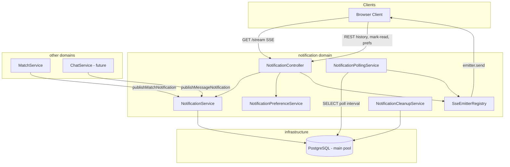
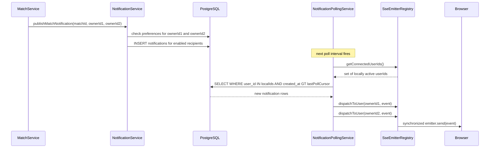
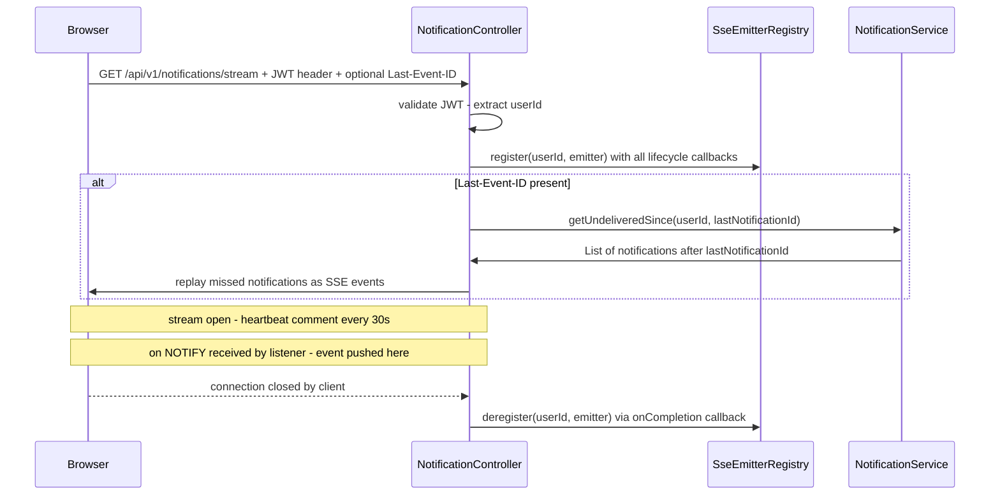
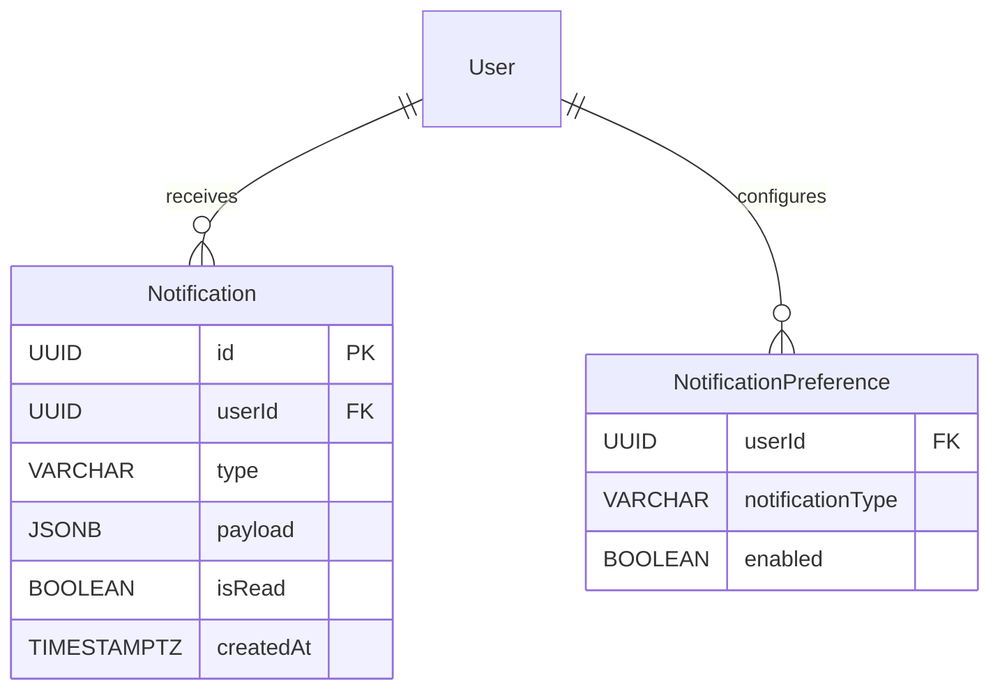

# Design Document — In-App Notifications

## Overview

The in-app-notifications feature delivers real-time browser notifications to authenticated PawMatch owners when key events occur (new match, new incoming message). It introduces a new `notification` domain module following the project's existing domain-driven package structure (`notification/model/`, `notification/service/`, `notification/presentation/`), backed by two new PostgreSQL tables.

Real-time delivery uses `SseEmitter` (Spring WebMVC) for the server→client stream. Multi-node fan-out is achieved through periodic SELECT polling of the `notifications` table; each node independently queries for new notifications for its locally connected users and pushes them to the relevant emitters. A persist-first pattern ensures no notification is lost if the user is offline at delivery time.

**Users**: Casual owners (Marco) and breeding owners (Giulia) receive notifications passively; no active interaction is required beyond opening the app.

### Goals

- Real-time browser notification delivery within 2 seconds for `NEW_MATCH` and `NEW_MESSAGE` events
- Zero notification loss for offline users: missed events replayed on reconnect via `Last-Event-ID`
- Per-user type-level opt-out of notification categories
- Paginated notification history with unread-count badge support
- Horizontally scalable: stateless design via PostgreSQL LISTEN/NOTIFY fan-out

### Non-Goals

- Mobile push notifications (explicitly out of scope, PRD v1)
- WebSocket bidirectional channel (SSE is sufficient for server-only push)
- Email or SMS notifications
- Admin/moderation notification types
- High-throughput broker (Redis, Kafka) — deferred to v2 if LISTEN/NOTIFY becomes a bottleneck

---

## Architecture

### Architecture Pattern & Boundary Map

The notification domain is a self-contained module. It exposes a `NotificationService` interface that other domains (`match`, `chat`) call to publish events. It owns all persistence, delivery, and preference logic internally.



**Key decisions captured in diagram**:
- `NotificationPollingService` polls the `notifications` table on a configurable interval (default 500 ms) using the standard HikariCP pool — no dedicated connection required.
- Each node independently queries only for users with locally registered emitters, then pushes to those emitters via `SseEmitterRegistry`.
- `NotificationCleanupService` runs only on one node at a time, guarded by ShedLock.

**Architecture Integration**:
- Selected pattern: Domain module with layered sub-packages — matches `support`, `match` domains.
- Domain boundary: The `notification` module owns all persistence and delivery; publishing domains call `NotificationService` without knowing delivery mechanics.
- Steering compliance: No global `service/` or `controller/` packages; all components nested under `notification/`.

### Technology Stack & Alignment

| Layer | Choice / Version | Role in Feature | Notes |
|-------|------------------|-----------------|-------|
| SSE Transport | `SseEmitter` (spring-web, Boot 4.0.4) | Server→client push stream | WebMVC-native; no new dep |
| Fan-out Mechanism | DB SELECT polling via Spring Data JPA (existing) | Multi-node event delivery | No new dependency; uses HikariCP pool |
| Cleanup Locking | ShedLock 6.x (`shedlock-spring`, `shedlock-provider-jdbc-template`) | Distributed single-node cleanup job | 2 new pom.xml deps |
| Persistence | Spring Data JPA + PostgreSQL (existing) | Notification + preference storage | 2 new JPA entities |
| Scheduling | Spring `@Scheduled` + `@EnableScheduling` (existing) | 30-day TTL cleanup | ShedLock guard required |
| Logging | `kotlin-logging-jvm` 7.0.3 (existing) | Structured error/event logging | No changes |

> Extended rationale and alternative evaluations are in `research.md` — Architecture Pattern Evaluation section.

---

## System Flows

### Flow 1: Real-Time Notification Delivery



**Key decisions**: INSERT commits first (persist-first); polling service picks up the row on the next interval (default 500 ms). If a node has no active emitter for a user, it skips that user — the notification remains in the DB and is replayed on reconnect via `Last-Event-ID`. Preferences are checked before INSERT — if a user has disabled the type, no record is created.

### Flow 2: SSE Connection and Missed-Event Replay



**Key decisions**: `Last-Event-ID` contains the `notificationId` UUID of the last received event. Replay query: `SELECT * FROM notifications WHERE user_id = :uid AND created_at > (SELECT created_at FROM notifications WHERE id = :lastId) ORDER BY created_at ASC`. Heartbeat sent every 30 s keeps connections alive through proxies and detects stale emitters early.

---

## Requirements Traceability

| Requirement | Summary | Components | Interfaces | Flow |
|-------------|---------|------------|------------|------|
| 1.1 | Match event triggers notification push ≤ 2 s | NotificationService, PostgresNotificationListener, SseEmitterRegistry | `publishMatchNotification` | Flow 1 |
| 1.2 | Message event triggers notification push ≤ 2 s | NotificationService, PostgresNotificationListener, SseEmitterRegistry | `publishMessageNotification` | Flow 1 |
| 1.3 | Real-time delivery without page refresh | SseEmitterRegistry, SseEmitter stream | SSE endpoint | Flow 2 |
| 1.4 | Persist on missed delivery | NotificationService → DB INSERT before NOTIFY | `notifications` table | Flow 1 |
| 1.5 | Reconnect replay via Last-Event-ID | NotificationController, NotificationService | `getUndeliveredSince`, SSE stream endpoint | Flow 2 |
| 2.1–2.2 | Authenticated connection, JWT reject 401 | NotificationController | SSE endpoint | Flow 2 |
| 2.3–2.4 | Connection lifecycle callbacks (onCompletion, onTimeout, onError) | SseEmitterRegistry | `register`, `deregister` | Flow 2 |
| 2.5 | Multi-tab: all emitters receive event | SseEmitterRegistry | `dispatchToUser` iterates list | Flow 1 |
| 2.6 | Cross-node fan-out via DB SELECT polling | NotificationPollingService | `pollAndDispatch` | Flow 1 |
| 3.1–3.4 | Typed payloads (NEW_MATCH, NEW_MESSAGE), no geo, ISO 8601 | NotificationPayload sealed class, NotificationService | SSE event data | — |
| 4.1–4.6 | Notification persistence, history, pagination, mark-read, bulk mark-read, audit retention | NotificationService, NotificationRepository | REST API | — |
| 4.7 | Unread-count endpoint | NotificationService | `GET /unread-count` | — |
| 4.8 | 30-day TTL auto-delete | NotificationCleanupService | `@Scheduled` + ShedLock | — |
| 4.9 | Account deletion cascades | `notifications` FK ON DELETE CASCADE | DB schema | — |
| 5.1–5.5 | Authorization: scoped delivery, 401/403 guards, server-side identity | NotificationController, NotificationService | all endpoints | — |
| 6.1–6.4 | Delivery failure isolation, DB failure isolation, graceful degradation | NotificationService error handling | exception boundaries | — |
| 7.1–7.6 | Per-type preferences CRUD, enabled-by-default on new accounts | NotificationPreferenceService, NotificationPreferenceRepository | `GET/PUT /preferences` | — |

---

## Components & Interface Contracts

### Component Summary

| Component | Domain / Layer | Intent | Req Coverage | Key Dependencies | Contracts |
|-----------|---------------|--------|--------------|------------------|-----------|
| NotificationController | notification / presentation | SSE stream + REST API entry point | 1.3, 1.5, 2.1–2.2, 4.2–4.3, 4.7, 5.2–5.3, 7.5 | NotificationService, NotificationPreferenceService, SseEmitterRegistry | API |
| NotificationService | notification / service | Core logic: publish, persist, query, mark-read | 1.1–1.5, 3.1–3.4, 4.1–4.9, 5.1–5.5, 6.1–6.2 | NotificationRepository, NotificationPreferenceService, JdbcTemplate | Service |
| NotificationPreferenceService | notification / service | Preferences CRUD; preference check | 7.1–7.6 | NotificationPreferenceRepository | Service |
| SseEmitterRegistry | notification / service | In-process emitter lifecycle + synchronized send | 2.1, 2.3–2.6 | SseEmitter (spring-web) | Service, State |
| NotificationPollingService | notification / service | SELECT polls notifications table; dispatches to registry | 1.1–1.2, 2.6 | SseEmitterRegistry, NotificationRepository | Service |
| NotificationCleanupService | notification / service | 30-day TTL delete; ShedLock-guarded | 4.8 | JdbcTemplate, ShedLock | Batch |

---

### notification / presentation

#### NotificationController

| Field | Detail |
|-------|--------|
| Intent | Exposes SSE stream, notification history, mark-read, unread count, and preference endpoints |
| Requirements | 1.3, 1.5, 2.1–2.2, 4.2–4.3, 4.7, 5.2–5.5, 7.5 |

**Responsibilities & Constraints**
- Authenticates every request from `SecurityContextHolder`; rejects with 401 if unauthenticated.
- Never uses client-supplied `userId` from request body — always extracts from authenticated principal.
- `GET /stream` returns `SseEmitter` instance; Spring MVC handles the async response lifecycle.

**Dependencies**
- Inbound: Browser HTTP requests (SSE + REST)
- Outbound: `NotificationService` — persistence queries and mark-read (P0)
- Outbound: `NotificationPreferenceService` — preferences CRUD (P0)
- Outbound: `SseEmitterRegistry` — emitter lifecycle (P0)

**Contracts**: API [x]

##### API Contract

| Method | Endpoint | Request | Response | Errors |
|--------|----------|---------|----------|--------|
| GET | `/api/v1/notifications/stream` | JWT header, optional `Last-Event-ID` | `text/event-stream` (SseEmitter) | 401 |
| GET | `/api/v1/notifications` | `?page=0&size=20` | `NotificationPageResponse` | 401 |
| GET | `/api/v1/notifications/unread-count` | — | `UnreadCountResponse` | 401 |
| PATCH | `/api/v1/notifications/{id}/read` | — | `UnreadCountResponse` | 401, 403, 404 |
| POST | `/api/v1/notifications/mark-all-read` | — | 204 No Content | 401 |
| GET | `/api/v1/notifications/preferences` | — | `NotificationPreferencesDto` | 401 |
| PUT | `/api/v1/notifications/preferences` | `UpdatePreferencesRequest` | `NotificationPreferencesDto` | 400, 401 |

**SSE Event Format**

Each SSE message sent to the client uses the following structure:

```
id: {notificationId as UUID string}
event: notification
data: {NotificationDto as JSON}

```

Heartbeat (every 30 s):

```
: heartbeat

```

**Implementation Notes**
- Integration: Register `onCompletion`, `onTimeout`, `onError` callbacks on every new emitter before returning it; all three must call `SseEmitterRegistry.deregister()`.
- Set `SseEmitter(timeout = 0L)` for no-timeout (relies on browser reconnect + heartbeat detection).
- Validation: `{id}` path variable must be a valid UUID; return 400 otherwise.
- Risks: Auth module not yet built; placeholder for `Authentication` principal extraction must be replaced when security is wired in.

---

### notification / service

#### NotificationService

| Field | Detail |
|-------|--------|
| Intent | Orchestrates notification lifecycle: preference check → persist → NOTIFY → query → mark-read |
| Requirements | 1.1–1.5, 3.1–3.4, 4.1–4.9, 5.1–5.5, 6.1–6.2 |

**Responsibilities & Constraints**
- Called by `MatchService` and `ChatService` to publish events; must not throw exceptions back to callers (Req 6.2).
- Preference check and INSERT must occur within the same transaction; the polling service picks up the committed row on the next interval.
- Enforces user ownership on all queries and mutations (`WHERE user_id = authenticatedUserId`).

**Dependencies**
- Inbound: NotificationController (queries), MatchService (publish), ChatService (publish)
- Outbound: `NotificationRepository` — JPA CRUD (P0)
- Outbound: `NotificationPreferenceService` — preference lookup (P0)

**Contracts**: Service [x]

##### Service Interface

```kotlin
interface NotificationService {
    /** Called by MatchService after mutual match persisted. Fires for both owners. */
    fun publishMatchNotification(matchId: UUID, ownerId1: UUID, ownerId2: UUID)

    /** Called by ChatService after message persisted. Fires for recipient only. */
    fun publishMessageNotification(
        matchId: UUID,
        senderId: UUID,
        recipientId: UUID,
        messagePreview: String,  // truncated to 100 chars by caller or here
    )

    fun getHistory(userId: UUID, pageable: Pageable): Page<NotificationDto>
    fun getUnreadCount(userId: UUID): Int
    fun markAsRead(userId: UUID, notificationId: UUID): Int   // returns updated unread count
    fun markAllAsRead(userId: UUID)
    fun getUndeliveredSince(userId: UUID, afterNotificationId: UUID): List<NotificationDto>
}
```

Preconditions: `userId` is the authenticated principal's ID (extracted by controller, never from request body).
Postconditions: After `publishMatchNotification`, a `Notification` record exists in DB for each enabled recipient.
Invariants: `notification.userId` always equals the authenticated requester for any read operation.

**Implementation Notes**
- Validation: `messagePreview` truncated to 100 chars with trailing `…` if longer.
- Risks: If the notification INSERT is in the same transaction as the match creation and that transaction rolls back, no notification is created — correct behaviour.

---

#### NotificationPreferenceService

| Field | Detail |
|-------|--------|
| Intent | Manages per-user per-type enabled/disabled preference flags |
| Requirements | 7.1–7.6 |

**Responsibilities & Constraints**
- On new user creation, initializes all `NotificationType` entries to `enabled = true`.
- Provides `isEnabled(userId, type)` for fast lookup (used in hot path by `NotificationService`).

**Dependencies**
- Outbound: `NotificationPreferenceRepository` — JPA CRUD (P0)

**Contracts**: Service [x]

##### Service Interface

```kotlin
interface NotificationPreferenceService {
    fun getPreferences(userId: UUID): NotificationPreferencesDto
    fun updatePreferences(userId: UUID, request: UpdatePreferencesRequest): NotificationPreferencesDto
    fun isEnabled(userId: UUID, type: NotificationType): Boolean
    /** Called by user creation flow to seed defaults. */
    fun initializeDefaults(userId: UUID)
}
```

---

#### SseEmitterRegistry

| Field | Detail |
|-------|--------|
| Intent | Node-local thread-safe registry of active SseEmitters; synchronized delivery |
| Requirements | 2.1, 2.3–2.6 |

**Responsibilities & Constraints**
- Stores emitters in `ConcurrentHashMap<UUID, CopyOnWriteArrayList<SseEmitter>>`.
- All `emitter.send()` calls wrapped in a `synchronized(emitterLock)` block where `emitterLock` is a per-emitter `Any` object stored alongside the emitter.
- Background reaper scheduled every 5 minutes removes emitters whose last heartbeat is > 10 minutes ago.

**Dependencies**
- Inbound: `NotificationController` (register/deregister), `PostgresNotificationListener` (dispatchToUser)
- External: `SseEmitter` (spring-web)

**Contracts**: Service [x], State [x]

##### Service Interface

```kotlin
interface SseEmitterRegistry {
    fun register(userId: UUID, emitter: SseEmitter): SseEmitter
    fun deregister(userId: UUID, emitter: SseEmitter)
    /** Sends to all active emitters for userId on this node. Swallows and logs per-emitter failures. */
    fun dispatchToUser(userId: UUID, event: SseEmitter.SseEventBuilder)
    fun sendHeartbeatToAll()
    fun getActiveUserCount(): Int
    /** Returns the set of userIds that have at least one active emitter on this node. */
    fun getConnectedUserIds(): Set<UUID>
}
```

##### State Management

- State model: `ConcurrentHashMap<UUID, CopyOnWriteArrayList<EmitterEntry>>` where `EmitterEntry` holds `(emitter: SseEmitter, lock: Any, registeredAt: Instant, lastHeartbeatAt: Instant)`.
- Persistence & consistency: In-memory only; no persistence. Lost on node restart — reconnect replay (Flow 2) recovers missed notifications.
- Concurrency strategy: `CopyOnWriteArrayList` for concurrent iteration; per-emitter `synchronized` block for sends.

---

#### NotificationPollingService

| Field | Detail |
|-------|--------|
| Intent | Periodically SELECTs new notifications for locally connected users and dispatches them to SseEmitterRegistry |
| Requirements | 1.1–1.2, 2.6 |

**Responsibilities & Constraints**
- Runs a `@Scheduled` task on a configurable interval (default 500 ms).
- On each tick: asks `SseEmitterRegistry` for the set of currently connected `userId`s on this node, then queries `notifications` for rows newer than the in-memory poll cursor for those users.
- Advances the poll cursor to the `MAX(created_at)` of the fetched batch after dispatching.
- Cursor is in-memory; on node restart, the cursor resets to `NOW()` — notifications created before restart are recoverable via the `Last-Event-ID` reconnect replay path.
- Does not interact with any dedicated JDBC connection; uses the standard HikariCP pool via `NotificationRepository`.

**Dependencies**
- Inbound: Spring `@Scheduled` executor
- Outbound: `SseEmitterRegistry.getConnectedUserIds()` (P0)
- Outbound: `SseEmitterRegistry.dispatchToUser` (P0)
- Outbound: `NotificationRepository` — polling query (P0)

**Contracts**: Service [x]

##### Service Interface

```kotlin
interface NotificationPollingService {
    /** Invoked by @Scheduled; queries DB and dispatches to local emitters. */
    fun pollAndDispatch()
}
```

##### Polling Query Contract

- Trigger: `@Scheduled(fixedDelayString = "\${notifications.poll-interval-ms:500}")`
- Input: `connectedUserIds` from `SseEmitterRegistry`; in-memory `lastPollCursor: Instant`
- Query: `SELECT * FROM notifications WHERE user_id IN :userIds AND created_at > :cursor ORDER BY created_at ASC`
- Output: `NotificationDto` list dispatched per user via `SseEmitterRegistry.dispatchToUser`
- Idempotency: Cursor advances only after successful dispatch; a duplicate push on cursor reset is harmless — clients deduplicate by `notificationId`

**Implementation Notes**
- Integration: If `connectedUserIds` is empty, skip the DB query entirely to avoid unnecessary load.
- Risks: On node restart the cursor resets; notifications created during downtime for offline users are already in the DB and replayed via `Last-Event-ID` — no data loss.

---

#### NotificationCleanupService

| Field | Detail |
|-------|--------|
| Intent | Deletes notifications older than 30 days; runs on one node at a time |
| Requirements | 4.8 |

**Contracts**: Batch [x]

##### Batch / Job Contract

- Trigger: `@Scheduled(cron = "0 2 * * *")` — daily at 02:00 server time; guarded by `@SchedulerLock(name = "notificationCleanup", lockAtMostFor = "PT30M")`
- Input: All rows in `notifications` where `created_at < NOW() - INTERVAL '30 days'`
- Output: DELETE executed; row count logged via `kotlin-logging`
- Idempotency: Fully idempotent; safe to re-run

---

## Data Models

### Domain Model

- **Notification** — aggregate root; owned by one `User`; immutable after creation (except `isRead`).
- **NotificationPreference** — value object per `(User, NotificationType)` pair; fully owned by the user.
- Domain event: `NotificationCreatedEvent` — internal Spring `ApplicationEvent` published after INSERT, consumed by `PostgresNotifyPublisher` to issue NOTIFY after commit.



### Physical Data Model

```sql
-- Requires: users(id UUID) table to exist (provided by auth module)

CREATE TABLE notifications (
    id             UUID         PRIMARY KEY DEFAULT gen_random_uuid(),
    user_id        UUID         NOT NULL REFERENCES users(id) ON DELETE CASCADE,
    type           VARCHAR(50)  NOT NULL,         -- NEW_MATCH | NEW_MESSAGE
    payload        JSONB        NOT NULL,
    is_read        BOOLEAN      NOT NULL DEFAULT FALSE,
    created_at     TIMESTAMPTZ  NOT NULL DEFAULT NOW()
);

CREATE INDEX idx_notifications_user_created
    ON notifications (user_id, created_at DESC);

CREATE INDEX idx_notifications_user_unread
    ON notifications (user_id)
    WHERE is_read = FALSE;

-- --------------------------------------------------------

CREATE TABLE notification_preferences (
    user_id            UUID        NOT NULL REFERENCES users(id) ON DELETE CASCADE,
    notification_type  VARCHAR(50) NOT NULL,   -- NEW_MATCH | NEW_MESSAGE
    enabled            BOOLEAN     NOT NULL DEFAULT TRUE,
    PRIMARY KEY (user_id, notification_type)
);

-- --------------------------------------------------------

-- Required by ShedLock (one-time migration)
CREATE TABLE shedlock (
    name       VARCHAR(64)  NOT NULL PRIMARY KEY,
    lock_until TIMESTAMPTZ  NOT NULL,
    locked_at  TIMESTAMPTZ  NOT NULL,
    locked_by  VARCHAR(255) NOT NULL
);
```

**Index rationale**:
- `idx_notifications_user_created`: covers paginated history queries (`ORDER BY created_at DESC` per user).
- `idx_notifications_user_unread`: partial index for `WHERE is_read = FALSE` unread-count queries; small size, fast lookups.

### Data Contracts & Integration

**NotificationDto** (used in SSE events, history API, and replay):

```kotlin
data class NotificationDto(
    val id: UUID,
    val type: NotificationType,           // NEW_MATCH | NEW_MESSAGE
    val payload: NotificationPayload,     // sealed class, see below
    val isRead: Boolean,
    val createdAt: Instant,               // ISO 8601 UTC in JSON serialization
)

sealed class NotificationPayload {
    data class NewMatch(
        val matchId: UUID,
        val matchedDogName: String,
        val matchedDogPhotoUrl: String?,
    ) : NotificationPayload()

    data class NewMessage(
        val matchId: UUID,
        val senderDogName: String,
        val messagePreview: String,       // max 100 chars
    ) : NotificationPayload()
}
```

**NotificationPageResponse**:

```kotlin
data class NotificationPageResponse(
    val content: List<NotificationDto>,
    val totalElements: Long,
    val totalPages: Int,
    val page: Int,
    val size: Int,
)
```

**UnreadCountResponse**:

```kotlin
data class UnreadCountResponse(val unreadCount: Int)
```

**NotificationPreferencesDto / UpdatePreferencesRequest**:

```kotlin
data class NotificationPreferencesDto(
    val newMatch: Boolean,
    val newMessage: Boolean,
)

data class UpdatePreferencesRequest(
    @field:NotNull val newMatch: Boolean?,
    @field:NotNull val newMessage: Boolean?,
)
```

**Serialization**: Jackson Kotlin module (existing) handles `sealed class` and `Instant`; configure `DeserializationFeature.FAIL_ON_UNKNOWN_PROPERTIES = false` for forward-compat.

---

## Error Handling

### Error Strategy

Notification failures are fully isolated from the triggering business transaction. `NotificationService.publish*` methods catch all exceptions internally and log them; they never propagate to `MatchService` or `ChatService` callers (Req 6.1–6.2).

### Error Categories and Responses

| Error | Category | Response |
|-------|----------|----------|
| Unauthenticated request | 401 | `{ "error": "Unauthorized" }` |
| Notification belongs to different user | 403 | `{ "error": "Forbidden" }` |
| Notification not found | 404 | `{ "error": "Notification not found" }` |
| Invalid UUID in path | 400 | Bean validation error response |
| SseEmitter send failure | Internal (5xx suppressed) | Log trace ID; remove emitter from registry; do not propagate |
| DB write failure (notification INSERT) | Internal (5xx suppressed) | Log trace ID; triggering transaction is NOT rolled back |
| PG LISTEN connection drop | Internal (infrastructure) | Log error; exponential backoff reconnect; miss covered by DB replay |
| Cleanup job failure | Internal (scheduled) | Log error with trace ID; ShedLock releases lock after `lockAtMostFor` |

### Monitoring

- All `SseEmitter` send failures logged at `WARN` with `userId` and trace ID via `kotlin-logging`.
- All DB failures within `NotificationService` logged at `ERROR` with trace ID.
- `PostgresNotificationListener` reconnect attempts logged at `WARN`.
- Active emitter count exposed via `SseEmitterRegistry.getActiveUserCount()` (wired to a health/metrics endpoint in a future observability task).

---

## Testing Strategy

### Unit Tests

- `SseEmitterRegistryTest`: register/deregister/concurrent-dispatch; verify send is synchronized; verify stale emitter reaper removes entries.
- `NotificationServiceTest`: preference check short-circuits publish; `markAsRead` returns updated unread count; `getUndeliveredSince` returns correct subset; cross-user access throws 403.
- `NotificationPreferenceServiceTest`: defaults initialized on new user; `isEnabled` returns correct value after update.
- `NotificationCleanupServiceTest`: DELETE issued for records > 30 days; records within 30 days untouched.

### Integration Tests

- **Full delivery flow**: Create match → `publishMatchNotification` → assert `notifications` row inserted → assert SSE emitter received event (use `TestSseClient` stub).
- **Reconnect replay**: Insert notification with `createdAt` before `lastEventId`; assert replay response includes only newer notifications.
- **Authorization boundary**: Attempt `PATCH /{id}/read` for notification belonging to a different user → assert HTTP 403.
- **Preference enforcement**: Disable `NEW_MESSAGE` for user → publish message notification → assert no DB row created for that user.
- **Account deletion cascade**: Delete user → assert all `notifications` and `notification_preferences` rows removed.
- **Cleanup job**: Insert records with `created_at = now() - 31 days` → run cleanup → assert deleted; insert `now() - 29 days` → assert retained.

### Performance

- `SseEmitterRegistry` under 200 concurrent emitters: assert `dispatchToUser` p99 < 50 ms.
- Cleanup job against 1M notification rows: assert completes within ShedLock `lockAtMostFor = 30 min` window.

---

## Security Considerations

- **Authentication**: All endpoints require a valid JWT. The auth module (not yet built) must provide `SecurityContextHolder` principal with `userId: UUID`. Notification endpoints validate this before any operation.
- **Authorization**: Every DB query and mutation scopes to `userId` extracted from the principal. Client-supplied user IDs in request bodies are ignored (Req 5.5).
- **No geo exposure**: `NotificationPayload` sealed classes contain no coordinate fields. `matchedDogPhotoUrl` is a relative or CDN URL, not a location indicator.
- **SSE connection scope**: `SseEmitter` instances are keyed by authenticated `userId`; a user can never receive another user's emitter.

---

## Performance & Scalability

- **Target**: Notification delivered to active client ≤ 2 s from trigger event (NFR-N-01). The LISTEN poll interval (500 ms) + DB INSERT + NOTIFY = expected p99 ~800 ms under normal load.
- **Fan-out scale**: PostgreSQL LISTEN/NOTIFY handles hundreds of notifications/second. v2 migration path to Redis Pub/Sub documented in `research.md` if this ceiling is reached.
- **Emitter cleanup**: Stale emitter reaper prevents memory growth. Max expected emitters per node: active users × avg tabs (1–3).
- **Cleanup job**: Runs at 02:00 daily; batched DELETE with index on `created_at`. For > 10M rows, a cursor-based batch DELETE should be implemented to avoid long-running locks (tracked as a follow-up risk).
