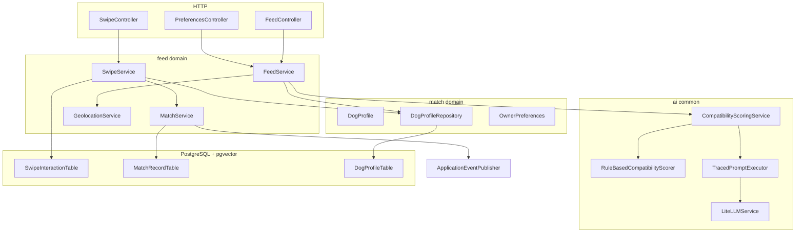
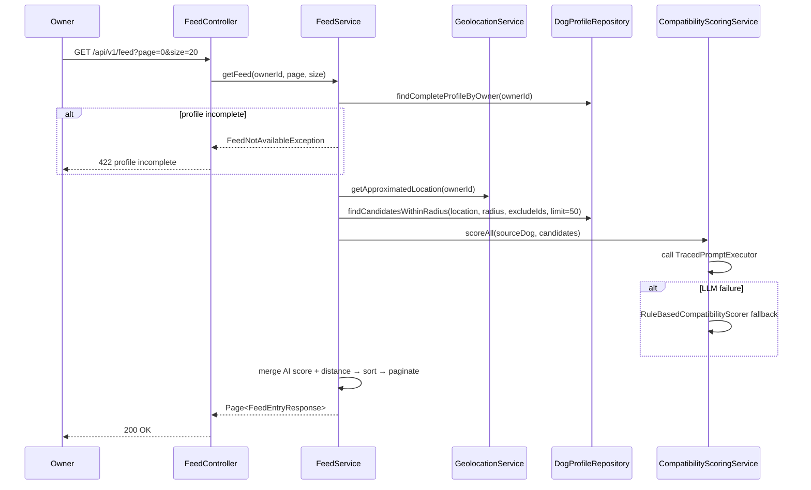
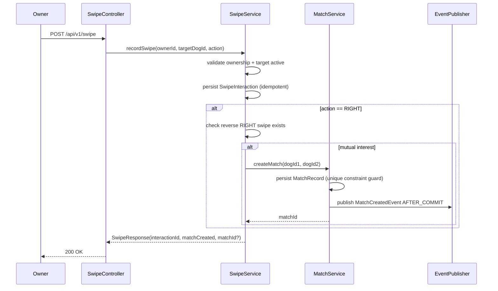
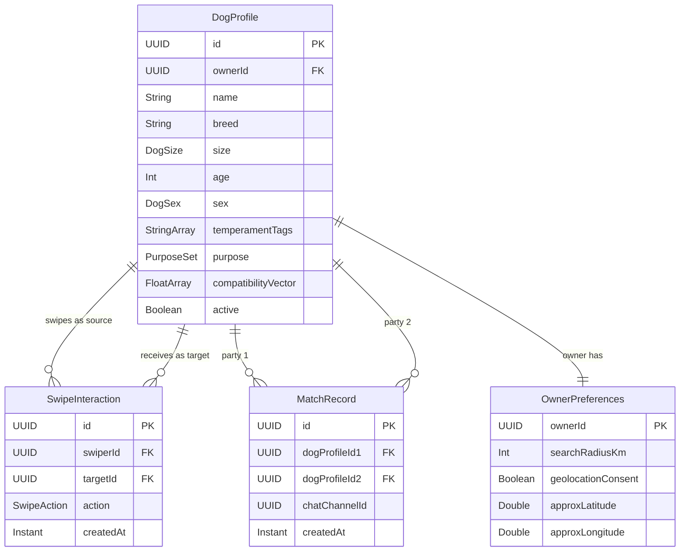

# Design Document — Intelligent Matching Feed

## Overview

The Intelligent Matching Feed delivers the core discovery experience of PawMatch: a ranked, personalized list of nearby dog profiles presented to each owner. Compatibility is determined by an AI scoring engine that combines pgvector ANN retrieval, LLM-based scoring (via the existing `TracedPromptExecutor` / LiteLLM stack), and a deterministic rule-based fallback. Owners interact with the feed via swipe actions; a mutual right-swipe atomically creates a Match record and publishes a domain event to unlock the owner chat.

The feature is a greenfield implementation that extends the existing `match/` domain with a new `feed/` domain module, following the project's established `model/ → service/ → presentation/` layered structure. It introduces the first JPA persistence layer (entities, repositories, Liquibase migrations) and the first use of pgvector in the project.

### Goals

- Serve a paginated, compatibility-ranked feed with p95 ≤ 500 ms.
- Score candidates using the AI engine (LiteLLM/Langfuse) with automatic fallback to rule-based scoring on failure.
- Record swipe interactions idempotently and detect mutual matches atomically.
- Enforce geolocation privacy: coordinates stored at ≥ 500 m approximation, never returned in API responses.
- Gate feed access behind a complete dog profile.

### Non-Goals

- Owner authentication and dog profile creation (separate specs).
- In-app notification delivery (F-05 — consumes the `MatchCreatedEvent` published here).
- Owner chat implementation (F-04 — uses the chat channel ID placed in `MatchRecord`).
- Superlike action (deferred; see Open Questions Q4 in requirements).
- Mobile push notifications.

---

## Architecture

### Existing Architecture Analysis

The existing codebase provides:
- `LiteLLMService` — HTTP exchange client for `/chat/completions` and `/embeddings`.
- `TracedPromptExecutor` — Langfuse-traced, TTL-cached, injection-safe LLM prompt executor.
- `MiniRagService` — In-memory RAG with cosine similarity (in-process, not pgvector).
- `match/model/Dog` and `match/service/DogMatcherService` — prototype stubs with no JPA, explicitly marked buggy; superseded by this feature.
- No JPA entities, no database tables, no event infrastructure exist yet.

### Architecture Pattern & Boundary Map



**Architecture Integration**:
- Selected pattern: Domain-driven layered modules — consistent with `structure.md` (`match/`, `support/`, `ai/` precedents).
- Domain boundaries: `feed/` owns swipe and match lifecycle; `match/` owns the `DogProfile` aggregate; `ai/common/` owns AI scoring infrastructure.
- Existing patterns preserved: `@Service` / `@RestController` pair per domain, `suspend fun` for async AI calls, `TracedPromptExecutor` for all LLM interactions.
- New components rationale: `GeolocationService` isolates privacy-sensitive coordinate handling; `CompatibilityScoringService` encapsulates AI + fallback scoring behind a single interface.

### Technology Stack

| Layer | Choice / Version | Role in Feature | Notes |
|-------|------------------|-----------------|-------|
| Backend | Kotlin 2.x + Spring Boot 4 (WebMVC) | REST controllers, services, JPA repositories | Existing stack |
| ORM | Spring Data JPA + Hibernate 6.4+ | Entity mapping, vector search queries | Add `hibernate-vector` module |
| Vector DB | PostgreSQL + pgvector extension | ANN candidate retrieval via `compatibilityVector` | New; requires Liquibase migration |
| Geo filtering | PostgreSQL `earthdistance` + `cube` extensions | Server-side radius filtering | New; requires Liquibase migration |
| AI scoring | LiteLLM proxy (existing) via `TracedPromptExecutor` | Compatibility score 0–100 per candidate | Reuse existing without change |
| Observability | Langfuse (existing) | Prompt tracing for scoring calls | Reuse existing; new prompt template needed |
| Schema migrations | Liquibase (existing convention) | Tables, indexes, extensions | New changesets only |
| Events | Spring `ApplicationEventPublisher` | `MatchCreatedEvent` dispatch post-commit | No external broker needed in v1 |

---

## System Flows

### Feed Request Flow



### Swipe & Match Flow



---

## Requirements Traceability

| Requirement | Summary | Components | Interfaces | Flows |
|-------------|---------|------------|------------|-------|
| 1.1 | Block feed if profile incomplete | FeedService, DogProfileRepository | `getFeed` checks `isProfileComplete` | Feed Request Flow |
| 1.2 | Grant feed access once profile complete | FeedService | Stateless check per request | Feed Request Flow |
| 1.3 | Profile completeness definition | DogProfile entity | `isComplete` computed property | — |
| 1.4 | Suspend feed on profile deactivation | FeedService, DogProfileRepository | Same completeness gate | — |
| 2.1 | Ranked paginated feed | FeedService | `getFeed` returns `Page<FeedEntryResponse>` sorted desc by score | Feed Request Flow |
| 2.2 | Exclude own profile | DogProfileRepository | `excludeIds` param includes ownerId | Feed Request Flow |
| 2.3 | Exclude already-swiped profiles | DogProfileRepository, SwipeRepository | `excludeIds` includes swiped targets | Feed Request Flow |
| 2.4 | Exclude already-matched profiles | DogProfileRepository, MatchRepository | `excludeIds` includes matched profiles | Feed Request Flow |
| 2.5 | Empty list with status indicator | FeedService | `Page` with empty content + `noMoreCandidates` flag | Feed Request Flow |
| 2.6 | p95 ≤ 500 ms | FeedService (shortlist strategy) | — | NFR-P1 |
| 3.1 | AI engine invoked per candidate | CompatibilityScoringService | `scoreAll(source, candidates)` | Feed Request Flow |
| 3.2 | Score 0–100 | CompatibilityScoringService | `CompatibilityScore(value: Int)` value object | — |
| 3.3 | Multi-signal scoring | CompatibilityScoringService | Prompt includes breed, size, temperament, purpose, distance | — |
| 3.4 | Purpose mismatch penalty | CompatibilityScoringService (prompt + rule scorer) | Prompt instruction + rule fallback | — |
| 3.5 | Langfuse prompt at runtime | TracedPromptExecutor (existing) | Reused as-is | — |
| 3.6 | AI failure → rule-based fallback + log | CompatibilityScoringService | Catches exception, calls `RuleBasedCompatibilityScorer` | — |
| 4.1 | Radius 0–100 km geo filter | DogProfileRepository, GeolocationService | `earth_distance` native query | Feed Request Flow |
| 4.2 | Consent-gated precision | GeolocationService | Falls back to city-level on no consent | — |
| 4.3 | Configurable default radius | OwnerPreferences entity | `searchRadius` field with platform default | — |
| 5.1 | Record right-swipe | SwipeService | `recordSwipe` persists `SwipeInteraction` | Swipe & Match Flow |
| 5.2 | Record left-swipe, exclude future | SwipeService, DogProfileRepository | LEFT swipe added to `excludeIds` set | Swipe & Match Flow |
| 5.3 | Inactive target profile error | SwipeService | 404 if target not found or deactivated | Swipe & Match Flow |
| 5.4 | Idempotent swipe | SwipeRepository | Unique constraint on (swiperId, targetId); upsert semantics | Swipe & Match Flow |
| 5.5 | Swipe response ≤ 200 ms | SwipeService (no AI call) | — | NFR-P2 |
| 6.1 | Create Match on mutual right-swipe | MatchService | `createMatch` called by SwipeService | Swipe & Match Flow |
| 6.2 | Publish MatchCreatedEvent | MatchService, ApplicationEventPublisher | `@TransactionalEventListener(AFTER_COMMIT)` | Swipe & Match Flow |
| 6.3 | At most one Match per pair | MatchRecord entity | Unique constraint on normalized (id1, id2) | — |
| 6.4 | Unlock chat channel | MatchRecord | `chatChannelId` set on creation | — |
| 6.5 | Rollback on Match creation failure | MatchService, SwipeService | `@Transactional` wraps swipe + match | Swipe & Match Flow |
| 7.1 | Validate radius 0–100 | FeedService / PreferencesController | Bean validation `@Min(0) @Max(100)` | — |
| 7.2 | 400 on invalid radius | PreferencesController | Standard Spring validation error response | — |
| 7.3 | Immediate radius application | FeedService | Reads `OwnerPreferences.searchRadius` per request | — |
| 7.4 | Persist radius preference | OwnerPreferences entity | JPA-persisted field | — |

---

## Components and Interfaces

### Summary

| Component | Domain/Layer | Intent | Req Coverage | Key Dependencies | Contracts |
|-----------|--------------|--------|--------------|------------------|-----------|
| FeedController | feed/presentation | Feed and preferences REST endpoints | 1, 2, 7 | FeedService (P0) | API |
| SwipeController | feed/presentation | Swipe action REST endpoint | 5, 6 | SwipeService (P0) | API |
| FeedService | feed/service | Feed orchestration: geo filter → ANN → AI score → paginate | 1, 2, 3, 4, 7 | DogProfileRepository (P0), GeolocationService (P0), CompatibilityScoringService (P0) | Service |
| SwipeService | feed/service | Swipe recording and mutual match detection | 5, 6 | SwipeRepository (P0), MatchService (P0), DogProfileRepository (P1) | Service |
| MatchService | feed/service | Atomic match creation and event publishing | 6 | MatchRepository (P0), ApplicationEventPublisher (P0) | Service, Event |
| GeolocationService | feed/service | Coordinate approximation and distance logic | 4 | OwnerPreferences repository (P0) | Service |
| CompatibilityScoringService | ai/common/service | AI scoring with rule-based fallback | 3 | TracedPromptExecutor (P0), RuleBasedCompatibilityScorer (P0) | Service |
| RuleBasedCompatibilityScorer | ai/common/service | Deterministic fallback scorer | 3.6 | — | Service |
| DogProfileRepository | match/repository | pgvector ANN search + geo filter | 1, 2, 4 | PostgreSQL + pgvector (P0) | State |
| SwipeRepository | feed/repository | Swipe interaction persistence | 5 | PostgreSQL (P0) | State |
| MatchRepository | feed/repository | Match record persistence | 6 | PostgreSQL (P0) | State |

---

### feed/presentation

#### FeedController

| Field | Detail |
|-------|--------|
| Intent | Exposes `GET /api/v1/feed` and `PATCH /api/v1/me/search-radius` |
| Requirements | 1.1, 2.1, 2.5, 7.1, 7.2, 7.3, 7.4 |

**Responsibilities & Constraints**
- Extracts `ownerId` from validated JWT (Spring Security principal).
- Delegates all business logic to `FeedService`.
- Maps `FeedNotAvailableException` → 422; validation errors → 400.

**Dependencies**
- Outbound: `FeedService` — feed retrieval and radius update (P0).

**Contracts**: API [x]

##### API Contract

| Method | Endpoint | Request | Response | Errors |
|--------|----------|---------|----------|--------|
| GET | /api/v1/feed | `?page=0&size=20` | `FeedPageResponse` | 401, 422 (incomplete profile) |
| PATCH | /api/v1/me/search-radius | `SearchRadiusRequest` | 204 No Content | 400 (invalid radius), 401 |

---

#### SwipeController

| Field | Detail |
|-------|--------|
| Intent | Exposes `POST /api/v1/swipe` |
| Requirements | 5.1, 5.2, 5.3, 5.4, 6.1, 6.2 |

**Dependencies**
- Outbound: `SwipeService` — swipe recording (P0).

**Contracts**: API [x]

##### API Contract

| Method | Endpoint | Request | Response | Errors |
|--------|----------|---------|----------|--------|
| POST | /api/v1/swipe | `SwipeRequest` | `SwipeResponse` | 400, 401, 403 (ownership), 404 (target gone) |

---

### feed/service

#### FeedService

| Field | Detail |
|-------|--------|
| Intent | Orchestrates feed generation: profile gate → geo filter → ANN retrieval → AI scoring → pagination |
| Requirements | 1.1, 1.2, 1.3, 1.4, 2.1, 2.2, 2.3, 2.4, 2.5, 2.6, 3.1, 3.3, 4.1, 4.2, 4.3, 7.3, 7.4 |

**Responsibilities & Constraints**
- Reads requesting dog profile; throws `FeedNotAvailableException` if incomplete.
- Loads excluded IDs (already-swiped LEFT/RIGHT + already-matched + own) before querying.
- Delegates geo-filtered ANN candidate retrieval to `DogProfileRepository.findCandidatesWithinRadius(...)`.
- Calls `CompatibilityScoringService.scoreAll()` on the shortlist (top-N, default 50).
- Merges AI score (weighted 70%) + normalised inverse distance (30%) → final score; sorts descending; returns `Page<FeedEntryResponse>`.
- Does not own transactions beyond read operations; AI scoring failures are handled inside `CompatibilityScoringService`.

**Dependencies**
- Inbound: `FeedController` (P0).
- Outbound: `DogProfileRepository` — candidate retrieval (P0); `GeolocationService` — approximated location (P0); `CompatibilityScoringService` — per-candidate AI score (P0); `SwipeRepository` — excluded IDs read (P1); `MatchRepository` — excluded IDs read (P1).

**Contracts**: Service [x]

##### Service Interface

```kotlin
interface FeedService {
    suspend fun getFeed(ownerId: UUID, page: Int, size: Int): FeedPageResponse
    fun updateSearchRadius(ownerId: UUID, radiusKm: Int)
}
```

- Preconditions: `ownerId` resolves to a registered owner with a dog profile.
- Postconditions: Returns a page of `FeedEntryResponse` sorted desc by `compatibilityScore`.
- Invariants: Never returns own profile, previously swiped profiles, or already-matched profiles.

**Implementation Notes**
- Shortlist size (default 50) configurable via `app.feed.shortlist-size` property.
- Score weights (AI: 70%, distance: 30%) configurable via `app.feed.score-weights`.
- The `Page` implementation uses Spring Data `PageImpl`; the total count is set to shortlist size to avoid an expensive COUNT query.

---

#### SwipeService

| Field | Detail |
|-------|--------|
| Intent | Records swipe interactions idempotently and detects mutual match condition |
| Requirements | 5.1, 5.2, 5.3, 5.4, 5.5, 6.1, 6.5 |

**Responsibilities & Constraints**
- Validates that the requesting owner owns the source dog profile (403 on violation).
- Checks target dog profile is active (404 on deactivation).
- Persists `SwipeInteraction` using an upsert; returns existing record on duplicate (idempotent).
- On RIGHT swipe: queries for reverse RIGHT swipe; if found, delegates to `MatchService.createMatch()` within the same transaction.
- Entire swipe + match creation wrapped in a single `@Transactional` boundary; rollback on any failure.

**Dependencies**
- Inbound: `SwipeController` (P0).
- Outbound: `SwipeRepository` — persist interaction (P0); `MatchService` — match creation on mutual interest (P0); `DogProfileRepository` — ownership + active check (P1).

**Contracts**: Service [x]

##### Service Interface

```kotlin
interface SwipeService {
    fun recordSwipe(ownerId: UUID, targetDogProfileId: UUID, action: SwipeAction): SwipeResponse
}
```

- Preconditions: `ownerId` owns a dog profile; target dog profile exists and is active.
- Postconditions: `SwipeInteraction` persisted; if mutual RIGHT, `MatchRecord` exists.
- Invariants: Idempotent — same (swiperId, targetId, action) always returns same `interactionId`.

---

#### MatchService

| Field | Detail |
|-------|--------|
| Intent | Creates `MatchRecord` atomically and publishes `MatchCreatedEvent` |
| Requirements | 6.1, 6.2, 6.3, 6.4, 6.5 |

**Responsibilities & Constraints**
- Creates `MatchRecord` with normalized ID pair `(min(id1,id2), max(id1,id2))` to enforce uniqueness.
- DB unique constraint on `(dog_profile_id_1, dog_profile_id_2)` is the idempotency guard.
- Publishes `MatchCreatedEvent` via `ApplicationEventPublisher`; listener must use `@TransactionalEventListener(phase = AFTER_COMMIT)` to avoid phantom events.
- Sets `chatChannelId = UUID.randomUUID()` on the new `MatchRecord`; F-04 uses this to initialise the chat.

**Dependencies**
- Inbound: `SwipeService` (P0).
- Outbound: `MatchRepository` — persist match (P0); `ApplicationEventPublisher` — domain event (P0).

**Contracts**: Service [x] Event [x]

##### Service Interface

```kotlin
interface MatchService {
    fun createMatch(dogProfileId1: UUID, dogProfileId2: UUID): MatchRecord
}
```

##### Event Contract

- Published event: `MatchCreatedEvent(matchId, dogProfileId1, ownerId1, dogProfileId2, ownerId2, chatChannelId, occurredAt)`
- Delivery: Synchronous in-process via `ApplicationEventPublisher`; dispatched `AFTER_COMMIT`.
- Ordering: Single event per match; no ordering guarantees needed for v1.

---

#### GeolocationService

| Field | Detail |
|-------|--------|
| Intent | Applies ≥ 500 m coordinate approximation and provides distance utilities |
| Requirements | 4.1, 4.2, 4.3 |

**Responsibilities & Constraints**
- Applies 0.005° grid snap before coordinates are stored (≈ 500 m at mid-latitudes).
- Never returns raw coordinates in any response DTO.
- When owner has not granted geolocation consent, returns city-centroid coordinates.
- Distance calculations use PostgreSQL `earth_distance` via native queries; not performed in application code.

**Contracts**: Service [x]

##### Service Interface

```kotlin
interface GeolocationService {
    fun approximate(latitude: Double, longitude: Double): ApproximatedCoordinates
    fun cityFallback(cityName: String): ApproximatedCoordinates
}

data class ApproximatedCoordinates(val latitude: Double, val longitude: Double)
```

---

### ai/common/service

#### CompatibilityScoringService

| Field | Detail |
|-------|--------|
| Intent | Scores candidate dog profiles 0–100 using the AI engine with a rule-based fallback |
| Requirements | 3.1, 3.2, 3.3, 3.4, 3.5, 3.6 |

**Responsibilities & Constraints**
- Calls `TracedPromptExecutor.execute()` with prompt ID `compatibility-score` and variables derived from source + target `DogProfile`.
- Parses the LLM response to extract an integer score 0–100.
- On any exception from `TracedPromptExecutor`: logs with trace ID, activates `RuleBasedCompatibilityScorer`.
- The scoring prompt is managed in Langfuse (not hardcoded); prompt ID is configurable via `app.ai.prompts.compatibility-score-id`.

**Dependencies**
- Outbound: `TracedPromptExecutor` — AI scoring (P0); `RuleBasedCompatibilityScorer` — fallback (P0).

**Contracts**: Service [x]

##### Service Interface

```kotlin
interface CompatibilityScoringService {
    suspend fun scoreAll(
        source: DogProfile,
        candidates: List<DogProfile>
    ): Map<UUID, CompatibilityScore>
}

@JvmInline
value class CompatibilityScore(val value: Int) {
    init { require(value in 0..100) }
}
```

---

#### RuleBasedCompatibilityScorer

| Field | Detail |
|-------|--------|
| Intent | Deterministic fallback scorer using breed matrix, size, temperament, and purpose signals |
| Requirements | 3.6 |

**Responsibilities & Constraints**
- Does not call any external service; must complete synchronously in < 1 ms per pair.
- Signal weights: breed/size affinity 35%, temperament overlap 35%, purpose alignment 20%, age proximity 10%.
- Purpose mismatch (no overlap between source.purpose and target.purpose) applies a 30-point penalty.

**Contracts**: Service [x]

##### Service Interface

```kotlin
interface RuleBasedCompatibilityScorer {
    fun score(source: DogProfile, target: DogProfile): CompatibilityScore
}
```

---

### match/repository

#### DogProfileRepository

| Field | Detail |
|-------|--------|
| Intent | Spring Data JPA repository for `DogProfile` with pgvector ANN + geo-radius query |
| Requirements | 1.1, 2.2, 2.3, 2.4, 4.1 |

**Responsibilities & Constraints**
- Provides `findCandidatesWithinRadius(...)` — a native query combining `earth_distance` geo filter and pgvector `<=>` cosine similarity ordering.
- Provides `searchByCompatibilityVectorNear(embedding, limit)` for pure ANN retrieval.
- All geo queries use approximated coordinates; the repository never receives or returns exact coordinates.

**Contracts**: State [x]

##### State Management

- State model: `DogProfile` JPA entity; `compatibilityVector: FloatArray` mapped via `@JdbcTypeCode(SqlTypes.VECTOR)`.
- Persistence: PostgreSQL table `dog_profiles`; HNSW index on `compatibility_vector`.
- Concurrency: Reads are non-transactional (read-only); writes (profile creation/update) use optimistic locking via `@Version`.

---

## Data Models

### Domain Model

- **`DogProfile`** (Aggregate Root in `match/` domain): represents a dog's identity, attributes, and compatibility vector. Owned by exactly one owner (1:1 via `ownerId`). A profile is "complete" when all mandatory fields are non-null/non-empty.
- **`SwipeInteraction`** (Entity in `feed/` domain): records a single directional interest decision. Immutable after creation.
- **`MatchRecord`** (Aggregate Root in `feed/` domain): represents an established mutual match. Created once per dog pair; owns the `chatChannelId`.
- **`OwnerPreferences`** (Entity in `match/` or `feed/` domain): holds the owner-level `searchRadius` and geolocation consent flag.
- **`MatchCreatedEvent`** (Domain Event): published after `MatchRecord` is committed; carries IDs needed by F-04 and F-05.



### Physical Data Model

**Table: `dog_profiles`**

| Column | Type | Constraints |
|--------|------|-------------|
| id | UUID | PK |
| owner_id | UUID | NOT NULL, FK → owners |
| name | VARCHAR(100) | NOT NULL |
| breed | VARCHAR(100) | NOT NULL |
| size | VARCHAR(20) | NOT NULL (enum: SMALL, MEDIUM, LARGE, XLARGE) |
| age | SMALLINT | NOT NULL, CHECK (age >= 0) |
| sex | VARCHAR(10) | NOT NULL (enum: MALE, FEMALE) |
| temperament_tags | TEXT[] | NOT NULL, CHECK (cardinality >= 1) |
| purpose | TEXT[] | NOT NULL, CHECK (cardinality >= 1) |
| compatibility_vector | VECTOR(1536) | NULLABLE (null until embedding generated) |
| active | BOOLEAN | NOT NULL DEFAULT TRUE |
| version | BIGINT | Optimistic lock |

Indexes:
- HNSW index on `compatibility_vector` using cosine distance.
- B-tree on `owner_id`.
- B-tree on `active`.

**Table: `owner_preferences`**

| Column | Type | Constraints |
|--------|------|-------------|
| owner_id | UUID | PK, FK → owners |
| search_radius_km | SMALLINT | NOT NULL DEFAULT 30, CHECK (0..100) |
| geolocation_consent | BOOLEAN | NOT NULL DEFAULT FALSE |
| approx_latitude | DOUBLE PRECISION | NULLABLE |
| approx_longitude | DOUBLE PRECISION | NULLABLE |

**Table: `swipe_interactions`**

| Column | Type | Constraints |
|--------|------|-------------|
| id | UUID | PK |
| swiper_id | UUID | NOT NULL, FK → dog_profiles |
| target_id | UUID | NOT NULL, FK → dog_profiles |
| action | VARCHAR(10) | NOT NULL (enum: LEFT, RIGHT) |
| created_at | TIMESTAMPTZ | NOT NULL DEFAULT now() |

Indexes:
- Unique on `(swiper_id, target_id)` — idempotency guard.
- B-tree on `(swiper_id, action)` — fast exclusion set lookup.
- B-tree on `(target_id, action)` — fast reverse swipe lookup.

**Table: `match_records`**

| Column | Type | Constraints |
|--------|------|-------------|
| id | UUID | PK |
| dog_profile_id_1 | UUID | NOT NULL, FK → dog_profiles |
| dog_profile_id_2 | UUID | NOT NULL, FK → dog_profiles |
| chat_channel_id | UUID | NOT NULL |
| created_at | TIMESTAMPTZ | NOT NULL DEFAULT now() |

Indexes:
- Unique on `(dog_profile_id_1, dog_profile_id_2)` — prevents duplicate matches; IDs normalized as `(min, max)`.

**Liquibase migrations required**:
1. Enable extensions: `vector`, `cube`, `earthdistance`.
2. Create `dog_profiles`, `owner_preferences`, `swipe_interactions`, `match_records` tables.
3. Create HNSW index on `dog_profiles.compatibility_vector`.

### Data Contracts & Integration

**API Response DTOs** (never contain raw coordinates):

```kotlin
data class FeedEntryResponse(
    val dogProfileId: UUID,
    val name: String,
    val breed: String,
    val size: DogSize,
    val age: Int,
    val temperamentTags: List<String>,
    val purpose: Set<Purpose>,
    val compatibilityScore: Int,        // 0-100
    val distanceKm: Double,             // approximate (rounded to 1 decimal)
    val photos: List<String>
)

data class FeedPageResponse(
    val content: List<FeedEntryResponse>,
    val page: Int,
    val size: Int,
    val noMoreCandidates: Boolean
)

data class SwipeRequest(
    val targetDogProfileId: UUID,
    val action: SwipeAction               // LEFT | RIGHT
)

data class SwipeResponse(
    val interactionId: UUID,
    val matchCreated: Boolean,
    val matchId: UUID?
)

data class SearchRadiusRequest(
    @field:Min(0) @field:Max(100)
    val radiusKm: Int
)
```

**Event Schema**:

```kotlin
data class MatchCreatedEvent(
    val matchId: UUID,
    val dogProfileId1: UUID,
    val ownerId1: UUID,
    val dogProfileId2: UUID,
    val ownerId2: UUID,
    val chatChannelId: UUID,
    val occurredAt: Instant
)
```

---

## Error Handling

### Error Strategy

Validate at controller boundaries (Bean Validation); translate domain exceptions to HTTP status codes via a `@ControllerAdvice`; degrade gracefully on AI failures.

### Error Categories and Responses

| Exception | Category | HTTP | Response Body |
|-----------|----------|------|---------------|
| `FeedNotAvailableException` | Business logic | 422 | `{ "error": "dog_profile_incomplete", "missingFields": [...] }` |
| `OwnershipViolationException` | Security | 403 | Standard Spring Security 403 |
| `DogProfileNotFoundException` | User | 404 | `{ "error": "dog_profile_not_found" }` |
| `InvalidSwipeTargetException` | User | 400 | `{ "error": "swipe_target_inactive" }` |
| `ConstraintViolationException` (duplicate swipe) | Idempotency | 200 | Returns existing `SwipeResponse` |
| AI scoring failure | System (handled) | — | Transparent fallback; 5xx not returned |
| DB error in `createMatch` | System | 500 | Rolled back; `{ "error": "internal_error", "traceId": "..." }` |

### Monitoring

- All 5xx errors logged with `traceId` via `kotlin-logging-jvm`; structured JSON format.
- `CompatibilityScoringService` logs each fallback activation at `WARN` level with prompt ID and exception message.
- Langfuse traces every AI scoring call automatically via `TracedPromptExecutor`.

---

## Testing Strategy

### Unit Tests

- `RuleBasedCompatibilityScorer`: breed/size match, temperament overlap, purpose mismatch penalty, edge cases (empty tags, 0-radius).
- `GeolocationService.approximate()`: assert output differs from input by 400–1000 m across a range of coordinates.
- `FeedService` score merging: weighted combination correctness; empty shortlist → `noMoreCandidates = true`.
- `MatchService.createMatch()`: normalized ID pair ordering; `MatchCreatedEvent` payload completeness.
- `SwipeService` idempotency: duplicate right-swipe returns same `interactionId`.

### Integration Tests

- `DogProfileRepository.findCandidatesWithinRadius()`: uses TestContainers (PostgreSQL + pgvector); verifies exclusion of own profile, swiped profiles, and geo boundary.
- `SwipeService` + `MatchService` mutual match flow: two sequential right-swipes in a real DB transaction; assert one `MatchRecord` and one event published.
- `FeedController` profile gate: GET /api/v1/feed with incomplete profile → 422.
- `PreferencesController` radius validation: PATCH with radius=150 → 400; radius=0 → 204.

### Performance Tests

- Feed endpoint: 50 concurrent requests, ≥ 100 candidate profiles per owner → p95 ≤ 500 ms.
- Swipe endpoint: 200 concurrent swipes → p95 ≤ 200 ms; no duplicate `MatchRecord` rows.
- pgvector ANN query with HNSW index vs. sequential scan: verify ≥ 10x speedup at 10k profiles.

---

## Security Considerations

- JWT validation and `ownerId` extraction delegated to Spring Security filter chain (existing).
- Ownership check in `SwipeService` — server-side comparison of `ownerId` from JWT with `DogProfile.ownerId`; 403 on mismatch. Never trust client-provided `ownerId`.
- `FeedEntryResponse` explicitly omits coordinates; DTO fields reviewed at each PR.
- Prompt injection: all LLM variable inputs pass through existing `PromptSanitizer` in `TracedPromptExecutor`.
- `MatchCreatedEvent` contains `ownerId` fields — consuming services must not forward these to other owners.

## Performance & Scalability

- Feed p95 ≤ 500 ms achieved by: HNSW index for ANN, geo pre-filter to reduce candidate pool, AI scoring on shortlist of 50 only, optional score cache (5 min TTL keyed on `(sourceId, targetId)`).
- Swipe p95 ≤ 200 ms: single DB write + one index lookup; no AI calls.
- The service is stateless; `OwnerPreferences` read per request from DB (cache optional via Spring Cache + Caffeine for radius/consent).
- pgvector HNSW index parameters (`m`, `ef_construction`) to be tuned post-MVP based on recall/latency benchmarks.

---

## Architecture Options Considered

### Option 1: Domain-driven modules (selected)
New `feed/` domain module alongside the existing `match/` domain, following the established `model/ → service/ → presentation/` pattern.

**Advantages:**
- Consistent with `structure.md` precedents (`match/`, `support/`) — zero new architectural concepts; every developer already understands the pattern.
- Clear ownership seams: `feed/` owns swipe/match lifecycle, `match/` owns `DogProfile` aggregate — no entity ownership conflicts during parallel development.
- `FeedService`, `SwipeService`, and `MatchService` can be developed in parallel without file-level merge conflicts across domain boundaries.

**Disadvantages:**
- Introduces one cross-domain read: `FeedService` injects `DogProfileRepository` (owned by `match/`) — slightly violates strict domain encapsulation.
- Two packages to navigate: developers tracing a swipe flow must cross from `feed/` into `match/` for entity definitions.
- `DogProfile` placement in `match/` may feel disconnected from the feed context where it is most heavily used.

### Option 2: Single `match/` extension
Expand the existing `match/` domain to contain feed, swipe, and match logic alongside the existing `DogMatcherService` stub.

**Advantages:**
- All related code in one package — no cross-domain imports needed.
- Smaller package footprint; fewer new directories.
- Existing `DogMatcherService` stub can be incrementally improved in place.

**Disadvantages:**
- Creates a bloated `match/` domain with three distinct responsibilities (profile management, feed orchestration, swipe lifecycle) — violates single-responsibility and makes future extraction more expensive.
- `DogMatcherService` is explicitly marked buggy; inheriting its package risks scope creep and unintended coupling with legacy stubs.
- Parallel implementation of feed and swipe tasks conflicts on the same package, increasing merge risk.

### Option 3: Hexagonal / Ports & Adapters
Core domain (scoring, match rules) isolated behind port interfaces; infrastructure (JPA, LiteLLM, pgvector) wired through adapters.

**Advantages:**
- Core logic is fully infrastructure-independent — unit-testable without Spring context or database.
- Adapter swap (e.g., replace pgvector with a dedicated vector DB) does not touch the domain layer.
- Clear separation of domain events from infrastructure side-effects.

**Disadvantages:**
- Requires building out an adapter layer (~4 adapters: JPA, LiteLLM, Langfuse, geo) before any business logic can be exercised end-to-end — increases initial development effort.
- Team has no prior hexagonal code in this repo; introduces an unfamiliar pattern alongside a greenfield JPA implementation.
- For v1 scale (single service, single DB), the indirection adds measurable overhead with no immediate benefit.

**Recommendation:** Option 1 (domain-driven modules) — it is the lowest-risk choice that is consistent with the existing codebase, enables parallel task delivery, and defers architectural complexity until the system demonstrates the need for it. See ADR below.

---

## Architecture Decision Record

See: [docs/adr/ADR-001-feed-domain-module-placement.md](../../../docs/adr/ADR-001-feed-domain-module-placement.md)

**Summary:**
- **Status**: Proposed
- **Decision**: Implement the Intelligent Matching Feed as a new `feed/` domain module, following the existing layered domain pattern, with `DogProfile` remaining in `match/`.
- **Key trade-off accepted**: One cross-domain read dependency (`FeedService` → `DogProfileRepository`) in exchange for zero merge conflicts during parallel task implementation and full consistency with existing architectural patterns.
- **NFRs affected**: NFR-SC1 (stateless, horizontally scalable), NFR-T1 (Kotlin + Spring Boot, WebMVC).

---

## Corner Cases

### Input Boundary Cases

| Scenario | Expected Behaviour | Req Coverage |
|----------|--------------------|--------------|
| `GET /api/v1/feed` with `page` or `size` as negative integer | Spring `@Validated` rejects with 400; `FeedService` never invoked | 2.1 |
| `PATCH /api/v1/me/search-radius` with `radiusKm = 0` | Valid; accepted and persisted; next feed uses the 0 km radius, returning empty list with `noMoreCandidates = true` | 7.1, 2.5 |
| `PATCH /api/v1/me/search-radius` with `radiusKm = 101` | 400 with descriptive message; preference not updated | 7.2 |
| `POST /api/v1/swipe` with `targetDogProfileId` equal to the requester's own dog | `SwipeService` ownership check detects self-swipe; returns 400 `invalid_swipe_target` | 5.1 |
| Dog profile with `temperamentTags = []` or `purpose = []` | `FeedService` treats profile as incomplete; feed access blocked with 422 `dog_profile_incomplete` | 1.3 |
| `compatibilityVector = null` (embedding not yet generated) | `DogProfileRepository.findCandidatesWithinRadius` excludes null-vector profiles from ANN results; rule-based scorer used as fallback | 3.6 |

### State & Timing Edge Cases

| Scenario | Expected Behaviour | Req Coverage |
|----------|--------------------|--------------|
| Two owners simultaneously swipe RIGHT on each other (race condition on `match_records` insert) | DB unique constraint on `(dog_profile_id_1, dog_profile_id_2)` causes one INSERT to fail with `ConstraintViolationException`; the winning transaction commits and publishes `MatchCreatedEvent`; the losing transaction rolls back and retries the swipe record only — no duplicate `MatchRecord` created | 6.3, 6.5 |
| Owner deletes their dog profile while another owner is mid-swipe on it | `SwipeService` detects `active = false` on target profile lookup; returns 404 `dog_profile_not_found`; client removes profile from local feed cache | 5.3 |
| Owner updates search radius concurrently with a feed request in flight | `FeedService` reads `OwnerPreferences.searchRadius` at request start; the concurrent update does not affect the in-flight query; the new radius applies to the next request — no partial state | 7.3 |
| `MatchCreatedEvent` published but the notification service listener is not deployed | Event is dispatched in-process via `ApplicationEventPublisher`; if no listener is registered, the event is silently dropped — no rollback triggered. In v1 this is acceptable; the notification spec (F-05) must register its listener before production rollout | 6.2 |
| Feed requested immediately after dog profile is completed (cold embedding vector) | `compatibilityVector` is null; candidates without a vector are excluded from ANN retrieval; if remaining candidate pool is non-empty, rule-based scoring is used; if pool is empty, `noMoreCandidates = true` is returned | 3.6, 2.5 |

### Integration Failure Modes

| Dependency | Failure Mode | Expected Behaviour | Req Coverage |
|------------|--------------|-------------------|--------------|
| LiteLLM proxy | Timeout or 5xx on `/chat/completions` | `CompatibilityScoringService` catches the exception, logs at WARN with trace ID, activates `RuleBasedCompatibilityScorer` for the entire batch — feed request completes without 5xx | 3.6, NFR-R1 |
| LiteLLM proxy | Cascade: both AI and embedding endpoints unavailable | Feed degrades to rule-based scoring; `compatibilityVector` generation is deferred; HNSW ANN falls back to sequential scan (no index entries) — feed latency increases but service remains available | 3.6 |
| Langfuse | Prompt fetch failure (network error or 404 for prompt ID) | `TracedPromptExecutor` TTL cache serves stale prompt if available; on cold start with no cache, exception propagates to `CompatibilityScoringService` which activates rule-based fallback | 3.5, 3.6 |
| PostgreSQL | DB unreachable on swipe write | `@Transactional` rolls back; `SwipeService` propagates 500 with structured `traceId`; no partial `SwipeInteraction` or `MatchRecord` is written | 6.5, NFR-R2 |
| PostgreSQL | pgvector extension not installed | `DogProfileRepository` ANN query fails at startup (Liquibase migration enforces `CREATE EXTENSION IF NOT EXISTS vector`); if migration was skipped, application fails to start rather than silently degrading | NFR-SC2 |

### Security Edge Cases

| Scenario | Expected Behaviour | Req Coverage |
|----------|--------------------|--------------|
| JWT expired mid-session during a feed request | Spring Security filter rejects with 401 before `FeedService` is called | NFR-S1 |
| Attacker supplies a forged `ownerId` in the swipe request body | `SwipeService` ignores the request body's `ownerId`; extracts `ownerId` exclusively from the validated JWT principal; 403 if target dog does not belong to the JWT principal's owner | NFR-S2, 5.1 |
| Prompt injection in dog name / breed field sent to LiteLLM | `TracedPromptExecutor` passes all variable inputs through `PromptSanitizer` before interpolation; injected control tokens are escaped | 3.5 |
| Attacker replays a valid swipe request (same `swiperId`, `targetId`, action) | `SwipeRepository` upsert returns the existing `SwipeInteraction` record; no duplicate created; response is identical to the original — idempotent by design | 5.4 |
| `FeedEntryResponse` inadvertently includes raw coordinates | DTO definition has no latitude/longitude fields; Kotlin data class prevents field addition without explicit code change; PR review gate enforces | NFR-C1 |

### Data Edge Cases

| Scenario | Expected Behaviour | Req Coverage |
|----------|--------------------|--------------|
| `dog_profiles` table has existing rows before `compatibility_vector` column is added (future migration) | Liquibase migration adds the column as `NULLABLE`; existing rows have `null` vectors; ANN queries exclude null-vector rows; no data loss | NFR-SC2 |
| Geolocation consent revoked after precise coordinates were stored | `GeolocationService.getApproximatedLocation` checks consent flag per request; if consent is `false`, returns city-centroid regardless of stored coordinates; precise coordinates are not deleted immediately (erasure is covered by NFR-C3 GDPR flow) | 4.2, NFR-C2 |
| `swipe_interactions` table at 10x projected load (~10M rows) | Unique index on `(swiper_id, target_id)` and composite index on `(swiper_id, action)` maintain sub-millisecond exclusion set lookups; no full-table scans; B-tree indexes remain efficient beyond 100M rows | NFR-P2, 2.3 |
| Owner account erasure request with active `MatchRecord` referencing their `DogProfile` | All `SwipeInteraction` rows where `swiper_id` or `target_id` matches the dog profile are deleted; `MatchRecord` rows are deleted; `chatChannelId` invalidated; cascading deletes handled via DB FK `ON DELETE CASCADE` on `dog_profiles` | NFR-C3 |
