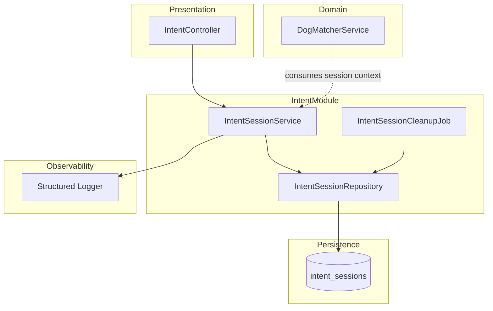
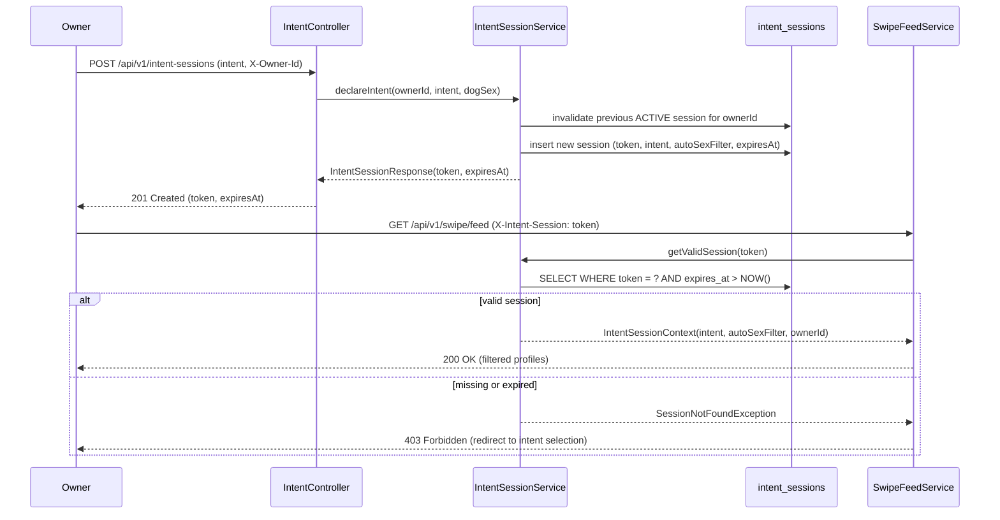
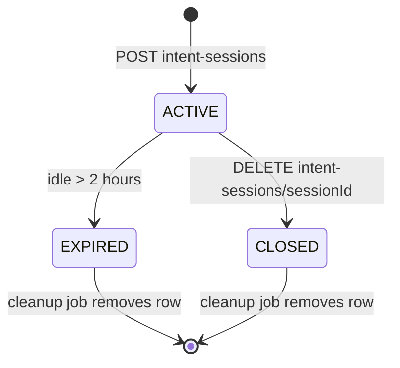

# Design Document — Intent Declaration

## Overview

The Intent Declaration feature introduces a mandatory session-scoped intent selection step that must precede every swipe session on Tinder4Dogs. An owner declares a goal — **Playmate** or **Breeding** — which is bound to an ephemeral session token (2-hour idle TTL). The token gates access to the swipe feed and carries context used by the Matching Service to filter the candidate pool and adapt available search filters.

**Purpose**: Contextualise every search session by the owner's stated goal, ensuring match quality and 100% intent attribution in analytics.
**Users**: All registered owners (Personas: Marco — playmate seeker; Giulia — breeding owner) interact with this feature at the start of every session.
**Impact**: Introduces the `intent` domain module and the `intent_sessions` persistence table; adds a required header (`X-Intent-Session`) to the swipe feed API contract.

### Goals

- Enforce explicit intent declaration before each swipe session (Req 1, 5)
- Filter the profile candidate pool by declared intent; auto-apply opposite-sex filter for Breeding (Req 2)
- Adapt available search filters to the declared intent (Req 3)
- Ensure sessions are ephemeral and never stored on the permanent owner profile (Req 4)
- Track `session.started`, `session.activated`, `session.ended` analytics events (Req 6)

### Non-Goals

- Mid-session intent change (owner must close session and start new one)
- Permanent intent preference storage
- Push notification on session expiry
- Premium session features (multi-intent, extended TTL) — out of scope v1

---

## Architecture

### Existing Architecture Analysis

The codebase is a Spring Boot 4 monolith (Kotlin 2.2, Java 24) with a `service/` domain core and feature modules following a vertical slice pattern (`<feature>/presentation/service/model/`). No authentication or session management infrastructure exists. Persistence is PostgreSQL via Spring Data JPA with `ddl-auto: update`. See `research.md` for full discovery notes.

**Constraints**:
- No Spring Security, no JWT infrastructure — owner identity is a placeholder (`X-Owner-Id` header) until an auth feature is implemented.
- No event bus — analytics events are emitted as structured log entries.
- `ddl-auto: update` creates the new `intent_sessions` table automatically.

### Architecture Pattern & Boundary Map



**Architecture Integration**:
- Selected pattern: Vertical slice module `intent/presentation/service/model/` — consistent with `support/` and `ai/finetuning/` modules.
- Domain boundary: `intent` module owns session lifecycle; `DogMatcherService` (and future `SwipeFeedService`) consumes it as a dependency, not the reverse.
- Existing patterns preserved: constructor injection, `@RestController`/`@Service` stereotypes, Kotlin `data class` DTOs, `suspend` coroutine functions in controllers.
- New components: `IntentController`, `IntentSessionService`, `IntentSessionRepository` (Spring Data JPA), `IntentSessionCleanupJob` (`@Scheduled`), `IntentSession` (JPA entity).
- Steering compliance: no field injection, `presentation → service` dependency only, AI isolation respected.

### Technology Stack

| Layer | Choice / Version | Role in Feature | Notes |
|-------|------------------|-----------------|-------|
| Backend | Spring Boot 4.0.2 / Kotlin 2.2 | REST controllers, service layer, scheduling | Existing — no change |
| Data | PostgreSQL + Spring Data JPA | Persist `intent_sessions` table | Existing — new entity only |
| Scheduling | Spring `@Scheduled` | Cleanup expired sessions every 30 min | Built-in — no new dependency |
| Observability | kotlin-logging-jvm | Structured analytics event logging | Existing |
| Auth (placeholder) | `X-Owner-Id` header | Owner identity until JWT auth is added | Replaced by JWT in future auth feature |

---

## System Flows

### Intent Declaration & Swipe Feed Access



### Session Expiry & Cleanup



**Key Decisions**: A new `declareIntent` call automatically invalidates the owner's previous `ACTIVE` session before creating a new one (prevents orphaned active sessions). The cleanup job runs every 30 minutes on `status IN (EXPIRED, CLOSED)` rows older than 1 hour.

---

## Requirements Traceability

| Requirement | Summary | Components | Interfaces | Flows |
|-------------|---------|------------|------------|-------|
| 1.1–1.6 | Intent selection UI & session creation | IntentController, IntentSessionService | `POST /api/v1/intent-sessions`, `declareIntent()` | Declaration flow |
| 2.1–2.5 | Profile pool filtered by intent + auto sex filter | IntentSessionService, DogMatcherService | `getValidSession()`, `IntentSessionContext` | Feed access flow |
| 3.1–3.5 | Filter options adapt to intent | IntentSessionService | `getValidSession()` → `availableFilters` | Feed access flow |
| 4.1–4.6 | Session ephemeral, 2h TTL, no persistence to profile | IntentSessionService, IntentSessionCleanupJob | `closeSession()`, `@Scheduled` cleanup | Expiry flow |
| 5.1–5.4 | 100% swipe feed requests require valid token | IntentSessionService | `getValidSession()` (throws on invalid) | Feed access flow |
| 6.1–6.5 | Analytics: started / activated / ended events | IntentSessionService | Structured log events | All flows |

---

## Components and Interfaces

### Component Summary

| Component | Layer | Intent | Req Coverage | Key Dependencies | Contracts |
|-----------|-------|--------|--------------|-----------------|-----------|
| IntentController | Presentation | REST entry point for session lifecycle | 1.1–1.6, 4.6 | IntentSessionService (P0) | API |
| IntentSessionService | Service | Core session lifecycle: create, validate, close, expire | All | IntentSessionRepository (P0), Logger (P1) | Service, Event |
| IntentSessionRepository | Persistence | JPA CRUD + queries on `intent_sessions` | 4.1–4.6 | PostgreSQL (P0) | — |
| IntentSessionCleanupJob | Scheduler | Removes expired/closed sessions every 30 min | 4.2–4.3 | IntentSessionRepository (P0) | Batch |
| IntentSession | Domain Model | JPA entity representing one session | All | — | State |

---

### Presentation Layer

#### IntentController

| Field | Detail |
|-------|--------|
| Intent | Accept intent declaration, return session token; accept session close request |
| Requirements | 1.1, 1.2, 1.3, 1.4, 1.5, 1.6, 4.6 |

**Responsibilities & Constraints**
- Accepts `POST /api/v1/intent-sessions` to declare intent; returns opaque session token.
- Accepts `DELETE /api/v1/intent-sessions/{sessionId}` to explicitly close a session.
- Reads `X-Owner-Id` header (Long) as owner identity placeholder — replace with JWT extraction when auth is implemented.
- Delegates all business logic to `IntentSessionService`; no direct repository access.

**Dependencies**
- Outbound: `IntentSessionService` — session lifecycle (P0)

**Contracts**: API [x]

##### API Contract

| Method | Endpoint | Request | Response | Errors |
|--------|----------|---------|----------|--------|
| POST | `/api/v1/intent-sessions` | `DeclareIntentRequest` | `IntentSessionResponse` (201) | 400 (invalid intent), 422 (dog sex missing for Breeding) |
| DELETE | `/api/v1/intent-sessions/{sessionId}` | — | 204 No Content | 404 (session not found or already closed) |

```kotlin
// Request / Response DTOs (Kotlin data classes)

data class DeclareIntentRequest(
    val intent: SearchIntent,      // enum: PLAYMATE | BREEDING
    val ownerDogSex: DogSex?       // required when intent == BREEDING; null allowed for PLAYMATE
)

data class IntentSessionResponse(
    val sessionId: String,         // UUID
    val token: String,             // UUID opaque token for X-Intent-Session header
    val intent: SearchIntent,
    val autoSexFilter: DogSex?,    // non-null only when intent == BREEDING
    val expiresAt: java.time.Instant
)
```

**Implementation Notes**
- Validation: `DeclareIntentRequest` validated with JSR-303 (`@NotNull intent`); service validates `ownerDogSex` for BREEDING intent.
- Integration: Add `@Valid` on `@RequestBody`; return `ResponseEntity<IntentSessionResponse>` with status 201.
- Risks: Without real auth, any caller can impersonate an owner via `X-Owner-Id`. Acceptable in MVP development phase only.

---

### Service Layer

#### IntentSessionService

| Field | Detail |
|-------|--------|
| Intent | Orchestrate session lifecycle: create, validate (token gate), close, and emit analytics events |
| Requirements | 1.1–1.6, 2.3, 3.1–3.5, 4.1–4.6, 5.1–5.4, 6.1–6.5 |

**Responsibilities & Constraints**
- Creates a new `IntentSession`, invalidating any previous `ACTIVE` session for the same `ownerId`.
- Validates a token on every swipe feed call: returns `IntentSessionContext` or throws `SessionNotFoundException` / `SessionExpiredException`.
- Derives `autoSexFilter` (opposite sex) automatically when intent is BREEDING.
- Emits structured log analytics events (`session.started`, `session.activated`, `session.ended`).
- Does not touch the owner's permanent profile — no write to any owner/dog table.
- Transaction boundary: each public method is a single transaction (`@Transactional`).

**Dependencies**
- Outbound: `IntentSessionRepository` — persistence (P0)
- Outbound: `KotlinLogging.logger {}` — analytics event emission (P1)

**Contracts**: Service [x] / Event [x]

##### Service Interface

```kotlin
interface IntentSessionService {

    /**
     * Declare intent for a new search session.
     * Invalidates the previous ACTIVE session for this owner (if any).
     * Preconditions: ownerId must be a known owner; intent must be non-null;
     *   ownerDogSex must be non-null when intent == BREEDING.
     * Postconditions: returns a new ACTIVE session with a fresh token and expiresAt = now + 2h.
     */
    fun declareIntent(
        ownerId: Long,
        intent: SearchIntent,
        ownerDogSex: DogSex?
    ): IntentSessionResponse

    /**
     * Validate a session token and return the session context.
     * Preconditions: token is non-blank.
     * Postconditions: returns IntentSessionContext for a valid, non-expired session.
     * Throws: SessionNotFoundException if token unknown; SessionExpiredException if TTL elapsed.
     */
    fun getValidSession(token: String): IntentSessionContext

    /**
     * Record the first swipe in a session (triggers session.activated event).
     * Idempotent: subsequent calls for already-activated sessions are no-ops.
     */
    fun recordFirstSwipe(token: String)

    /**
     * Explicitly close a session (owner-initiated).
     * Postconditions: session status set to CLOSED; session.ended event emitted.
     * Throws: SessionNotFoundException if sessionId not found for ownerId.
     */
    fun closeSession(ownerId: Long, sessionId: String)
}
```

**Preconditions**:
- `declareIntent`: `ownerId > 0`; `intent` non-null; `ownerDogSex` non-null when `intent == BREEDING`
- `getValidSession`: `token` non-blank

**Postconditions**:
- After `declareIntent`: previous ACTIVE session for `ownerId` is CLOSED; new session row exists with `status = ACTIVE` and `expiresAt = Instant.now() + 2h`
- After `getValidSession`: session `lastActivityAt` updated (resets idle window)

**Invariants**:
- At most one `ACTIVE` session per `ownerId` at any time
- `autoSexFilter` is always null for PLAYMATE sessions and always non-null for BREEDING sessions

##### Event Contract

- **`session.started`** — emitted on `declareIntent`. Fields: `event.type`, `sessionId`, `ownerId`, `intent`, `autoSexFilter` (nullable), `expiresAt`.
- **`session.activated`** — emitted on first `recordFirstSwipe` call. Fields: `event.type`, `sessionId`, `ownerId`, `intent`.
- **`session.ended`** — emitted on `closeSession` or scheduler expiry. Fields: `event.type`, `sessionId`, `ownerId`, `intent`, `swipeCount`, `reason` (`OWNER_CLOSED | EXPIRED`).
- Ordering: events are synchronous structured log entries; no delivery guarantee beyond log shipping.

**Implementation Notes**
- Integration: `DogMatcherService` / `SwipeFeedService` calls `getValidSession(token)` and uses `IntentSessionContext.intent` and `IntentSessionContext.autoSexFilter` to build the candidate query.
- Validation: Reject BREEDING sessions where `ownerDogSex` is null with `IllegalArgumentException` before persisting.
- Risks: `getValidSession` is called on every swipe feed request — ensure `(token, expires_at)` index exists on `intent_sessions`.

---

### Persistence Layer

#### IntentSessionRepository

Spring Data JPA repository — no custom logic beyond standard CRUD and two named queries:

```kotlin
interface IntentSessionRepository : JpaRepository<IntentSession, Long> {

    fun findByTokenAndExpiresAtAfter(token: String, now: Instant): IntentSession?

    fun findByOwnerIdAndStatus(ownerId: Long, status: SessionStatus): IntentSession?

    @Modifying
    @Query("DELETE FROM IntentSession s WHERE s.status IN :statuses AND s.expiresAt < :cutoff")
    fun deleteExpired(statuses: List<SessionStatus>, cutoff: Instant): Int
}
```

---

### Scheduler

#### IntentSessionCleanupJob

| Field | Detail |
|-------|--------|
| Intent | Periodically remove expired and closed session rows from `intent_sessions` |
| Requirements | 4.2, 4.3 |

**Contracts**: Batch [x]

##### Batch / Job Contract
- **Trigger**: `@Scheduled(fixedDelay = 1800000)` — every 30 minutes
- **Input / validation**: Queries rows where `status IN (EXPIRED, CLOSED)` AND `expires_at < NOW() - 1 hour` (1-hour grace period)
- **Output / destination**: Deleted rows; count logged at INFO level
- **Idempotency & recovery**: Deletion is idempotent; safe to run multiple times

---

## Data Models

### Domain Model

**Aggregates**:
- `IntentSession` — root aggregate. Owns the session lifecycle. No sub-entities. Invariant: one `ACTIVE` session per owner.

**Value Objects**:
- `SearchIntent` — enum: `PLAYMATE`, `BREEDING`
- `DogSex` — enum: `MALE`, `FEMALE`
- `SessionStatus` — enum: `ACTIVE`, `CLOSED`, `EXPIRED`
- `IntentSessionContext` — read-only value object returned to consumers; carries `intent`, `autoSexFilter`, `ownerId`

**Domain Events** (emitted as structured log entries):
- `SessionStarted`, `SessionActivated`, `SessionEnded`

### Logical Data Model

**`IntentSession` entity**:

| Field | Type | Notes |
|-------|------|-------|
| `id` | Long (PK, auto) | Internal surrogate key |
| `sessionId` | UUID (unique, not null) | Stable public identifier |
| `token` | UUID (unique, not null) | Opaque access token for header |
| `ownerId` | Long (not null) | Foreign key placeholder — no FK constraint until Owner entity exists |
| `intent` | VARCHAR(20) (not null) | `PLAYMATE` or `BREEDING` |
| `autoSexFilter` | VARCHAR(10) (nullable) | `MALE`, `FEMALE`, or null |
| `status` | VARCHAR(10) (not null) | `ACTIVE`, `CLOSED`, `EXPIRED` |
| `swipeCount` | INT (not null, default 0) | Incremented on `recordFirstSwipe` (capped at 1 for activation tracking) |
| `activated` | BOOLEAN (not null, default false) | True after first swipe |
| `createdAt` | TIMESTAMP WITH TIME ZONE | Session creation time |
| `lastActivityAt` | TIMESTAMP WITH TIME ZONE | Updated on `getValidSession` to reset idle window |
| `expiresAt` | TIMESTAMP WITH TIME ZONE | `createdAt + 2h`; refreshed on activity |

**Consistency & Integrity**:
- Unique constraint on `(owner_id, status = 'ACTIVE')` — enforced at service layer via invalidation before insert (application-level enforcement; DB-level partial unique index for PostgreSQL: `CREATE UNIQUE INDEX ON intent_sessions (owner_id) WHERE status = 'ACTIVE'`).
- No FK to owner table until `Owner` entity is created.

### Physical Data Model

**Index strategy** (critical for performance — NFR-P2: < 50ms filter overhead):

```sql
-- Primary lookup on swipe feed validation
CREATE INDEX idx_intent_sessions_token_expires ON intent_sessions (token, expires_at);

-- Partial unique index: one active session per owner
CREATE UNIQUE INDEX idx_intent_sessions_owner_active ON intent_sessions (owner_id)
    WHERE status = 'ACTIVE';

-- Cleanup job query
CREATE INDEX idx_intent_sessions_status_expires ON intent_sessions (status, expires_at);
```

### Data Contracts & Integration

**`IntentSessionContext`** — read-only DTO consumed by `DogMatcherService` / `SwipeFeedService`:

```kotlin
data class IntentSessionContext(
    val sessionId: String,
    val ownerId: Long,
    val intent: SearchIntent,
    val autoSexFilter: DogSex?,          // null for PLAYMATE; opposite sex for BREEDING
    val availableFilters: Set<FilterType> // derived from intent; see Req 3
)

enum class FilterType {
    BREED, SIZE, AGE, ENERGY_LEVEL, TEMPERAMENT,   // PLAYMATE
    PEDIGREE, HEALTH_CRITERIA                        // BREEDING only
    // SEX is intentionally omitted — auto-applied for BREEDING
}
```

---

## Error Handling

### Error Strategy

Validate at the boundary (controller + service entry points). Fail fast with actionable HTTP responses. No silent degradation for session validation failures.

### Error Categories and Responses

| Scenario | HTTP Status | Response Body | Req |
|----------|-------------|---------------|-----|
| Missing or blank intent in request | 400 Bad Request | `{"error": "intent is required"}` | 1.4 |
| Invalid intent value | 400 Bad Request | `{"error": "intent must be PLAYMATE or BREEDING"}` | 1.4 |
| BREEDING declared without ownerDogSex | 422 Unprocessable Entity | `{"error": "ownerDogSex is required for BREEDING intent"}` | 2.3 |
| Swipe feed accessed without session token | 403 Forbidden | `{"error": "intent session required", "redirectTo": "/intent-sessions/new"}` | 5.1, 5.4 |
| Session token not found | 403 Forbidden | Same as above | 5.1 |
| Session token expired (2h TTL) | 403 Forbidden | Same as above | 4.4, 5.4 |
| Session not found on close | 404 Not Found | `{"error": "session not found"}` | — |

### Monitoring

- INFO log on each session lifecycle event (analytics events per Req 6).
- WARN log when an expired token is presented (potential client bug or clock skew).
- WARN log when cleanup job deletes > 1000 rows in a single run (capacity signal).
- Session token validation failure rate tracked via log-based alerting.

---

## Testing Strategy

### Unit Tests

- `IntentSessionService.declareIntent`: verify session created with correct `intent`, `autoSexFilter`, `expiresAt`; verify previous ACTIVE session is invalidated.
- `IntentSessionService.declareIntent` — BREEDING without `ownerDogSex`: verify `IllegalArgumentException` thrown.
- `IntentSessionService.getValidSession` — expired token: verify `SessionExpiredException`.
- `IntentSessionService.getValidSession` — unknown token: verify `SessionNotFoundException`.
- `IntentSessionService.recordFirstSwipe` — idempotency: second call does not re-emit `session.activated`.
- `autoSexFilter` derivation: `MALE` dog owner → filter `FEMALE`; `FEMALE` dog owner → filter `MALE`.

### Integration Tests

- `POST /api/v1/intent-sessions` → 201 with valid token and `expiresAt` (2h from now ±5s).
- `POST /api/v1/intent-sessions` twice for the same owner → second call succeeds; first session status becomes `CLOSED`.
- `GET /api/v1/swipe/feed` without `X-Intent-Session` header → 403.
- `GET /api/v1/swipe/feed` with expired token → 403.
- `DELETE /api/v1/intent-sessions/{sessionId}` → 204; subsequent `getValidSession` throws.
- `IntentSessionCleanupJob` removes only `EXPIRED`/`CLOSED` rows older than grace period; `ACTIVE` rows untouched.

### Performance Tests

- `getValidSession` under 1000 concurrent requests: p95 < 50ms (NFR-P2); requires `(token, expires_at)` index.
- `declareIntent` throughput: sustain 100 req/s without contention on the partial unique index.

---

## Security Considerations

- **Session isolation** (NFR-S1): `getValidSession` only returns data for the token presented; no cross-owner data exposure. Verified by integration test asserting token A cannot retrieve session B's context.
- **Server-side validation** (NFR-S2): token validated on every call to `getValidSession`; no client-side trust.
- **Intent data privacy**: `intent_sessions` table holds `ownerId` (Long) and intent; no PII beyond the owner identifier. Session rows deleted on close or expiry (Req 4.2) — supports GDPR right-to-erasure chain (NFR-03).
- **Auth placeholder risk**: `X-Owner-Id` is unauthenticated in MVP. Mitigation: deploy behind VPN/internal network only until the auth feature is implemented.

---

## Performance & Scalability

- **Target**: `getValidSession` p95 < 50ms; intent selection screen render < 200ms (NFR-P1, NFR-P2).
- **Index**: `(token, expires_at)` covering index is the critical optimization — eliminates full table scans on the hot path.
- **Scale**: At 10k DAU (NFR-SC1), peak concurrent active sessions ≈ 2k–5k rows. PostgreSQL handles this comfortably without partitioning.
- **Cleanup**: 30-minute cleanup job prevents unbounded table growth; row count stays bounded to `2h_window × peak_session_rate`.
