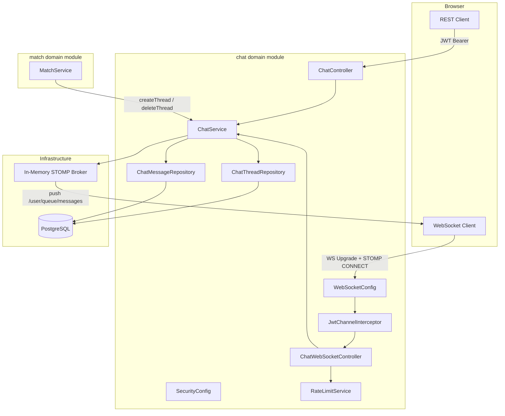
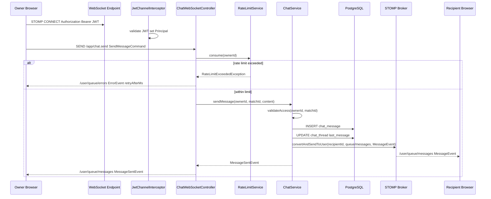
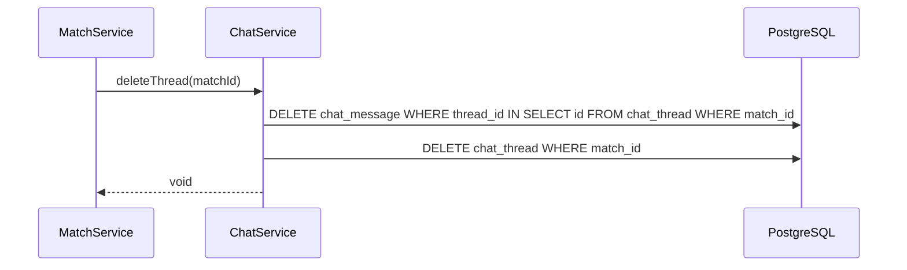

# Design Document — Owner Chat

## Overview

Owner Chat delivers real-time, match-gated text messaging to dog owners on PawMatch. Once a mutual match is established, both owners receive a dedicated chat thread through which they can coordinate meetups. Messaging is bidirectional via STOMP over WebSocket; message history and the inbox are accessible via REST. The feature introduces the first Spring Security configuration, the first JPA-persisted domain entities, and the first WebSocket infrastructure into the project.

**Purpose**: Enables matched owners to communicate safely without sharing external contact details, removing the friction of arranging in-person dog meetups.

**Users**: All owners with at least one active match (Personas: Marco — casual owner; Giulia — breeding owner).

**Impact**: Introduces a new `chat` domain module; adds Spring Security, WebSocket, Bucket4j, and Liquibase as first-time project dependencies. Establishes the JPA entity and security patterns for future domains.

### Goals

- Real-time bidirectional messaging via STOMP/WebSocket for matched owner pairs
- Match-gated access control: no chat without a confirmed mutual match
- Per-owner rate limiting (30 msg/min) to prevent spam
- Durable message persistence; hard delete on unmatch (GDPR-compliant)
- REST endpoints for message history (paginated) and inbox

### Non-Goals

- SSE or mobile push notifications
- Read receipts or "seen" status
- Configurable rate-limit threshold (hard-coded; `application.yaml` property only)
- Message editing or individual message deletion
- Multi-node STOMP broker (upgrade path documented; not implemented in v1)

---

## Requirements Traceability

| Requirement | Summary | Components | Interfaces | Flows |
|-------------|---------|------------|------------|-------|
| 1.1–1.5 | Chat access gated on mutual match | `ChatService`, `ChatThreadRepository` | `ChatService.validateAccess` | Send flow (guard) |
| 2.1–2.5 | Persist messages with metadata; validate content | `ChatService`, `ChatMessageRepository` | `ChatService.sendMessage` | Send flow |
| 3.1–3.4 | Per-owner rate limit before persist | `RateLimitService` | `RateLimitService.consume` | Send flow (pre-persist) |
| 4.1–4.5 | Paginated message history via REST | `ChatController`, `ChatService` | `GET /api/v1/chat/threads/{matchId}/messages` | — |
| 5.1–5.4 | Hard delete thread + messages on unmatch | `ChatService`, cascade DELETE | `ChatService.deleteThread` | Unmatch flow |
| 6.1–6.5 | Sorted inbox via REST | `ChatController`, `ChatService` | `GET /api/v1/chat/threads` | — |
| 7.1–7.6 | STOMP/WebSocket real-time send and push | `ChatWebSocketController`, `JwtChannelInterceptor`, `WebSocketConfig` | STOMP `/app/chat.send`, `/user/queue/messages` | Send flow |
| 8.1–8.5 | JWT auth on all endpoints; no cross-thread leaks | `JwtChannelInterceptor`, `SecurityConfig`, `ChatService` | HTTP 401/403 guards | All flows |

---

## Architecture

### Existing Architecture Analysis

The codebase is a single Spring Boot 4.0.4 / Spring Framework 7 service using Spring WebMVC (not WebFlux). Domain modules follow `<domain>/model/service/presentation/` package layout under `com.ai4dev.tinderfordogs`. No security, no WebSocket, no JPA entities with `@Entity` annotations (only in-memory models), and `ddl-auto: update` (no Liquibase).

Chat is the first feature to introduce:
- Spring Security (`spring-boot-starter-security`)
- Spring WebSocket STOMP (`spring-boot-starter-websocket`)
- JPA entities with `@Entity` (real DB persistence)
- Liquibase (replacing `ddl-auto: update` for the new schema)
- Bucket4j (rate limiting)

### Architecture Pattern & Boundary Map



**Architecture Integration**:
- Selected pattern: domain module (chat) within existing layered monolith — consistent with `match/` and `support/` domains
- Domain boundary: `ChatService` is the only entry point for both REST and WebSocket layers; `MatchService` calls `ChatService` directly for thread lifecycle events
- Existing patterns preserved: `model/service/presentation` layering, `/api/v1/` REST prefix, `KotlinLogging.logger {}`, `@RestController` + `@RequestMapping`
- New components: `WebSocketConfig`, `JwtChannelInterceptor`, `SecurityConfig`, `RateLimitService`
- Steering compliance: domain-first packages; no global `service/` or `controller/` packages; secrets via env-var placeholders in `application.yaml`

### Technology Stack

| Layer | Choice / Version | Role in Feature | Notes |
|-------|------------------|-----------------|-------|
| Backend | Spring Boot 4.0.4 / Spring Framework 7 | Hosts all chat endpoints | Existing; no change |
| Real-time | spring-boot-starter-websocket (STOMP) | Bidirectional WebSocket messaging | New dependency |
| Security | spring-boot-starter-security + auth0 java-jwt 4.x | JWT validation on HTTP filter chain and STOMP CONNECT | First security dependency in project |
| Rate limiting | Bucket4j 8.17.0 core | Per-owner token-bucket rate limiting | In-memory `ConcurrentHashMap<UUID, Bucket>`; see research.md |
| Persistence | PostgreSQL + Spring Data JPA | `chat_thread` and `chat_message` tables | First `@Entity` usage in project |
| DB migrations | Liquibase | Schema versioning with rollback | First Liquibase adoption; replaces `ddl-auto: update` for chat |
| Serialization | tools.jackson (Jackson 3, existing) | STOMP message serialization | Jackson 2 dependency in pom.xml is a pre-existing risk; see research.md |

---

## System Flows

### Send Message (WebSocket)



Message is persisted before the STOMP push is dispatched (satisfies NFR-C07); if the recipient is offline the message remains in history (satisfies 7.5).

### Unmatch — Thread Deletion



Deletion is atomic within a single transaction. `ON DELETE CASCADE` on `chat_message.thread_id` serves as a safety net but the service also issues explicit bulk delete to avoid JPA loading all entities.

---

## Components and Interfaces

### Summary Table

| Component | Layer | Intent | Req Coverage | Key Dependencies | Contracts |
|-----------|-------|--------|--------------|------------------|----------|
| `ChatController` | presentation | REST inbox + history | 4, 6, 8 | `ChatService` (P0) | API |
| `ChatWebSocketController` | presentation | STOMP send/receive | 7, 3, 2, 1, 8 | `ChatService` (P0), `RateLimitService` (P0), `SimpMessagingTemplate` (P0) | API, Event |
| `JwtChannelInterceptor` | config/security | Authenticate STOMP CONNECT | 7.2, 7.3, 8.1 | JWT library (P0) | Service |
| `WebSocketConfig` | config | STOMP broker + endpoint registration | 7.1 | Spring WebSocket (P0) | — |
| `SecurityConfig` | config | HTTP JWT filter chain | 8.1, 8.2 | Spring Security (P0) | — |
| `ChatService` | service | All chat business logic | 1–8 | `ChatThreadRepository` (P0), `ChatMessageRepository` (P0), `SimpMessagingTemplate` (P0) | Service |
| `RateLimitService` | service | Per-owner token-bucket rate limit | 3 | Bucket4j (P0) | Service |
| `ChatThreadRepository` | data | JPA access to `chat_thread` | 1, 5, 6 | PostgreSQL (P0) | — |
| `ChatMessageRepository` | data | JPA access to `chat_message` | 2, 4, 5 | PostgreSQL (P0) | — |

---

### Domain: chat/service

#### ChatService

| Field | Detail |
|-------|--------|
| Intent | Single service encapsulating all chat business rules: access control, message persistence, inbox, thread lifecycle |
| Requirements | 1.1–1.5, 2.1–2.5, 4.1–4.5, 5.1–5.4, 6.1–6.5 |

**Responsibilities & Constraints**
- Owns the `ChatThread` and `ChatMessage` aggregate
- Enforces participant access invariant before every read/write operation
- Is the sole caller of `SimpMessagingTemplate` for outbound WebSocket push
- `createThread` and `deleteThread` are called only by `MatchService`; all other methods are called by the presentation layer

**Dependencies**
- Outbound: `ChatThreadRepository` — thread CRUD (P0)
- Outbound: `ChatMessageRepository` — message CRUD (P0)
- Outbound: `SimpMessagingTemplate` — push to recipient WebSocket (P0)

**Contracts**: Service [x]

##### Service Interface

```kotlin
interface ChatService {
    fun createThread(matchId: UUID, ownerAId: UUID, ownerBId: UUID): ChatThread
    fun deleteThread(matchId: UUID)
    fun sendMessage(senderOwnerId: UUID, matchId: UUID, content: String): ChatMessage
    fun getMessageHistory(
        requestingOwnerId: UUID,
        matchId: UUID,
        pageable: Pageable
    ): Page<ChatMessageResponse>
    fun getInbox(ownerId: UUID): List<InboxEntryResponse>
}
```

- **Preconditions for `sendMessage`**: thread exists for `matchId`; `senderOwnerId` is a participant; `content` non-blank, ≤ 2,000 chars
- **Postconditions for `sendMessage`**: message persisted with UTC timestamp; `ChatThread.lastMessagePreview` and `lastMessageAt` updated; push dispatched to recipient
- **Invariant**: `sendMessage`, `getMessageHistory` throw `AccessDeniedException` if owner is not a participant of the thread

---

#### RateLimitService

| Field | Detail |
|-------|--------|
| Intent | Enforce per-owner token-bucket rate limit on message sends |
| Requirements | 3.1–3.4 |

**Responsibilities & Constraints**
- Maintains a `ConcurrentHashMap<UUID, Bucket>` keyed by owner ID
- Bucket configuration: capacity 30 tokens, refill 30 tokens / 60 s (configurable via `tinder4dogs.chat.rate-limit.messages-per-minute`)
- Throws `RateLimitExceededException` (containing `retryAfterMs`) when limit is exceeded
- State is in-memory; resets on application restart (acceptable for v1)

**Dependencies**
- External: Bucket4j 8.17.0 core — token-bucket implementation (P0)

**Contracts**: Service [x]

##### Service Interface

```kotlin
interface RateLimitService {
    /**
     * Attempts to consume one token for [ownerId].
     * @throws RateLimitExceededException if the bucket is exhausted,
     *         containing [RateLimitExceededException.retryAfterMs]
     */
    fun consume(ownerId: UUID)
}

data class RateLimitExceededException(val retryAfterMs: Long) : RuntimeException()
```

---

### Domain: chat/presentation

#### ChatController

| Field | Detail |
|-------|--------|
| Intent | REST endpoints for message history retrieval and inbox listing |
| Requirements | 4.1–4.5, 6.1–6.5, 8.1, 8.2 |

**Dependencies**
- Outbound: `ChatService` — business logic (P0)
- Inbound: Spring Security HTTP filter chain — JWT validation (P0)

**Contracts**: API [x]

##### API Contract

| Method | Endpoint | Request | Response | Errors |
|--------|----------|---------|----------|--------|
| GET | `/api/v1/chat/threads` | — | `200 List<InboxEntryResponse>` | 401 |
| GET | `/api/v1/chat/threads/{matchId}/messages` | `page`, `size` query params (default size=50) | `200 Page<ChatMessageResponse>` | 401, 403, 404 |

**InboxEntryResponse fields**: `matchId: UUID`, `matchedDogName: String`, `matchedDogPhotoUrl: String?`, `lastMessagePreview: String?`, `lastMessageAt: Instant?`

**ChatMessageResponse fields**: `id: UUID`, `senderOwnerId: UUID`, `content: String`, `sentAt: Instant`

---

#### ChatWebSocketController

| Field | Detail |
|-------|--------|
| Intent | STOMP `@MessageMapping` controller; receives send commands, delegates to ChatService, pushes response events |
| Requirements | 7.1–7.6, 3.1–3.4, 2.1–2.5, 1.1, 8.1, 8.3 |

**Dependencies**
- Outbound: `ChatService` — persist and push (P0)
- Outbound: `RateLimitService` — rate check before send (P0)
- Outbound: `SimpMessagingTemplate` — error delivery to `/user/queue/errors` (P0)
- Inbound: `JwtChannelInterceptor` — authenticated `Principal` on every message (P0)

**Contracts**: API [x], Event [x]

##### API Contract (STOMP)

| Direction | Destination | Payload | Description |
|-----------|-------------|---------|-------------|
| Client → Server | `/app/chat.send` | `SendMessageCommand` | Owner sends a message |
| Server → Client | `/user/queue/messages` | `MessageEvent` | Delivered to both sender (ACK) and recipient (push) |
| Server → Client | `/user/queue/errors` | `ErrorEvent` | Rate limit exceeded or validation failure |

**SendMessageCommand fields**: `matchId: UUID`, `content: String`

**MessageEvent fields**: `id: UUID`, `matchId: UUID`, `senderOwnerId: UUID`, `senderDogName: String`, `content: String`, `sentAt: Instant`

**ErrorEvent fields**: `code: String` (e.g. `RATE_LIMIT_EXCEEDED`, `ACCESS_DENIED`, `VALIDATION_ERROR`), `message: String`, `retryAfterMs: Long?`

##### Event Contract
- Published events: `MessageEvent` to `/user/queue/messages` (recipient), `MessageEvent` to `/user/queue/messages` (sender ACK), `ErrorEvent` to `/user/queue/errors`
- Ordering guarantee: publish occurs after successful DB persist; no guarantee of delivery to offline clients (messages are recoverable via REST history)

---

### Domain: chat/config

#### JwtChannelInterceptor

| Field | Detail |
|-------|--------|
| Intent | Authenticate STOMP CONNECT frame using JWT; set `Principal` on the WebSocket session |
| Requirements | 7.2, 7.3, 8.1, 8.2 |

**Responsibilities & Constraints**
- Intercepts only `StompCommand.CONNECT` messages
- Extracts `Authorization` header from `StompHeaderAccessor`; validates JWT; calls `accessor.setUser(principal)` where principal username = owner UUID string
- Registered on inbound channel with `@Order(Ordered.HIGHEST_PRECEDENCE + 99)` (before Spring Security interceptors)
- Rejects connection with `MessageDeliveryException` (closes WS with 4001) if JWT is absent, expired, or invalid

**Dependencies**
- External: auth0 java-jwt 4.x — JWT verification (P0)

**Contracts**: Service [x]

**Implementation Notes**
- Must be registered in `WebSocketSecurityConfig` without `@EnableWebSocketSecurity` (CSRF must be off for stateless JWT)
- Risk: Jackson dual-version conflict in pom.xml may surface as STOMP serialization failures at runtime; see research.md

#### WebSocketConfig

| Field | Detail |
|-------|--------|
| Intent | Register STOMP WebSocket endpoint and configure in-memory message broker |
| Requirements | 7.1 |

**Contracts**: (configuration only — no service/API contract)

**Configuration Summary**:
- WebSocket endpoint: `/ws` (SockJS fallback enabled for browser compatibility)
- App destination prefix: `/app`
- Message broker destination prefix: `/queue`
- User destination prefix: `/user`
- Tomcat text buffer: `server.tomcat.websocket.max-text-message-buffer-size=65536` in `application.yaml`

#### SecurityConfig

| Field | Detail |
|-------|--------|
| Intent | Configure Spring Security HTTP filter chain with JWT stateless auth; permit existing endpoints |
| Requirements | 8.1, 8.2 |

**Contracts**: (configuration only)

**Configuration Summary**:
- Stateless session management (no HTTP session)
- `OncePerRequestFilter` validates `Authorization: Bearer <jwt>` on each request
- Existing endpoints (`/api/v1/matches/**`, `/api/v1/support/**`) permitted without auth during transition (to be tightened when those domains add auth)
- All `/api/v1/chat/**` endpoints require authentication
- WebSocket handshake endpoint `/ws/**` permitted at HTTP level (auth handled by `JwtChannelInterceptor`)

---

## Data Models

### Domain Model

- **`ChatThread`** — aggregate root. Owns the participant invariant (exactly two owner IDs) and inbox metadata. Creation is triggered by `MatchService`; deletion cascades to all messages.
- **`ChatMessage`** — entity within `ChatThread`. Immutable after creation (no update operations). Content is a bounded value object (≤ 2,000 chars, non-blank).
- **Invariant**: A `ChatMessage` always belongs to exactly one `ChatThread`. A `ChatThread` always has exactly two distinct owner IDs (`ownerAId ≠ ownerBId`).
- **Domain event** (conceptual): `MessageSentEvent` — carries `matchId`, `recipientOwnerId`, `MessageEvent` payload — used internally between `ChatService` and `SimpMessagingTemplate`.

### Logical Data Model

```
ChatThread (1) ──────< (N) ChatMessage
  matchId : UUID [unique]     threadId : UUID [FK]
  ownerAId : UUID             senderOwnerId : UUID
  ownerBId : UUID             content : String
  lastMessagePreview : String sentAt : Instant
  lastMessageAt : Instant
  createdAt : Instant
```

Cardinality: one thread per match; unbounded messages per thread.

### Physical Data Model

```sql
-- Liquibase changeset: create_chat_schema

CREATE TABLE chat_thread (
    id                    UUID         PRIMARY KEY DEFAULT gen_random_uuid(),
    match_id              UUID         NOT NULL UNIQUE,   -- loose ref; no FK until match table exists
    owner_a_id            UUID         NOT NULL,
    owner_b_id            UUID         NOT NULL,
    last_message_preview  VARCHAR(100),
    last_message_at       TIMESTAMPTZ,
    created_at            TIMESTAMPTZ  NOT NULL DEFAULT NOW()
);

CREATE INDEX idx_chat_thread_match_id   ON chat_thread(match_id);
CREATE INDEX idx_chat_thread_owner_a_id ON chat_thread(owner_a_id);
CREATE INDEX idx_chat_thread_owner_b_id ON chat_thread(owner_b_id);

CREATE TABLE chat_message (
    id                UUID         PRIMARY KEY DEFAULT gen_random_uuid(),
    thread_id         UUID         NOT NULL REFERENCES chat_thread(id) ON DELETE CASCADE,
    sender_owner_id   UUID         NOT NULL,
    content           VARCHAR(2000) NOT NULL,
    sent_at           TIMESTAMPTZ  NOT NULL DEFAULT NOW()
);

CREATE INDEX idx_chat_message_thread_sent ON chat_message(thread_id, sent_at ASC);
```

**Rollback**: `DROP TABLE chat_message; DROP TABLE chat_thread;` — must be included in Liquibase changeset rollback block.

### Data Contracts & Integration

**API Data Transfer**

All REST responses serialized as JSON via Jackson 3. Timestamps as ISO-8601 `Instant` strings.

Validation at REST boundary (Spring Validation):
- `matchId` — valid UUID format
- `page` ≥ 0, `size` 1–100 (default 50)

**STOMP Payloads**: serialized as JSON via Jackson 3's STOMP message converter. `SendMessageCommand.content` validated in `ChatWebSocketController` before `ChatService` call.

---

## Error Handling

### Error Strategy

Validate at the controller/interceptor boundary; throw domain exceptions from `ChatService`; map to HTTP status or STOMP error event in the presentation layer.

### Error Categories and Responses

| Category | Error | Channel | Response |
|----------|-------|---------|----------|
| Auth | Missing/expired JWT (REST) | HTTP | 401 `{ "error": "Unauthorized" }` |
| Auth | Missing/expired JWT (WebSocket) | WS close | 4001 connection rejected |
| Access | Non-participant access (REST) | HTTP | 403 `{ "error": "Forbidden" }` |
| Access | Non-participant access (WebSocket) | STOMP error | `ErrorEvent(code=ACCESS_DENIED)` to `/user/queue/errors` |
| Not Found | Thread deleted or never existed | HTTP | 404 `{ "error": "Chat thread not found" }` |
| Validation | Blank or >2000 char message | STOMP error | `ErrorEvent(code=VALIDATION_ERROR, message=...)` |
| Rate Limit | Bucket exhausted | STOMP error | `ErrorEvent(code=RATE_LIMIT_EXCEEDED, retryAfterMs=...)` |
| System | Unexpected persistence failure | HTTP / STOMP | 500 / `ErrorEvent(code=INTERNAL_ERROR)`; logged with trace ID |

### Monitoring

- All 5xx errors logged via `KotlinLogging.logger {}` with trace ID (MDC); message content never included in log entries (satisfies 8.5).
- WebSocket connection count and message-send rate tracked via Spring Boot Actuator metrics.

---

## Testing Strategy

### Unit Tests

- `ChatService`: access control (`validateAccess` — participant vs non-participant), `sendMessage` content validation (blank, exactly 2,000 chars, 2,001 chars), `deleteThread` cascading behaviour
- `RateLimitService`: token consumed successfully within limit; `RateLimitExceededException` thrown when bucket exhausted; bucket refills after window

### Integration Tests

- `ChatMessageRepository` + `ChatThreadRepository` with TestContainers PostgreSQL: create thread, persist messages, paginated history query, cascade delete on thread removal
- `ChatService.sendMessage` end-to-end: persist → update thread → verify `SimpMessagingTemplate` called with correct user and destination (MockK)
- `ChatService.deleteThread`: verify both thread and messages deleted in single transaction

### WebSocket Tests

- `StompClient` integration test (Spring's `WebSocketStompClient`): authenticated CONNECT → send to `/app/chat.send` → receive on `/user/queue/messages`
- Unauthorized CONNECT (no JWT) → connection rejected
- Non-participant send → `ErrorEvent` on `/user/queue/errors`
- Rate-limit breach (31st message in window) → `ErrorEvent(code=RATE_LIMIT_EXCEEDED)`

### Security Tests

- REST: `GET /api/v1/chat/threads` without JWT → 401
- REST: `GET /api/v1/chat/threads/{matchId}/messages` for a thread the caller does not participate in → 403
- REST: access deleted thread → 404

---

## Security Considerations

- **JWT validation is dual-layer**: HTTP filter chain (REST) and `JwtChannelInterceptor` (WebSocket CONNECT). A valid token is required in both paths — no bypass through the WebSocket upgrade.
- **Participant check in service layer**: `ChatService` re-verifies ownership on every read/write, independently of the controller. Protects against accidental future refactoring that bypasses controller-level guards.
- **Message content never logged**: trace IDs reference internal request context only; no message body in any log statement.
- **No CSRF for WebSocket**: CSRF explicitly disabled for the stateless JWT flow; see research.md for Spring Security issue context.
- **Existing endpoints unprotected during transition**: `permit` rules in `SecurityConfig` for `support` and `matches` endpoints until those domains add auth — documented as technical debt.

## Performance & Scalability

- **Inbox query**: uses indexed columns `owner_a_id` / `owner_b_id`; sorted by `last_message_at` (not a full table scan)
- **History query**: `(thread_id, sent_at ASC)` composite index makes paginated queries efficient; default page size 50 avoids large result sets
- **In-memory STOMP broker**: sufficient for single-node v1; upgrade path to RabbitMQ STOMP relay requires adding `configureMessageBroker` relay config only — no controller or service changes
- **Bucket4j in-memory**: acceptable for single node; upgrade to Redis-backed buckets via same API if multi-node rate limiting is needed

---

## Architecture Options Considered

### Option 1: STOMP over WebSocket (selected)

**Advantages:**
1. `SimpMessagingTemplate.convertAndSendToUser()` delivers messages to a specific owner's session without any bespoke routing code, eliminating approximately 300 lines of custom session-registry and dispatcher logic.
2. The in-memory broker can be replaced with a RabbitMQ STOMP relay by changing two lines in `WebSocketConfig`; `ChatWebSocketController` and `ChatService` require zero modifications to achieve horizontal scale.
3. Structured STOMP frames carry destination headers, enabling the `/user/queue/messages` (delivery) vs `/user/queue/errors` (error feedback) split without a custom sub-protocol.

**Disadvantages:**
1. Browser clients must include a STOMP library (e.g., `@stomp/stompjs`, ≥ 40 KB minified) — no native browser STOMP support exists.
2. JWT authentication on the STOMP CONNECT frame requires a `ChannelInterceptor` ordered ahead of Spring Security interceptors; `@EnableWebSocketSecurity` must be disabled for stateless JWT flows — a non-obvious setup prone to mis-configuration.
3. STOMP protocol overhead per frame (destination header, content-type header, heartbeat frames) adds approximately 100–200 bytes per message compared to raw WebSocket.

### Option 2: Raw WebSocket

**Advantages:**
1. No STOMP dependency; classpath footprint is limited to the Tomcat WebSocket API already present in `spring-boot-starter-web`.
2. Wire format is fully controlled — binary framing (e.g., MessagePack) is trivially adoptable if bandwidth optimisation becomes a priority.
3. Authentication can be handled entirely at the HTTP upgrade handshake via `HandshakeInterceptor`, keeping security concerns at a single entry point.

**Disadvantages:**
1. Per-user routing must be implemented from scratch: a `ConcurrentHashMap<UUID, WebSocketSession>` must be maintained and kept consistent with disconnection events — estimated 300+ lines of custom infrastructure code.
2. Horizontal scaling requires adding Redis pub/sub or a custom message queue layer, with changes propagating into the dispatcher and potentially into `ChatService`.
3. STOMP's built-in user-destination namespace is unavailable; distinguishing delivery queues from error queues requires designing a custom message type discriminator embedded in each frame payload.

### Option 3: SSE + REST (hybrid)

**Advantages:**
1. SSE operates over standard HTTP/1.1 and traverses corporate proxies without WebSocket upgrade negotiation — eliminates firewall compatibility issues.
2. Spring MVC's `SseEmitter` is simpler to configure than `WebSocketConfig` + `JwtChannelInterceptor` + STOMP broker; no custom interceptor chain is required.
3. Message sends via REST POST are idempotent-friendly and testable with standard HTTP tooling (`MockMvc`), requiring no STOMP client in tests.

**Disadvantages:**
1. SSE is server-to-client only (unidirectional); message sends use a separate REST POST, creating two distinct connection and authentication paths that must both be maintained and secured.
2. Requirement 7.6 explicitly prohibits SSE as the real-time channel for v1 — this option is directly non-compliant with a P0 constraint.
3. Under Tomcat's default thread-per-request model, each long-lived SSE response occupies a thread; at the default pool size of ~200 threads, concurrent active chat sessions are capped at ~200 before the server becomes unresponsive to new requests.

**Recommendation:** Option 1 (STOMP over WebSocket) — the only option that satisfies Req 7.4 (bidirectional messaging) and Req 7.6 (no SSE) simultaneously, while providing an upgrade path to distributed messaging that requires zero controller or service changes.

---

## Architecture Decision Record

See: `docs/adr/ADR-001-stomp-websocket-realtime-messaging.md`

---

## Corner Cases

### Input boundary cases

| Scenario | Expected Behaviour | Req Coverage |
|----------|--------------------|-------------|
| `content` is blank or whitespace-only | `ChatService` rejects before DB write; `ErrorEvent(code=VALIDATION_ERROR)` sent to sender | 2.3 |
| `content` is exactly 2,000 characters | Accepted, persisted, and pushed — at the hard limit boundary | 2.4 |
| `content` is 2,001 characters | Rejected before DB write; `ErrorEvent(code=VALIDATION_ERROR)` sent to sender | 2.4 |
| `matchId` is null or not a valid UUID in `SendMessageCommand` | STOMP message deserialisation fails before `ChatWebSocketController` is reached; Spring issues a WS error frame | 1.1 |
| Two concurrent SEND frames from the same owner before first DB write completes | Both independently consume a rate-limit token; each issues a separate DB `INSERT` with distinct UUID primary keys; ordering determined by `sent_at` | 2.5, 3.1 |

### State & timing edge cases

| Scenario | Expected Behaviour | Req Coverage |
|----------|--------------------|-------------|
| Unmatch commits after `validateAccess()` passes but before `INSERT chat_message` | FK violation (`chat_message.thread_id` references deleted `chat_thread`); caught as `DataIntegrityViolationException`; mapped to 404 / STOMP `ErrorEvent` | 1.3, 5.1 |
| Owner disconnects after DB `INSERT` but before STOMP push dispatches | Message is durably persisted (NFR-C07 satisfied); `SimpMessagingTemplate` logs a warning for the disconnected session; recipient push is unaffected if recipient is connected | 7.5, NFR-C07, NFR-C08 |
| Two application nodes assign `sent_at` within the same millisecond | Messages within the same millisecond have non-deterministic order in history query; v1 is single-node so this is a dormant risk — documented as a multi-node concern | 4.1 |
| Application restarts during peak usage | In-memory Bucket4j buckets reset; affected owners receive a brief fresh window (≤ 60 s of extra capacity); rate-limit state is not a security-critical invariant for v1 | 3.3, NFR-C11 |

### Integration failure modes

| Dependency | Failure Mode | Expected Behaviour | Req Coverage |
|------------|-------------|---------------------|-------------|
| PostgreSQL unavailable | `DataAccessException` on `chatMessageRepository.save()` | 500 / `ErrorEvent(code=INTERNAL_ERROR)` to sender; trace ID logged; recipient receives no push (persist-before-push maintained) | NFR-C07, 8.5 |
| PostgreSQL slow (p95 > 200 ms) | `sendMessage()` blocks beyond NFR-C01 threshold | Owner ACK is delayed; no circuit breaker in v1; Spring Boot Actuator metrics expose degradation for alerting | NFR-C01 |
| STOMP push fails (session evicted) | `SimpMessagingTemplate.convertAndSendToUser()` throws | Exception caught silently; DB transaction is NOT rolled back — message remains in history | 7.5, NFR-C08 |
| Bucket4j `ConcurrentHashMap` grows unboundedly | Memory pressure as unique owner count grows | Acceptable for v1; documented upgrade path to Caffeine-backed eviction without API change | 3.4 |

### Security edge cases

| Scenario | Expected Behaviour | Req Coverage |
|----------|--------------------|-------------|
| Expired JWT on STOMP CONNECT | `JwtChannelInterceptor` rejects; WS connection closed with code 4001 | 7.3, 8.2 |
| JWT expires mid-session (after valid CONNECT) | Session remains live; subsequent SEND frames are not re-validated. Client must reconnect with a refreshed token. Documented as v1 technical debt. | 7.2, 8.1 |
| Owner guesses a `matchId` they do not participate in | `ChatService.validateAccess()` throws `AccessDeniedException` (403 / STOMP `ACCESS_DENIED`); check is in the service layer, independent of the controller | 1.4, 1.5, 8.3 |
| STOMP SEND to an unregistered destination | Spring STOMP dispatcher rejects with `MessageDeliveryException` before business logic is reached | 8.1 |
| Raw HTML/script injection in message content | API stores and returns content as-is; HTML escaping is the client rendering layer's responsibility; API contract documents content as untrusted | 8.4 |

### Data edge cases

| Scenario | Expected Behaviour | Req Coverage |
|----------|--------------------|-------------|
| Owner has no active matches (empty inbox) | `ChatService.getInbox()` returns `emptyList()`; HTTP 200 with empty array | 6.4 |
| Thread exists but contains no messages | Inbox entry returned with `lastMessagePreview = null`, `lastMessageAt = null`; history endpoint returns empty page with HTTP 200 | 6.5, 4.1 |
| Message history at 10× current load | The `(thread_id, sent_at ASC)` composite index enables an index scan (O(log n + page_size)); NFR-C02 target must be validated via `EXPLAIN ANALYZE` under load | NFR-C02, NFR-C06 |
| Unmatch commits while pagination is in flight | Next page request finds no thread; HTTP 404 returned; no partial or residual message data exposed (hard delete, no soft-delete residue) | 5.3, 5.4 |
