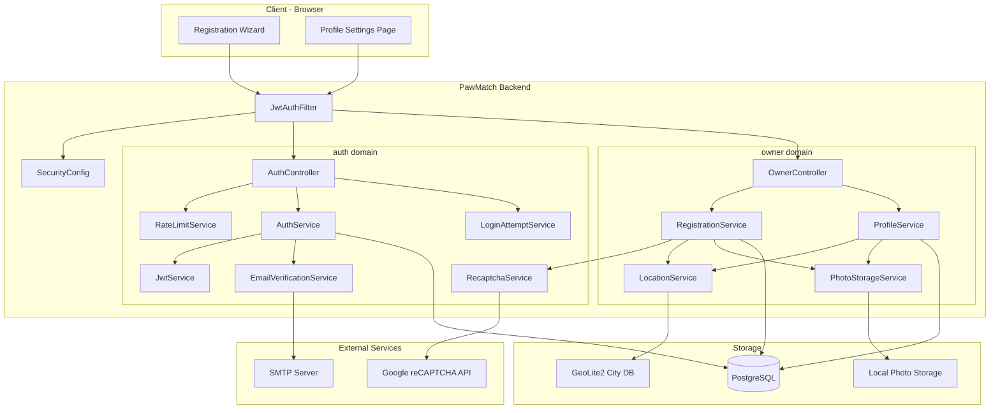
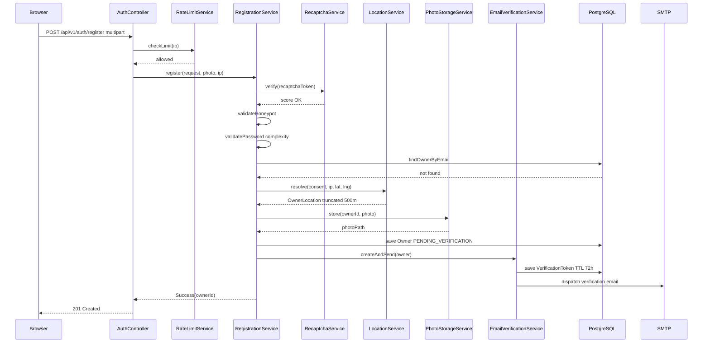
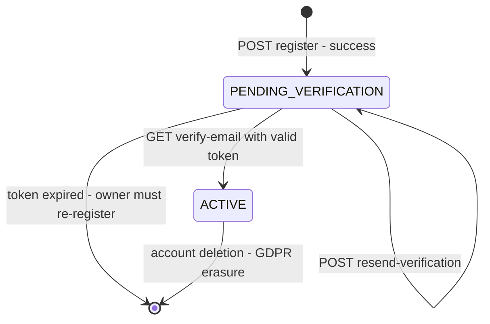
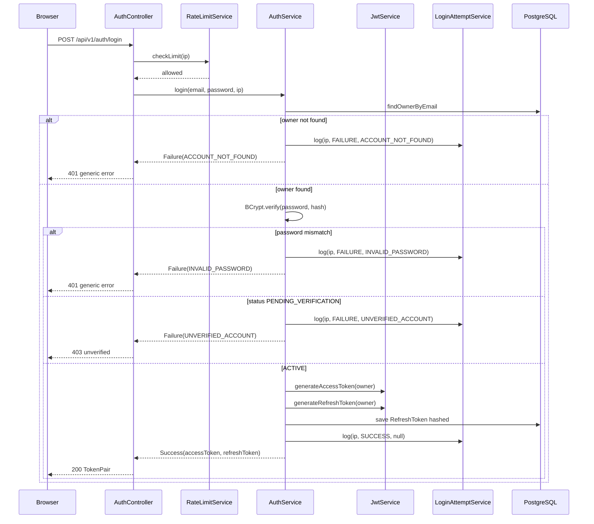
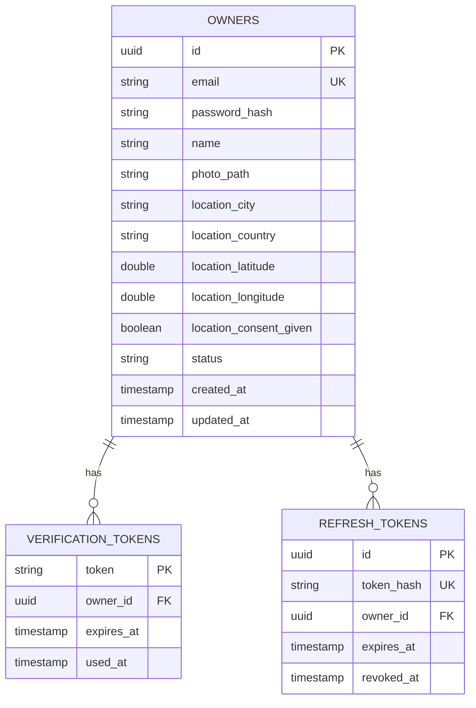

# Technical Design — Registration & Owner Profile

## Overview

This feature introduces owner identity and account management to PawMatch. It delivers two new domains — `auth` (security infrastructure) and `owner` (domain entity + profile) — on top of the existing Spring Boot 4.0 / Kotlin monolith. No authentication layer currently exists; this is a greenfield addition.

**Purpose**: Enable owners to create a verified account, complete their profile via a 3-step wizard, and manage that profile post-registration. A verified account is the prerequisite gate for the matching feed and all downstream features.

**Users**: New owners (Marco, Giulia personas) follow the wizard on first visit. Returning owners use the profile settings page to update their details.

**Impact**: Adds two new domain packages (`auth/`, `owner/`), three new database tables (`owners`, `verification_tokens`, `refresh_tokens`), and Spring Security 7 to the build. No existing domains are modified.

### Goals

- Atomic 3-step wizard: credentials → personal details → location + consent.
- Verified-only access: full platform block until email is confirmed.
- Stateless JWT authentication with short-lived access tokens (≤ 1 h) + refresh tokens.
- IP-based rate limiting with Fibonacci-progressive blocks and dual anti-bot protection.

### Non-Goals

- Password reset / forgot-password flow (deferred).
- Social login (deferred to v2).
- Multi-dog profiles per owner (deferred to v2).
- Distributed rate-limit state (Redis-backed Bucket4j deferred; in-memory for v1 single instance).
- Refresh token cleanup scheduler (deferred; flagged as operational gap).

---

## Architecture

### Architecture Pattern & Boundary Map



**Architecture Integration**:
- Selected pattern: **Domain-first layered** — consistent with the existing `match/`, `support/` domains.
- `auth/` owns security infrastructure (JWT, verification tokens, rate limiting, reCAPTCHA); it depends on the `owner/` `OwnerRepository` but never exposes owner domain objects in its API.
- `owner/` owns the `Owner` aggregate and profile management; it has no dependency on `auth/`.
- `JwtAuthFilter` is in `auth/config/` and populates `SecurityContextHolder` before the request reaches any controller; this avoids `@PreAuthorize` annotations which lose Kotlin coroutine context in servlet-based Spring MVC.
- Steering compliance: `suspend` controllers, `@Value` config injection, `KotlinLogging.logger {}` at file top-level, domain-first packages.

### Technology Stack

| Layer | Choice / Version | Role in Feature | Notes |
|-------|-----------------|-----------------|-------|
| Backend | Spring Boot 4.0.4 / Kotlin 2.2.21 | Existing runtime | No change |
| Security | Spring Security 7 (`spring-boot-starter-security`) | JWT filter chain, `SecurityFilterChain` bean | New dependency |
| JWT | Nimbus JOSE + JWT (bundled in Spring Security 7) | Access token + refresh token generation/validation | Preferred over JJWT in Spring Boot 4; see `research.md` |
| Password hashing | `BCryptPasswordEncoder` (Spring Security) | Cost factor 12 | No external library |
| Rate limiting | Bucket4j `bucket4j-core` + companion in-memory map | 5/30-min window + Fibonacci-progressive blocks | Redis-backed Bucket4j for horizontal scale (deferred) |
| Email | `spring-boot-starter-mail` (Spring Boot 4) | Verification email dispatch | No API changes from v3; SMTP via `.envrc` |
| Geolocation | MaxMind GeoLite2 + `com.maxmind.geoip2:geoip2` | IP-to-city resolution | Free; database refresh ≤ 30 days required by EULA |
| File upload | Spring `MultipartFile` + local filesystem | Photo storage up to 5 MB | `PhotoStorageService` abstraction for future S3 migration |
| MIME validation | Apache Tika Core | Magic-byte MIME type detection for photos | More reliable than `Content-Type` header |
| DB migrations | Liquibase (`spring-boot-starter-liquibase`) | Schema versioning for 3 new tables | `ddl-auto` changed to `validate` |
| Data | Spring Data JPA + PostgreSQL | `Owner`, `VerificationToken`, `RefreshToken` persistence | Extends existing setup |

---

## System Flows

### Registration Flow



> Key decision: client aggregates all 3 wizard steps; one atomic POST. No per-step persistence. See `research.md` for rationale.

---

### Owner Account State Machine



> `PENDING_VERIFICATION` owners are blocked from all endpoints except `/api/v1/auth/verify-email` and `/api/v1/auth/resend-verification`. Expired-pending accounts may be cleaned up by a future scheduled job (not in v1 scope).

---

### Login & JWT Issuance Flow



---

## Requirements Traceability

| Requirement | Summary | Components | Interfaces | Flows |
|-------------|---------|------------|------------|-------|
| 1.1 | 3-step wizard with inline tutorial | OwnerController, RegistrationService | POST /api/v1/auth/register | Registration Flow |
| 1.2 | Atomic flow — no partial saves | RegistrationService | — | Registration Flow |
| 1.3 | Step 1: email format + uniqueness + password complexity | RegistrationService | GET /api/v1/auth/email-available | Registration Flow |
| 1.4 | Enumeration prevention on duplicate email | RegistrationService, AuthController | — | Registration Flow |
| 1.5 | Per-rule password feedback | RegistrationService | RegistrationResponse.violations | Registration Flow |
| 1.6–1.7 | Photo validation: max 5 MB, JPEG/PNG/WebP | RegistrationService, PhotoStorageService | — | Registration Flow |
| 1.8–1.9 | Location consent + IP fallback + 500 m truncation | RegistrationService, LocationService | — | Registration Flow |
| 1.10 | Account created as PENDING_VERIFICATION; bcrypt hash; verification email dispatched | RegistrationService, EmailVerificationService | — | Registration Flow |
| 2.1 | Full feature block while PENDING_VERIFICATION | SecurityConfig, JwtAuthFilter | — | Account State Machine |
| 2.2 | Valid token → ACTIVE + redirect | EmailVerificationService, AuthService | GET /api/v1/auth/verify-email | Account State Machine |
| 2.3 | 72 h TTL; expired token → resend option | EmailVerificationService | POST /api/v1/auth/resend-verification | Account State Machine |
| 2.4 | One-time token invalidation | EmailVerificationService, VerificationToken entity | — | Account State Machine |
| 2.5 | Already-ACTIVE link → redirect without error | EmailVerificationService | GET /api/v1/auth/verify-email | Account State Machine |
| 3.1–3.5 | Profile view + update + photo management | OwnerController, ProfileService, PhotoStorageService | GET/PUT /api/v1/owner/profile | — |
| 4.1 | reCAPTCHA v3 + honeypot | RecaptchaService, RegistrationService | — | Registration Flow |
| 4.2 | IP rate limiting 5/30 min + Fibonacci blocks | RateLimitService | — | All auth endpoints |
| 4.3 | Email enumeration rate limiting | RateLimitService | GET /api/v1/auth/email-available | Registration Flow |
| 4.4–4.5 | No plaintext passwords; bcrypt cost ≥ 12 | RegistrationService, AuthService | — | All password flows |
| 5.1–5.3 | Structured login attempt logging | LoginAttemptService | — | Login Flow |

---

## Components & Interfaces

### Component Summary

| Component | Domain / Layer | Intent | Req Coverage | Key Dependencies | Contracts |
|-----------|---------------|--------|--------------|-----------------|-----------|
| AuthController | auth / presentation | Login, token refresh, email verification, logout | 2.2, 2.3, 2.5, 4.2, 5.1 | AuthService, RateLimitService, LoginAttemptService | API |
| AuthService | auth / service | Login orchestration; JWT lifecycle | 2.2, 4.4, 5.1 | JwtService, EmailVerificationService, OwnerRepository | Service |
| JwtService | auth / service | Nimbus JOSE token generation and validation | 2.1 | Nimbus JOSE (Spring Security 7) | Service |
| EmailVerificationService | auth / service | Token CRUD and email dispatch | 2.2, 2.3, 2.4 | JavaMailSender, VerificationTokenRepository | Service |
| RateLimitService | auth / service | Bucket4j rate limiting + Fibonacci progressive blocks | 4.2, 4.3 | Bucket4j core | Service |
| RecaptchaService | auth / service | reCAPTCHA v3 HTTP verification | 4.1 | RestClient (Google API) | Service |
| LoginAttemptService | auth / service | Structured login event logging | 5.1, 5.2, 5.3 | KotlinLogging | Service |
| JwtAuthFilter | auth / config | OncePerRequestFilter — JWT extraction and SecurityContext population | 2.1 | JwtService | — |
| SecurityConfig | auth / config | SecurityFilterChain bean; permit/deny rules | 2.1, 4.2 | JwtAuthFilter | — |
| OwnerController | owner / presentation | Registration endpoint, profile read/update/photo delete | 1.1, 3.1–3.5 | RegistrationService, ProfileService | API |
| RegistrationService | owner / service | 3-step wizard orchestration; atomicity | 1.1–1.10, 4.1, 4.4 | RecaptchaService, LocationService, PhotoStorageService, OwnerRepository | Service |
| ProfileService | owner / service | Profile update validation and persistence | 3.1–3.5 | PhotoStorageService, LocationService, OwnerRepository | Service |
| LocationService | owner / service | IP-to-city resolution + 500 m coordinate truncation | 1.8, 1.9, 3.3 | MaxMind GeoIP2 DatabaseReader | Service |
| PhotoStorageService | owner / service | Photo store / delete (local filesystem v1) | 1.6, 1.7, 3.5 | Tika Core (MIME), filesystem | Service |

---

### auth / service

#### RegistrationService (lives in owner / service — core orchestrator)

| Field | Detail |
|-------|--------|
| Intent | Orchestrates the atomic registration flow: anti-bot checks → validation → location resolution → photo storage → DB persistence → verification email dispatch |
| Requirements | 1.1, 1.2, 1.3, 1.4, 1.5, 1.6, 1.7, 1.8, 1.9, 1.10, 4.1, 4.4, 4.5 |

**Responsibilities & Constraints**
- Owns the registration transaction boundary: all side effects (photo save, DB insert, email dispatch) must succeed or the operation is aborted and no partial state is retained.
- Photo is written to disk only after DB insert succeeds; if email dispatch fails the account is still created (email can be resent).
- Does not persist any data for failed validations.

**Dependencies**
- Inbound: `OwnerController` — delegates the registration multipart request (P0).
- Outbound: `RecaptchaService` — bot check before any DB access (P0).
- Outbound: `OwnerRepository` — email uniqueness check + `Owner` save (P0).
- Outbound: `LocationService` — resolve location from consent / IP / coordinates (P0).
- Outbound: `PhotoStorageService` — persist optional photo (P1).
- Outbound: `EmailVerificationService` — dispatch verification email (P0).

**Contracts**: Service [x]

##### Service Interface

```kotlin
interface RegistrationService {
    suspend fun register(
        request: RegistrationRequest,
        photo: ByteArray?,
        photoContentType: String?,
        ipAddress: String,
    ): RegistrationResult
}

data class RegistrationRequest(
    val email: String,
    val password: String,
    val name: String,
    val recaptchaToken: String,
    val honeypotField: String,          // must be empty string
    val locationConsent: Boolean,
    val latitude: Double?,              // present only when consent = true
    val longitude: Double?,
)

sealed class RegistrationResult {
    data class Success(val ownerId: UUID) : RegistrationResult()
    data class ValidationFailed(val violations: List<FieldViolation>) : RegistrationResult()
    object BotDetected : RegistrationResult()
    object Forbidden : RegistrationResult()      // generic; covers duplicate email (enumeration prevention)
}

data class FieldViolation(val field: String, val message: String)
```

- Preconditions: `ipAddress` is not blank; `recaptchaToken` is present.
- Postconditions on `Success`: `Owner` row with `status = PENDING_VERIFICATION` exists; `VerificationToken` row with `expiresAt = now + 72h` exists; verification email is dispatched.
- Invariants: No `Owner` row is created if any validation step fails. Photo file is deleted if the DB save fails after the photo was already written.

**Implementation Notes**
- Integration: reCAPTCHA verification and honeypot check happen before any DB access to minimize unnecessary load.
- Validation: Password complexity checked via a `PasswordValidator` value object (injectable, testable in isolation). Email format checked with Jakarta Bean Validation (`@Email`); uniqueness checked via repository.
- Risks: Race condition on email uniqueness (two simultaneous registrations with the same email) — mitigated by `UNIQUE` constraint on `owners.email`; the second insert will throw `DataIntegrityViolationException`, caught and returned as `Forbidden` result.

---

#### AuthService

| Field | Detail |
|-------|--------|
| Intent | Login orchestration: credential verification, account status check, JWT pair issuance |
| Requirements | 2.2, 4.4, 5.1 |

**Dependencies**
- Inbound: `AuthController` (P0).
- Outbound: `OwnerRepository` — load owner by email (P0).
- Outbound: `JwtService` — generate access + refresh tokens (P0).
- Outbound: `RefreshTokenRepository` — persist refresh token hash (P0).
- Outbound: `LoginAttemptService` — log every attempt outcome (P1).

**Contracts**: Service [x]

##### Service Interface

```kotlin
interface AuthService {
    suspend fun login(email: String, password: String, ipAddress: String): AuthResult
    suspend fun verifyEmail(token: String): VerificationResult
    suspend fun resendVerification(email: String): Unit
    suspend fun refreshTokens(refreshToken: String): AuthResult
    suspend fun logout(refreshToken: String): Unit
}

sealed class AuthResult {
    data class Success(val accessToken: String, val refreshToken: String) : AuthResult()
    data class Failure(val reason: AuthFailureReason) : AuthResult()
}

enum class AuthFailureReason { INVALID_CREDENTIALS, UNVERIFIED_ACCOUNT, TOKEN_EXPIRED, TOKEN_INVALID }

sealed class VerificationResult {
    object Success : VerificationResult()
    object AlreadyActive : VerificationResult()
    object TokenExpired : VerificationResult()
    object TokenNotFound : VerificationResult()
}
```

- Preconditions: `email` and `password` are non-blank.
- Postconditions on `Success`: `RefreshToken` row exists in DB; access token is a signed Nimbus JWT with `sub = ownerId`, `exp = now + 1h`.
- Invariants: Plaintext password is never stored, logged, or returned. BCrypt verification uses cost factor ≥ 12.

---

#### JwtService

| Field | Detail |
|-------|--------|
| Intent | Nimbus JOSE JWT generation and validation using a configured HMAC-SHA256 or RSA signing key |
| Requirements | 2.1 |

**Contracts**: Service [x]

##### Service Interface

```kotlin
interface JwtService {
    fun generateAccessToken(ownerId: UUID, email: String, status: OwnerStatus): String
    fun generateRefreshToken(ownerId: UUID): String          // opaque SecureRandom token (not JWT)
    fun validateAccessToken(token: String): JwtClaims?
}

data class JwtClaims(
    val ownerId: UUID,
    val email: String,
    val status: OwnerStatus,
    val expiresAt: Instant,
)
```

- Access tokens are signed JWTs (Nimbus `JWSObject`, algorithm HS256 or RS256 depending on key config).
- Refresh tokens are 64-byte SecureRandom hex strings (not JWTs) stored as SHA-256 hashes in the DB.
- `validateAccessToken` returns `null` on any validation failure (expired, malformed, wrong signature); never throws.

---

#### RateLimitService

| Field | Detail |
|-------|--------|
| Intent | Enforce IP-based rate limits with Bucket4j and Fibonacci-progressive block durations |
| Requirements | 4.2, 4.3 |

**Contracts**: Service [x]

##### Service Interface

```kotlin
interface RateLimitService {
    fun checkLimit(ipAddress: String, action: RateLimitAction): RateLimitDecision
    fun recordBreach(ipAddress: String, action: RateLimitAction): Duration
}

enum class RateLimitAction { REGISTRATION, LOGIN, EMAIL_LOOKUP }

sealed class RateLimitDecision {
    object Allowed : RateLimitDecision()
    data class Blocked(val retryAfter: Duration) : RateLimitDecision()
}
```

- Each `(ipAddress, action)` pair has its own Bucket4j bucket: capacity 5, refill 5 tokens every 30 minutes.
- On first bucket exhaustion, `recordBreach` increments the breach counter and returns a Fibonacci(breachCount) minute duration.
- Block state stored in `ConcurrentHashMap<String, BlockState>` where `BlockState(expiresAt: Instant, breachCount: Int)`.
- Fibonacci sequence: `[1, 1, 2, 3, 5, 8, 13, 21, ...]` minutes, capped at 60 minutes for breach count > 10.
- **Risk**: In-memory state lost on restart; acceptable for v1 single instance. Redis-backed `ProxyManager` required before horizontal scale (see `research.md`).

---

#### RecaptchaService

| Field | Detail |
|-------|--------|
| Intent | HTTP client for Google reCAPTCHA v3 token verification |
| Requirements | 4.1 |

**Contracts**: Service [x]

##### Service Interface

```kotlin
interface RecaptchaService {
    suspend fun verify(token: String, expectedAction: String = "register"): RecaptchaResult
}

sealed class RecaptchaResult {
    data class Success(val score: Float) : RecaptchaResult()
    object Failed : RecaptchaResult()
    object Error : RecaptchaResult()
}
```

- Calls `POST https://www.google.com/recaptcha/api/siteverify` with `secret` (from config) and `response` (client token).
- `Success` is returned only when `response.success == true` and `response.score >= tinder4dogs.security.recaptcha.min-score` (default 0.5).
- On network error or score below threshold: returns `Failed` (treats as bot).
- `Error` is returned on infrastructure failure (HTTP timeout, 5xx from Google); in `Error` case, `RegistrationService` may optionally proceed (configurable fail-open policy, default fail-closed).

---

#### EmailVerificationService

| Field | Detail |
|-------|--------|
| Intent | Manage secure verification token lifecycle and dispatch verification emails |
| Requirements | 2.2, 2.3, 2.4, 2.5 |

**Responsibilities & Constraints**
- Owns the `VerificationToken` aggregate: creation, consumption, expiry, and resend.
- Generates 64-char cryptographically secure random hex tokens via `SecureRandom`.
- Persists at most one active (non-expired, non-consumed) token per owner; invalidates the previous token on resend.
- Email dispatch is asynchronous (`withContext(Dispatchers.IO)`) to stay within the 5-second SLA without blocking the request thread.

**Dependencies**
- Inbound: `RegistrationService` — request token creation + email dispatch after account creation (P0).
- Inbound: `AuthService` — token consumption for verification + resend requests (P0).
- Outbound: `VerificationTokenRepository` — token CRUD (P0).
- Outbound: `JavaMailSender` — SMTP email dispatch (P1; failure does not abort registration).

**Contracts**: Service [x]

##### Service Interface

```kotlin
interface EmailVerificationService {
    suspend fun createAndSend(owner: Owner): Unit
    suspend fun verify(token: String): VerificationResult
    suspend fun resend(ownerId: UUID): Unit
}
```

- Preconditions: `owner.email` is non-blank and `owner.status == PENDING_VERIFICATION` for `createAndSend`.
- Postconditions on `createAndSend`: `VerificationToken` row with `expiresAt = now + 72h` exists; email dispatched within 5 seconds.
- Invariants: `verify` marks `used_at` before transitioning owner status; SMTP failure does not roll back token creation.

**Implementation Notes**
- Integration: SMTP credentials sourced from `spring.mail.*` environment variables via `JavaMailSenderAutoConfiguration`.
- Validation: Token lookup uses indexed PK; `used_at IS NULL AND expires_at > now()` check enforces single-use and TTL.
- Risks: SMTP server failure — non-fatal; logged at WARN; owner can request resend from "Check your email" screen.

---

#### LoginAttemptService

| Field | Detail |
|-------|--------|
| Intent | Write structured login-attempt audit log entries without storing PII |
| Requirements | 5.1, 5.2, 5.3 |

**Contracts**: Service [x]

##### Service Interface

```kotlin
interface LoginAttemptService {
    fun log(ipAddress: String, outcome: LoginOutcome, reason: LoginFailureReason?): Unit
}

enum class LoginOutcome { SUCCESS, FAILURE }
enum class LoginFailureReason { INVALID_PASSWORD, UNVERIFIED_ACCOUNT, ACCOUNT_NOT_FOUND }
```

- Each call writes one structured log entry via `KotlinLogging` at `INFO` (SUCCESS) or `WARN` (FAILURE) level.
- Log fields: UTC timestamp, IP (last octet zeroed for IPv4 privacy), outcome, reason code.
- `log` is synchronous to guarantee no attempt is silently dropped (NFR-REG-10).
- Plaintext passwords, hashes, and email addresses are never included in any log entry.

---

### auth / config

#### SecurityConfig

| Field | Detail |
|-------|--------|
| Intent | Spring Security 7 `SecurityFilterChain` bean; defines permit/deny rules and registers `JwtAuthFilter` |
| Requirements | 2.1 |

**Responsibilities & Constraints**
- All endpoints except `POST /api/v1/auth/register`, `POST /api/v1/auth/login`, `GET /api/v1/auth/verify-email`, and `POST /api/v1/auth/resend-verification` require a valid access token.
- CORS configuration must allow the browser origin for the wizard frontend.
- `SessionCreationPolicy.STATELESS` — no server-side session.
- CSRF disabled (stateless JWT API).

**Implementation Notes**
- `JwtAuthFilter` is registered before `UsernamePasswordAuthenticationFilter` in the filter chain.
- Owners with `status = PENDING_VERIFICATION` are blocked at the filter level: `JwtAuthFilter` reads the `status` claim from the JWT and rejects requests to protected endpoints with 403.

---

### owner / service

#### LocationService

| Field | Detail |
|-------|--------|
| Intent | Resolve geographic location from IP or explicit coordinates; truncate to 500 m grid |
| Requirements | 1.8, 1.9, 3.3 |

**Contracts**: Service [x]

##### Service Interface

```kotlin
interface LocationService {
    fun resolve(consent: Boolean, ipAddress: String, latitude: Double?, longitude: Double?): OwnerLocation
    fun truncateTo500m(latitude: Double, longitude: Double): Pair<Double, Double>
}
```

- When `consent == true` and `latitude` / `longitude` are provided: truncate coordinates to 0.005° grid (≈ 500 m) before returning.
- When `consent == false` or coordinates absent: use MaxMind `DatabaseReader.city(InetAddress.getByName(ipAddress))` to obtain city/country; `latitude` and `longitude` in the result are null.
- `DatabaseReader` is a Spring singleton bean; the `GeoLite2-City.mmdb` file is loaded from `classpath:geoip/GeoLite2-City.mmdb`.
- If the GeoLite2 lookup fails (private IP, DB error): returns a `OwnerLocation` with city = "Unknown", no coordinates. Never blocks registration.

---

#### PhotoStorageService

| Field | Detail |
|-------|--------|
| Intent | Store and delete owner profile photos; validate MIME type and size |
| Requirements | 1.6, 1.7, 3.5 |

**Contracts**: Service [x]

##### Service Interface

```kotlin
interface PhotoStorageService {
    fun store(ownerId: UUID, photo: ByteArray, contentType: String): String  // returns relative path
    fun delete(photoPath: String): Unit
    fun validate(photo: ByteArray, declaredContentType: String): PhotoValidationResult
}

sealed class PhotoValidationResult {
    object Valid : PhotoValidationResult()
    data class Invalid(val reason: String) : PhotoValidationResult()
}
```

- `validate`: Uses Apache Tika to detect actual MIME from magic bytes; rejects if not `image/jpeg`, `image/png`, or `image/webp`. Size is enforced at the Spring multipart layer (`spring.servlet.multipart.max-file-size=5MB`) and double-checked in `validate`.
- `store`: Persists to `${tinder4dogs.storage.photos-dir}/{ownerId}/profile.{ext}`. Returns a relative path for storage in the DB.
- The stored path is served via `GET /api/v1/owner/profile/photo` (streaming endpoint, not a static resource URL).

---

#### ProfileService

| Field | Detail |
|-------|--------|
| Intent | Validate and persist owner profile updates; enforce location consent and photo rules post-registration |
| Requirements | 3.1, 3.2, 3.3, 3.4, 3.5 |

**Responsibilities & Constraints**
- Applies the same validation rules as `RegistrationService`: name mandatory, photo ≤ 5 MB and JPEG/PNG/WebP, location re-consent required when coordinates change.
- Coordinates are always truncated to the 0.005° grid (≈ 500 m) before persisting.
- Photo deletion removes the file from the filesystem and clears `owner.photoPath` within the same `@Transactional` boundary.

**Dependencies**
- Inbound: `OwnerController` (P0).
- Outbound: `OwnerRepository` — load and save the `Owner` aggregate (P0).
- Outbound: `PhotoStorageService` — validate, store, and delete photos (P1).
- Outbound: `LocationService` — truncate coordinates on consent-given updates (P0).

**Contracts**: Service [x]

##### Service Interface

```kotlin
interface ProfileService {
    suspend fun getProfile(ownerId: UUID): OwnerProfileResponse
    suspend fun updateProfile(
        ownerId: UUID,
        request: ProfileUpdateRequest,
        photo: ByteArray?,
        photoContentType: String?,
    ): ProfileUpdateResult
    suspend fun deletePhoto(ownerId: UUID): Unit
}

data class ProfileUpdateRequest(
    val name: String,
    val locationConsent: Boolean,
    val latitude: Double?,
    val longitude: Double?,
)

sealed class ProfileUpdateResult {
    data class Success(val profile: OwnerProfileResponse) : ProfileUpdateResult()
    data class ValidationFailed(val violations: List<FieldViolation>) : ProfileUpdateResult()
}
```

- Preconditions: `ownerId` resolves to an `ACTIVE` owner; `request.name` is non-blank.
- Postconditions on `Success`: `Owner` row updated; success notification included in response.
- Invariants: No coordinate stored when `locationConsent == false`; photo write and DB update are co-ordinated — file cleanup triggered if DB update fails after photo is written.

**Implementation Notes**
- Integration: Delegates to `PhotoStorageService` and `LocationService`; no new external integrations.
- Validation: Re-uses the same `FieldViolation` type defined in `RegistrationService`.
- Risks: Concurrent profile updates from two sessions — last-write-wins (no optimistic locking in v1); acceptable given low concurrent update probability.

---

## Data Models

### Domain Model

```
Owner (Aggregate Root)
├── id: UUID
├── email: String             -- unique identifier; enumeration-safe error responses
├── passwordHash: String      -- BCrypt cost ≥ 12
├── name: String
├── photoPath: String?        -- nullable; relative filesystem path
├── location: OwnerLocation   -- embedded value object
├── status: OwnerStatus       -- PENDING_VERIFICATION | ACTIVE
└── timestamps: createdAt, updatedAt

OwnerLocation (Value Object)
├── city: String?
├── country: String?
├── latitude: Double?         -- truncated to 0.005° grid (≈ 500 m)
├── longitude: Double?
└── consentGiven: Boolean

VerificationToken (Entity)
├── token: String (PK)        -- 64-char SecureRandom hex
├── owner: Owner (FK)
├── expiresAt: Instant        -- now + 72 h
└── usedAt: Instant?          -- null = not yet consumed

RefreshToken (Entity)
├── id: UUID (PK)
├── tokenHash: String         -- SHA-256(raw token); indexed
├── owner: Owner (FK)
├── expiresAt: Instant        -- now + 30 days
└── revokedAt: Instant?       -- null = active
```

**Domain invariants**:
- An `Owner` in `PENDING_VERIFICATION` cannot authenticate (JWT issuance blocked).
- `VerificationToken.usedAt != null` means consumed; re-use must be rejected with `TokenNotFound` semantics (constant-time check).
- `OwnerLocation.latitude` and `longitude` are always `null` when `consentGiven == false`.

### Logical Data Model



### Physical Data Model

**Table: `owners`**
```sql
id                      UUID         PRIMARY KEY DEFAULT gen_random_uuid()
email                   VARCHAR(255) NOT NULL UNIQUE
password_hash           VARCHAR(60)  NOT NULL
name                    VARCHAR(100) NOT NULL
photo_path              VARCHAR(500)
location_city           VARCHAR(100)
location_country        VARCHAR(100)
location_latitude       DOUBLE PRECISION
location_longitude      DOUBLE PRECISION
location_consent_given  BOOLEAN      NOT NULL DEFAULT FALSE
status                  VARCHAR(30)  NOT NULL DEFAULT 'PENDING_VERIFICATION'
created_at              TIMESTAMPTZ  NOT NULL DEFAULT now()
updated_at              TIMESTAMPTZ  NOT NULL DEFAULT now()

INDEX idx_owners_email ON owners(email)
INDEX idx_owners_status ON owners(status)
```

**Table: `verification_tokens`**
```sql
token      VARCHAR(128) PRIMARY KEY
owner_id   UUID         NOT NULL REFERENCES owners(id) ON DELETE CASCADE
expires_at TIMESTAMPTZ  NOT NULL
used_at    TIMESTAMPTZ

INDEX idx_vt_owner ON verification_tokens(owner_id)
INDEX idx_vt_expires ON verification_tokens(expires_at)
```

**Table: `refresh_tokens`**
```sql
id         UUID         PRIMARY KEY DEFAULT gen_random_uuid()
token_hash VARCHAR(64)  NOT NULL UNIQUE
owner_id   UUID         NOT NULL REFERENCES owners(id) ON DELETE CASCADE
expires_at TIMESTAMPTZ  NOT NULL
revoked_at TIMESTAMPTZ
created_at TIMESTAMPTZ  NOT NULL DEFAULT now()

INDEX idx_rt_owner ON refresh_tokens(owner_id)
INDEX idx_rt_hash  ON refresh_tokens(token_hash)
```

All DDL is managed via Liquibase changesets under `src/main/resources/db/changelog/`. Each changeset includes a tested rollback. `spring.jpa.hibernate.ddl-auto` is changed from `update` to `validate`.

### Data Contracts & Integration

**POST /api/v1/auth/register** — `multipart/form-data`

| Part | Type | Required | Notes |
|------|------|----------|-------|
| data | JSON `RegistrationRequest` | Yes | See RegistrationService interface |
| photo | Binary | No | Max 5 MB; JPEG/PNG/WebP |

Response `201 Created`:
```json
{ "message": "Registration successful. Please verify your email." }
```

**POST /api/v1/auth/login** — `application/json`

Request: `{ "email": "string", "password": "string" }`
Response `200`: `{ "accessToken": "string", "refreshToken": "string", "expiresIn": 3600 }`

**GET /api/v1/owner/profile** — auth required

Response `200 OwnerProfileResponse`:
```json
{
  "id": "uuid",
  "name": "string",
  "email": "string",
  "photoUrl": "/api/v1/owner/profile/photo | null",
  "location": { "city": "string | null", "country": "string | null", "consentGiven": true },
  "status": "ACTIVE"
}
```

---

## Error Handling

### Error Strategy

All errors are returned as structured JSON: `{ "error": "ERROR_CODE", "message": "human-readable" }`. Controllers never expose internal exception messages.

### Error Categories and Responses

**User Errors (4xx)**

| Scenario | HTTP | `error` Code | Notes |
|----------|------|-------------|-------|
| Validation failure (email format, password rules) | 400 | `VALIDATION_FAILED` | `violations: [{field, message}]` array |
| Duplicate email / bot detected | 400 | `REGISTRATION_FAILED` | Generic — no account existence disclosure |
| Invalid credentials (login) | 401 | `AUTHENTICATION_FAILED` | Same message for wrong password and unknown email |
| Account not verified | 403 | `EMAIL_NOT_VERIFIED` | Includes hint to check email |
| Rate limit exceeded | 429 | `RATE_LIMIT_EXCEEDED` | `Retry-After` header set to block duration in seconds |
| Invalid/expired verification token | 400 | `TOKEN_INVALID` | |
| Unsupported photo format / size | 400 | `PHOTO_INVALID` | |

**System Errors (5xx)**

| Scenario | HTTP | `error` Code | Notes |
|----------|------|-------------|-------|
| reCAPTCHA service unreachable (fail-closed) | 503 | `SERVICE_UNAVAILABLE` | Retry suggested |
| SMTP dispatch failure | 202 | — | Registration succeeds; email can be resent |
| DB error | 500 | `INTERNAL_ERROR` | Generic; full stack trace logged |

### Monitoring

- All `5xx` responses are logged at `ERROR` level with a `traceId` (UUID generated per request in a filter).
- Rate limit breaches are logged at `WARN` level with `ipAddress` (truncated: last octet zeroed for IPv4).
- Login attempt outcomes are logged via `LoginAttemptService` (structured KotlinLogging, never PII).

---

## Testing Strategy

### Unit Tests

- `RegistrationService`: validate that duplicate-email path returns `Forbidden` (not `ValidationFailed`); verify atomic rollback when photo store fails after DB insert.
- `PasswordValidator`: cover all complexity rules individually; verify per-rule feedback.
- `RateLimitService`: verify Fibonacci block sequence for 6+ breaches; verify bucket refill after 30 minutes.
- `JwtService`: generate and validate a round-trip token; assert `null` returned for tampered / expired tokens.
- `LocationService.truncateTo500m`: verify coordinate rounding to 0.005° grid for edge cases.

### Integration Tests

- `RegistrationService` + real PostgreSQL (via Docker Compose): full happy path; race-condition duplicate email with concurrent requests.
- `EmailVerificationService`: token creation, consumption, and expiry (mock SMTP via GreenMail).
- `RateLimitService`: 5 requests → 429 → Fibonacci block duration sequence over mocked clock.
- `JwtAuthFilter` + `SecurityConfig`: assert that a `PENDING_VERIFICATION` JWT is rejected on protected endpoints with 403.

### E2E / UI Tests

- Happy-path wizard: steps 1 → 2 → 3 → `POST /register` → 201.
- Duplicate email: wizard step 1 → real-time `GET /email-available` → warning shown.
- Email verification link: click → redirect to home; click again → redirect without error.
- Expired link: forced expiry → "resend" link shown → new email dispatched.

### Performance

- `POST /api/v1/auth/register` under 50 concurrent users: p95 < 500 ms (NFR-REG-06).
- `POST /api/v1/auth/login` under 100 concurrent users: p95 < 200 ms.
- `BCryptPasswordEncoder(12).encode()` benchmark: expected 200–400 ms on target hardware; acceptable for login (not registration-path critical).

---

## Security Considerations

- **Password storage**: `BCryptPasswordEncoder(strength = 12)`. Strength is configurable via `tinder4dogs.security.bcrypt-strength` (default 12; never below 10 in production).
- **Enumeration prevention**: All registration errors for duplicate email return the same HTTP 400 + `REGISTRATION_FAILED` code as validation errors; timing is not constant (BCrypt hash is not run for non-existent emails). To prevent timing attacks on login: always run BCrypt verify even for unknown emails using a pre-computed dummy hash (dummy-hash approach from OWASP).
- **JWT signing key**: HMAC-SHA256 key ≥ 256 bits sourced from `.envrc` (`JWT_SECRET`). Never logged. Rotation requires re-login for all users (acceptable for v1).
- **Refresh token**: stored as `SHA-256(rawToken)` in DB; raw token transmitted once to client, never stored server-side.
- **GDPR right to erasure**: `DELETE /api/v1/owner/account` (future endpoint) must cascade-delete `Owner`, `VerificationToken`, `RefreshToken`, and photo file within 30 days. `ON DELETE CASCADE` on FK constraints ensures DB consistency.
- **Geolocation**: Coordinates are truncated to a 0.005° grid (≈ 500 m) before persisting. Exact GPS coordinates are never written to any table or log.

---

## Performance & Scalability

- **BCrypt cost 12** adds ~300 ms per login on modern hardware — acceptable; login is infrequent relative to API calls.
- **Bucket4j in-memory**: zero-latency rate-limit checks; state is lost on restart (acceptable for v1). Redis-backed `ProxyManager` is the horizontal-scale upgrade path.
- **GeoLite2 `DatabaseReader`**: thread-safe singleton; lookups are O(log n) in the binary MMDB file; no I/O after initial load.
- **Photo upload**: multipart parsing is synchronous in Spring MVC; large uploads (up to 5 MB) may delay the registration response — acceptable given the infrequency of registration.
- **Email dispatch**: sent via `withContext(Dispatchers.IO)` coroutine to avoid blocking the request thread; contributes to the 5-second SLA (NFR-REG-07).

---

## Architecture Options Considered

### Option 1: Domain-First Layered — `owner/` + `auth/` (Selected)

**Advantages:**
- Extends the existing `match/` and `support/` domain structure directly — zero new patterns for the team to learn.
- `auth/` and `owner/` have orthogonal change drivers (security vs. product features), so each is versioned and tested independently without risking regressions in the other.
- The `OwnerService` interface mediates the one cross-domain dependency, keeping `auth/` free of JPA annotations and preventing a future `owner/` migration from cascading into security code.

**Disadvantages:**
- One cross-domain interface (`auth/` → `OwnerService`) must be kept synchronized; adding a new `Owner` field required by auth (e.g., `roles` claim) forces a two-file change.
- The domain boundary is invisible from the package structure alone — a developer unfamiliar with the project may add a direct `OwnerRepository` reference inside `auth/`.
- Does not provide the adapter isolation needed for a future microservices extraction without further refactoring.

---

### Option 2: Hexagonal Architecture (Ports & Adapters)

**Advantages:**
- The `Owner` aggregate is free of Spring annotations; domain logic is unit-testable without a Spring context, cutting test startup time to near zero.
- Every external integration (PostgreSQL, SMTP, reCAPTCHA, MaxMind) is behind a port interface — each is independently replaceable without touching domain logic.
- Enforces dependency inversion at compile time: the domain dictates the shape of its adapters, not the reverse.

**Disadvantages:**
- Requires building adapter classes for all 6 external integrations, adding approximately 12 additional source files and an estimated 20% delivery overhead for v1.
- No hexagonal patterns exist in the codebase today; introduces a second structural paradigm alongside the layered approach used by `match/` and `support/`, raising cognitive load for the entire team.
- Adapter swappability has low near-term value: there is one DB, one mail provider, and one reCAPTCHA provider in v1; the cost is paid now while the return accrues hypothetically.

---

### Option 3: Monolithic Security Module (`security/`)

**Advantages:**
- Single package contains authentication, token, `Owner` entity, and profile logic — trivially searchable by a new developer.
- No cross-package imports; `security/` is self-contained with a single dependency on the shared `ai/` infrastructure.
- Fewer files to navigate during debugging of end-to-end authentication flows.

**Disadvantages:**
- Couples the `Owner` domain entity to security infrastructure: adding a product field (e.g., `bio`) requires touching a security-focused package, triggering unrelated code review and test churn.
- When social login (OAuth) is added in v2, the `Owner` aggregate must be refactored out of the security module to support the new identity source — a multi-PR breaking change.
- Contradicts the domain-first structure documented in `steering/structure.md`, creating an inconsistency that increases onboarding friction.

---

**Recommendation:** Option 1 (Domain-First Layered) — maintains architectural consistency with the existing codebase at no added complexity; the `OwnerService` interface keeps the one required cross-domain dependency explicit and auditable. Option 2 is the correct long-term target but adds unjustifiable boilerplate for a v1 single-instance monolith. Option 3 is rejected because it conflates domain and security concerns in a way that blocks v2 extensibility.

---

## Architecture Decision Record

See: `docs/adr/ADR-001-domain-separation-owner-auth.md`

---

## Corner Cases

### Input boundary cases

| Scenario | Expected Behaviour | Req |
|----------|-------------------|-----|
| Email at maximum RFC 5321 length (254 chars) | Accepted if syntactically valid and unique; stored without truncation | 1.3 |
| Password > 72 chars (BCrypt truncation boundary) | Accepted; BCrypt hashes only the first 72 bytes — API documentation must note this cap | 1.3 |
| Two simultaneous POST /register with the same email | First insert succeeds (`PENDING_VERIFICATION`); second receives `DataIntegrityViolationException` on the `UNIQUE` constraint, caught and returned as `Forbidden` (generic, no account existence disclosed) | 1.4 |
| Photo with `.jpg` extension but PNG magic bytes | Apache Tika detects actual MIME from bytes; file accepted and stored as `image/png`; extension mismatch is harmless | 1.6, 1.7 |
| Photo payload exactly 5,242,880 bytes (5 MiB) | Accepted; 5,242,881 bytes rejected with `PHOTO_INVALID` | 1.6, 1.7 |
| `name` field containing only whitespace | Rejected by `@NotBlank`; per-field violation returned without reaching the DB | 1.3 |
| `latitude` provided but `locationConsent = false` | Coordinates silently ignored; city derived from IP only | 1.8 |
| Malformed JSON in the multipart `data` part | Spring `HttpMessageNotReadableException` mapped to 400 `VALIDATION_FAILED` before any service call | 1.1 |
| Honeypot field populated | `RegistrationService` rejects before reCAPTCHA call; `BotDetected` result → 422 | 4.1 |

### State & timing edge cases

| Scenario | Expected Behaviour | Req |
|----------|-------------------|-----|
| Verification link clicked at the exact 72-hour boundary | `expires_at < now()` check marks token expired; user sees expiry message and resend link | 2.3 |
| Resend request while a non-expired token already exists | Existing token's `used_at` set to `now()`; new 72-hour token issued; old link is dead on next click | 2.3, 2.4 |
| Login while account transitions PENDING → ACTIVE concurrently | JWT embeds status at issuance; a PENDING token issued seconds before email verification is valid ≤ 1 h but blocked by `JwtAuthFilter`; next login produces an ACTIVE token | 2.1, 2.2 |
| Concurrent profile updates from two browser tabs | `@Transactional` on `ProfileService.updateProfile` serialises writes; last-write-wins — acceptable in v1 (no optimistic locking) | 3.2 |
| Server restart mid-registration (after photo write, before DB commit) | Photo file is orphaned on disk; no `Owner` row exists so the user re-registers; orphan cleanup is a future maintenance task | 1.2 |
| Rate-limit in-memory state lost on server restart | Fibonacci breach counters reset to zero; IP can immediately make 5 new attempts — acceptable for v1 single instance | 4.2 |

### Integration failure modes

| Dependency | Failure Mode | Behaviour | Req |
|-----------|-------------|-----------|-----|
| Google reCAPTCHA API — timeout or 5xx | `RecaptchaService` returns `Error`; fail-closed default rejects registration with 503 `SERVICE_UNAVAILABLE` | 4.1 |
| SMTP server — connection refused or timeout | `EmailVerificationService.createAndSend` logs at WARN; registration returns 201 anyway; owner resends from "Check your email" screen | 1.10, 2.3 |
| PostgreSQL — connection pool exhausted | `DataAccessException` propagates; controller catches and maps to 500 `INTERNAL_ERROR`; trace ID in response for operator correlation | All |
| MaxMind GeoLite2 — private/loopback IP | `AddressNotFoundException` caught in `LocationService`; `OwnerLocation(city="Unknown")` returned; registration is never blocked | 1.9 |
| MaxMind GeoLite2 — `.mmdb` file absent from classpath | `DatabaseReader` bean creation throws `IOException`; `ApplicationContext` fails to start; startup log contains file path and cause | 1.9 |
| Bucket4j in-memory map under extreme IP cardinality (DDoS) | `ConcurrentHashMap` grows unbounded; heap pressure → OOM risk; not mitigated in v1 — Redis-backed `ProxyManager` required before production scale | 4.2 |

### Security edge cases

| Scenario | Expected Behaviour | Req |
|----------|-------------------|-----|
| JWT with forged `status` claim (PENDING → ACTIVE) | Nimbus signature verification fails; `JwtAuthFilter` returns 401 | 2.1 |
| JWT with `exp` set far in the future | `JWTClaimsSet` validates `exp` during parsing; rejected as invalid | 2.1 |
| Refresh token replayed after explicit logout | `revokedAt != null` detected in `RefreshTokenRepository`; rejected with `TOKEN_INVALID` | 2.1 |
| Verification token reused after `used_at` is set | `used_at != null` returns `TokenNotFound` — same response as a never-issued token; constant-time semantics prevent existence inference | 2.4 |
| Login timing attack to confirm account existence | Dummy BCrypt hash always computed even for unknown emails; response time is uniform (~300 ms) regardless of path | 1.4, 4.4 |
| Password value logged by Spring HTTP access log | `CommonsRequestLoggingFilter` is not activated; request body is never written to logs — enforced by absence of the bean definition | 4.4 |
| Coordinate precision leaked via API response | `OwnerProfileResponse.location` exposes only city and country strings plus `consentGiven`; latitude/longitude are never included in any response payload | 3.3, NFR-REG-03 |

### Data edge cases

| Scenario | Expected Behaviour | Req |
|----------|-------------------|-----|
| `verification_tokens` table growth from unverified accounts never completing | Expired rows accumulate; queries filter on `expires_at > now() AND used_at IS NULL` via `idx_vt_expires` — read performance unaffected; cleanup job deferred to v2 | 2.3 |
| `owners` table at 1 M rows — email uniqueness check | `UNIQUE` index on `owners.email` provides O(log n) lookup; no degradation expected | 1.3 |
| GDPR erasure request with outstanding sessions | `ON DELETE CASCADE` on `verification_tokens.owner_id` and `refresh_tokens.owner_id` removes all associated rows atomically; photo file deletion is a separate imperative step (no DB CASCADE) | NFR-REG-02 |
| GeoLite2 database older than 30 days in production | Startup warning logged at > 25 days; accuracy degrades silently; MaxMind EULA breach is a legal risk — operational runbook must include a monthly refresh reminder | 1.9 |
| `password_hash` column width mismatch on algorithm upgrade | BCrypt output is always 60 chars; Argon2id output is up to 95 chars; a `VARCHAR(128)` column migration via Liquibase is required before any algorithm change is deployed | 4.5 |

---

## Supporting References

Detailed investigation notes, benchmarks, and library comparisons are in `.kiro/specs/registration-owner-profile/research.md`.
