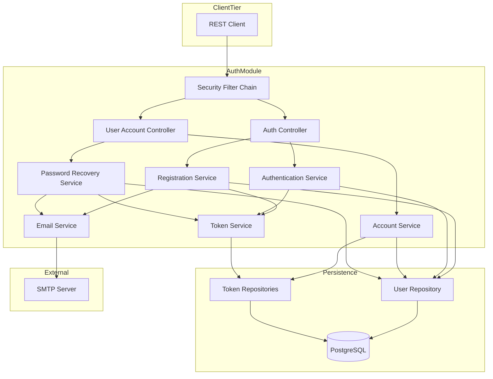
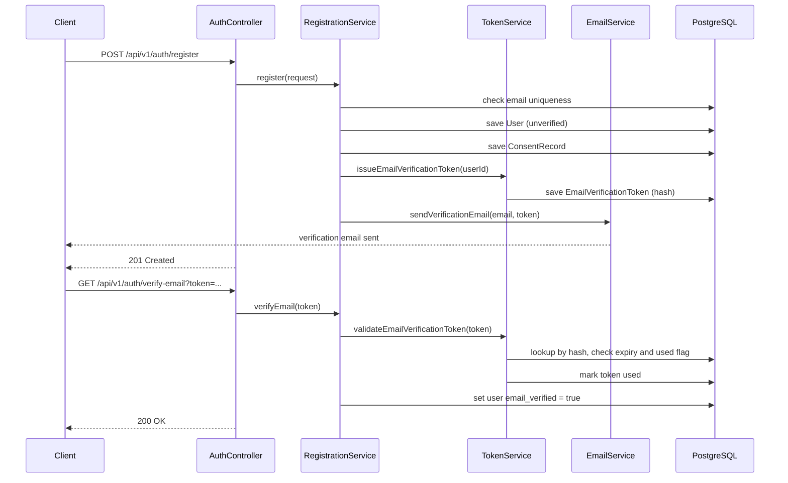
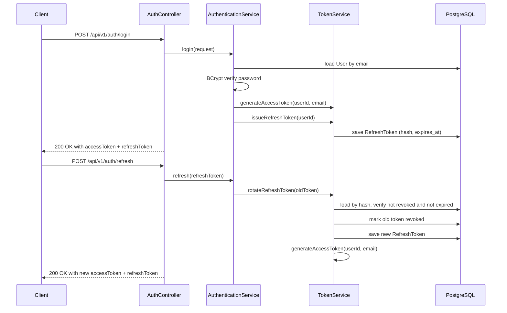
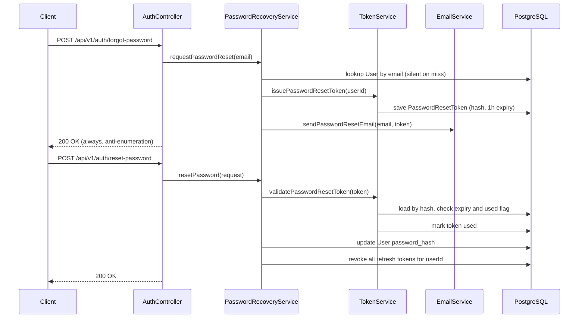
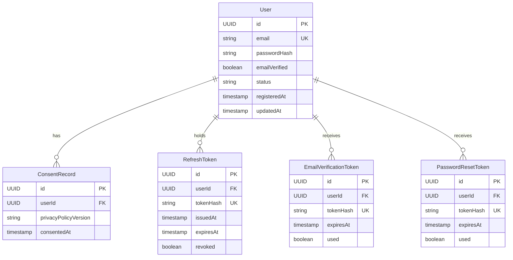

# Design Document — User Registration & Account (F-01)

## Overview

This feature delivers secure user account lifecycle management to all Tinder4Dogs owners. It is the foundational layer upon which every other platform feature depends: no dog profile, swipe, match, or chat can exist without a verified, authenticated account.

**Purpose**: Provide email/password registration with email verification, JWT-based authentication with refresh token rotation, account management (view, update email/password, delete), password recovery via email, and GDPR consent recording.

**Users**: Casual owners and private breeders — non-technical users who expect a simple and secure onboarding flow (v1 personas: Marco, Giulia).

**Impact**: Introduces Spring Security to the project and adds five new DB tables. All existing routes (`/api/v1/support/**`) become public by default; the security filter chain must be configured carefully to avoid breaking them.

### Goals

- Implement all seven requirements (Registration, Authentication, Account Retrieval, Account Update, Account Deletion, GDPR Consent, Password Recovery).
- Establish a Spring Security + JWT baseline that future features (dog profile, swipe, match) extend without modification.
- Keep authorization logic decoupled from domain logic (NFR-C-04) to support the planned premium tier.

### Non-Goals

- OAuth2 / social login (NFR-C-02, deferred post-v1).
- Email HTML templates (plain-text email sufficient for MVP).
- Refresh token Redis caching (see `research.md` — deferred to higher-scale phase).
- Expired-token DB cleanup job (noted risk, out of scope v1).
- Two-factor authentication.

---

## Requirements Traceability

| Requirement | Summary | Components | Interfaces | Flows |
|-------------|---------|------------|------------|-------|
| 1.1–1.7 | Register with email/password + consent | RegistrationService, AuthController | `register()` | Registration flow |
| 1.8–1.11 | Email verification lifecycle | RegistrationService, TokenService, EmailService, AuthController | `verifyEmail()`, `resendVerification()` | Email verification flow |
| 2.1–2.6 | Login, access token, JWT protection | AuthenticationService, TokenService, SecurityConfig | `login()` | Login flow |
| 2.7–2.9 | Refresh token rotation + logout | AuthenticationService, TokenService | `refresh()`, `logout()` | Refresh/logout flow |
| 3.1–3.3 | Authenticated account info retrieval | AccountService, UserAccountController | `getAccount()` | — |
| 4.1–4.5 | Email and password update | AccountService, UserAccountController | `updateEmail()`, `changePassword()` | — |
| 5.1–5.5 | Account deletion + cascade (GDPR) | AccountService, UserAccountController | `deleteAccount()` | Deletion flow |
| 6.1–6.4 | GDPR consent record | RegistrationService, AccountService, UserAccountController | `recordConsent()`, `getConsents()` | — |
| 7.1–7.7 | Password recovery via email | PasswordRecoveryService, TokenService, EmailService, AuthController | `requestPasswordReset()`, `resetPassword()` | Password recovery flow |

---

## Architecture

### Existing Architecture Analysis

The codebase is a layered Spring Boot monolith following a vertical-slice module pattern (`support/presentation`, `support/service`, `support/model`). No Spring Security is present; all endpoints are currently unprotected. The `auth/` module introduced here is the first to use Spring Security and the only one that owns identity/credential data.

**Integration constraint**: Existing routes (`/api/v1/support/**`) must be declared public in `SecurityConfig` to preserve current behaviour.

### Architecture Pattern & Boundary Map

The `auth/` module follows the existing vertical-slice pattern with two additional sub-packages (`repository/`, `config/`) required for persistence and security configuration.



**Key decisions**: Authorization filter is stateless (no HTTP session). `SecurityFilter` extracts and validates the JWT access token; downstream components receive the authenticated `UserId` via `SecurityContextHolder`. See `research.md` for pattern evaluation.

### Technology Stack

| Layer | Choice / Version | Role in Feature | Notes |
|-------|------------------|-----------------|-------|
| Backend | Spring Boot 4.0.2 + Spring Security 7 | Filter chain, `BCryptPasswordEncoder`, `UserDetailsService` | New dependency: `spring-boot-starter-security` |
| JWT | JJWT 0.12.x (`jjwt-api`, `jjwt-impl`, `jjwt-jackson`) | Access token generation and parsing | New dependency; preferred over OAuth2 Resource Server — see `research.md` |
| Data | Spring Data JPA + PostgreSQL | Five new tables via JPA entities | Existing dependency; DDL via `ddl-auto: update` |
| Email | Spring Boot Starter Mail + JavaMailSender | Transactional email (verification, password reset) | New dependency: `spring-boot-starter-mail` |
| Language | Kotlin 2.2, Java 24 | All implementation | Existing; sealed interfaces used for service result types |

---

## System Flows

### Registration + Email Verification Flow



### Login + Refresh Token Flow



### Password Recovery Flow



---

## Components and Interfaces

### Component Summary

| Component | Layer | Intent | Req Coverage | Key Dependencies | Contracts |
|-----------|-------|--------|--------------|------------------|-----------|
| SecurityConfig | config | Spring Security filter chain and access rules | 2.5, 2.6, NFR-S-02–S-05 | JwtAuthenticationFilter (P0) | — |
| JwtAuthenticationFilter | config | Extract and validate JWT from every request | 2.5, 2.6 | TokenService (P0) | — |
| AuthController | presentation | HTTP entry for auth flows | 1, 2, 7 | RegistrationService, AuthService (P0) | API |
| UserAccountController | presentation | HTTP entry for account operations | 3, 4, 5, 6 | AccountService, RecoveryService (P0) | API |
| RegistrationService | service | Account creation, consent, email verification | 1, 6 | TokenService, EmailService, UserRepo (P0) | Service |
| AuthenticationService | service | Login, refresh, logout | 2 | TokenService, UserRepo (P0) | Service |
| AccountService | service | Account read, update, delete, consents | 3, 4, 5, 6 | UserRepo, TokenRepo, ConsentRepo (P0) | Service |
| PasswordRecoveryService | service | Forgot-password and reset-password | 7 | TokenService, EmailService, UserRepo (P0) | Service |
| TokenService | service | JWT lifecycle + DB token (refresh, verify, reset) | 2.1, 2.7–2.9, 1.8–1.11, 7 | TokenRepo (P0) | Service |
| EmailService | service | Transactional email dispatch | 1.8, 7.1 | JavaMailSender (P0) | Service |

---

### config layer

#### SecurityConfig

| Field | Detail |
|-------|--------|
| Intent | Configure Spring Security filter chain: stateless session, public vs protected endpoints, JWT filter injection |
| Requirements | 2.5, 2.6, NFR-S-02, NFR-S-04, NFR-S-05 |

**Responsibilities & Constraints**
- Declares `SecurityFilterChain` bean with stateless session management.
- Registers `JwtAuthenticationFilter` before `UsernamePasswordAuthenticationFilter`.
- Public endpoints: `POST /api/v1/auth/register`, `POST /api/v1/auth/login`, `POST /api/v1/auth/refresh`, `GET /api/v1/auth/verify-email`, `POST /api/v1/auth/resend-verification`, `POST /api/v1/auth/forgot-password`, `POST /api/v1/auth/reset-password`.
- Public by backward-compatibility: `/api/v1/support/**` (existing routes).
- All other endpoints require a valid JWT.
- Registers `BCryptPasswordEncoder(strength = 12)` as a Spring bean.

**Contracts**: Service [ ]

**Implementation Notes**
- Authorization logic must remain in the filter/config layer; no auth checks in service or domain code (NFR-C-04).
- CSRF disabled (stateless API; no session cookies).

---

#### JwtAuthenticationFilter

| Field | Detail |
|-------|--------|
| Intent | Intercept every request, extract Bearer token, validate, and populate `SecurityContextHolder` |
| Requirements | 2.5, 2.6 |

**Responsibilities & Constraints**
- Extends `OncePerRequestFilter`.
- Delegates token parsing to `TokenService.validateAccessToken()`.
- On failure: clears context and passes request to the next filter (Spring Security returns 401 from `ExceptionTranslationFilter`).

**Dependencies**
- Outbound: TokenService — token validation (P0)

**Contracts**: Service [ ]

---

### presentation layer

#### AuthController

| Field | Detail |
|-------|--------|
| Intent | REST entry point for all authentication and registration flows |
| Requirements | 1.1–1.11, 2.1–2.9, 7.1–7.7 |

**Dependencies**
- Outbound: RegistrationService (P0), AuthenticationService (P0)

**Contracts**: API [x]

##### API Contract

| Method | Endpoint | Request Body | Response | Errors |
|--------|----------|--------------|----------|--------|
| POST | /api/v1/auth/register | `RegistrationRequest` | 201 `RegistrationResponse` | 400 validation, 409 email exists, 422 consent missing |
| GET | /api/v1/auth/verify-email | `?token=<string>` | 200 | 400 invalid/used token, 410 expired token |
| POST | /api/v1/auth/resend-verification | `ResendVerificationRequest` | 200 | 400 validation |
| POST | /api/v1/auth/login | `LoginRequest` | 200 `AuthTokenResponse` | 401 invalid credentials, 403 email not verified |
| POST | /api/v1/auth/refresh | `RefreshTokenRequest` | 200 `AuthTokenResponse` | 401 invalid/expired refresh token |
| POST | /api/v1/auth/logout | `RefreshTokenRequest` | 204 | 401 unauthorized |
| POST | /api/v1/auth/forgot-password | `ForgotPasswordRequest` | 200 | — (always 200, anti-enumeration) |
| POST | /api/v1/auth/reset-password | `ResetPasswordRequest` | 200 | 400 validation, 400 invalid/used token, 410 expired token |

**Implementation Notes**
- Controllers map sealed service results to HTTP responses. No business logic in controller methods.
- Validation via `@Valid` and Jakarta Bean Validation on all request DTOs.

---

#### UserAccountController

| Field | Detail |
|-------|--------|
| Intent | REST entry point for account lifecycle operations (protected endpoints) |
| Requirements | 3.1–3.3, 4.1–4.5, 5.1–5.5, 6.4 |

**Dependencies**
- Outbound: AccountService (P0), PasswordRecoveryService (P0 for session invalidation context)

**Contracts**: API [x]

##### API Contract

| Method | Endpoint | Request Body | Response | Errors |
|--------|----------|--------------|----------|--------|
| GET | /api/v1/users/me | — | 200 `AccountInfoResponse` | 401 |
| PATCH | /api/v1/users/me/email | `UpdateEmailRequest` | 200 `AccountInfoResponse` | 400 validation, 401, 409 email exists |
| PATCH | /api/v1/users/me/password | `UpdatePasswordRequest` | 204 | 400 validation, 401, 422 wrong current password |
| DELETE | /api/v1/users/me | — | 204 | 401 |
| GET | /api/v1/users/me/consents | — | 200 `List<ConsentRecordResponse>` | 401 |

**Implementation Notes**
- `userId` extracted from `SecurityContextHolder` (populated by `JwtAuthenticationFilter`), never from request body or path variable.

---

### service layer

#### RegistrationService

| Field | Detail |
|-------|--------|
| Intent | Orchestrate account creation: validate, persist user + consent, issue and send verification token |
| Requirements | 1.1–1.11, 6.1–6.2 |

**Responsibilities & Constraints**
- Owns the `User` and `ConsentRecord` creation transaction.
- Delegates token generation to `TokenService`; email dispatch to `EmailService`.
- User is persisted with `emailVerified = false`; `AccountStatus = ACTIVE`.
- Password validation (min 8 chars, ≥1 letter, ≥1 digit) applied before hashing.

**Dependencies**
- Outbound: UserRepository (P0), ConsentRecordRepository (P0), TokenService (P0), EmailService (P0)
- External: BCryptPasswordEncoder (P0)

**Contracts**: Service [x]

##### Service Interface

```kotlin
interface RegistrationService {
    suspend fun register(request: RegistrationRequest): RegistrationResult
    suspend fun verifyEmail(token: String): EmailVerificationResult
    suspend fun resendVerification(email: String): Unit
}

sealed interface RegistrationResult {
    data class Success(val userId: UUID) : RegistrationResult
    data object EmailAlreadyExists : RegistrationResult
    data class ValidationFailure(val field: String, val message: String) : RegistrationResult
    data object ConsentNotProvided : RegistrationResult
}

sealed interface EmailVerificationResult {
    data object Success : EmailVerificationResult
    data object InvalidToken : EmailVerificationResult
    data object ExpiredToken : EmailVerificationResult
    data object AlreadyVerified : EmailVerificationResult
}
```

- Preconditions: `request.email` non-blank, `request.password` non-blank, `request.consentGiven = true`.
- Postconditions on Success: `User` row created with `emailVerified = false`; `ConsentRecord` row created; verification email dispatched.
- Invariants: If any DB write fails, the transaction rolls back; no partial state persisted (NFR-R-01).

---

#### AuthenticationService

| Field | Detail |
|-------|--------|
| Intent | Authenticate credentials, issue token pair, handle refresh rotation and logout |
| Requirements | 2.1–2.9 |

**Responsibilities & Constraints**
- Credential verification via BCrypt; no timing difference between "email not found" and "wrong password" responses (NFR-S-04).
- Login rejected if `user.emailVerified = false` (Req 1.9).
- Refresh rotation is atomic: old token revoked and new token issued in a single transaction.

**Dependencies**
- Outbound: UserRepository (P0), TokenService (P0)
- External: BCryptPasswordEncoder (P0)

**Contracts**: Service [x]

##### Service Interface

```kotlin
interface AuthenticationService {
    suspend fun login(request: LoginRequest): LoginResult
    suspend fun refresh(refreshToken: String): RefreshResult
    suspend fun logout(refreshToken: String): Unit
}

sealed interface LoginResult {
    data class Success(val accessToken: String, val refreshToken: String, val expiresInSeconds: Long) : LoginResult
    data object InvalidCredentials : LoginResult
    data object EmailNotVerified : LoginResult
}

sealed interface RefreshResult {
    data class Success(val accessToken: String, val refreshToken: String, val expiresInSeconds: Long) : RefreshResult
    data object InvalidToken : RefreshResult
    data object ExpiredToken : RefreshResult
}
```

- Preconditions: `request.email` and `request.password` non-blank.
- Postconditions on LoginResult.Success: a `RefreshToken` row exists in DB; previously issued refresh tokens for the user remain valid until rotation or explicit logout.

---

#### AccountService

| Field | Detail |
|-------|--------|
| Intent | Provide account info retrieval, email/password updates, and GDPR-compliant account deletion |
| Requirements | 3.1–3.3, 4.1–4.5, 5.1–5.5, 6.4 |

**Responsibilities & Constraints**
- Account deletion cascades to all user-owned data within a single transaction (NFR-R-02).
- Password change requires the correct current password before updating the hash.
- Response DTOs must never contain `passwordHash` or any internal token field.

**Dependencies**
- Outbound: UserRepository (P0), RefreshTokenRepository (P0), ConsentRecordRepository (P0)

**Contracts**: Service [x]

##### Service Interface

```kotlin
interface AccountService {
    suspend fun getAccount(userId: UUID): AccountInfo
    suspend fun updateEmail(userId: UUID, request: UpdateEmailRequest): UpdateEmailResult
    suspend fun changePassword(userId: UUID, request: UpdatePasswordRequest): ChangePasswordResult
    suspend fun deleteAccount(userId: UUID): Unit
    suspend fun getConsents(userId: UUID): List<ConsentRecord>
}

sealed interface UpdateEmailResult {
    data class Success(val email: String) : UpdateEmailResult
    data object EmailAlreadyExists : UpdateEmailResult
    data class ValidationFailure(val message: String) : UpdateEmailResult
}

sealed interface ChangePasswordResult {
    data object Success : ChangePasswordResult
    data object WrongCurrentPassword : ChangePasswordResult
    data class ValidationFailure(val message: String) : ChangePasswordResult
}
```

- Invariants: `deleteAccount` uses `@Transactional`; partial deletion must not be committed.

---

#### PasswordRecoveryService

| Field | Detail |
|-------|--------|
| Intent | Manage forgot-password and reset-password flows |
| Requirements | 7.1–7.7 |

**Responsibilities & Constraints**
- `requestPasswordReset` always returns successfully regardless of whether the email is registered (NFR-S-04 anti-enumeration).
- `resetPassword` invalidates all refresh tokens for the user on success (Req 7.5).

**Dependencies**
- Outbound: UserRepository (P0), TokenService (P0), EmailService (P0), RefreshTokenRepository (P0)

**Contracts**: Service [x]

##### Service Interface

```kotlin
interface PasswordRecoveryService {
    suspend fun requestPasswordReset(email: String): Unit
    suspend fun resetPassword(request: ResetPasswordRequest): ResetPasswordResult
}

sealed interface ResetPasswordResult {
    data object Success : ResetPasswordResult
    data object InvalidToken : ResetPasswordResult
    data object ExpiredToken : ResetPasswordResult
    data class ValidationFailure(val message: String) : ResetPasswordResult
}
```

---

#### TokenService

| Field | Detail |
|-------|--------|
| Intent | Central service for JWT access token lifecycle and DB-backed token (refresh, email verification, password reset) management |
| Requirements | 2.1, 2.5, 2.7–2.9, 1.8–1.11, 7.1–7.5 |

**Responsibilities & Constraints**
- JWT access tokens are signed with a symmetric HMAC-SHA256 key (configurable via `tinder4dogs.jwt.secret`).
- All DB tokens (refresh, verification, reset) are stored as SHA-256 hashes of the raw random token.
- Raw token = 32 cryptographically secure random bytes, URL-safe base64 encoded.
- Refresh token rotation is transactional.

**Dependencies**
- Outbound: RefreshTokenRepository (P0), EmailVerificationTokenRepository (P0), PasswordResetTokenRepository (P0)

**Contracts**: Service [x]

##### Service Interface

```kotlin
interface TokenService {
    fun generateAccessToken(userId: UUID, email: String): String
    fun validateAccessToken(token: String): AccessTokenClaims

    fun issueRefreshToken(userId: UUID): String
    fun rotateRefreshToken(rawToken: String): RotateRefreshResult
    fun revokeRefreshToken(rawToken: String): Unit
    fun revokeAllRefreshTokensForUser(userId: UUID): Unit

    fun issueEmailVerificationToken(userId: UUID): String
    fun validateEmailVerificationToken(rawToken: String): EmailVerificationTokenResult

    fun issuePasswordResetToken(userId: UUID): String
    fun validatePasswordResetToken(rawToken: String): PasswordResetTokenResult
}

data class AccessTokenClaims(val userId: UUID, val email: String)

sealed interface RotateRefreshResult {
    data class Success(val newRawToken: String) : RotateRefreshResult
    data object InvalidToken : RotateRefreshResult
    data object ExpiredToken : RotateRefreshResult
}

sealed interface EmailVerificationTokenResult {
    data class Success(val userId: UUID) : EmailVerificationTokenResult
    data object InvalidToken : EmailVerificationTokenResult
    data object ExpiredToken : EmailVerificationTokenResult
    data object AlreadyUsed : EmailVerificationTokenResult
}

sealed interface PasswordResetTokenResult {
    data class Success(val userId: UUID) : PasswordResetTokenResult
    data object InvalidToken : PasswordResetTokenResult
    data object ExpiredToken : PasswordResetTokenResult
    data object AlreadyUsed : PasswordResetTokenResult
}
```

- Invariants: `validateAccessToken` throws `InvalidTokenException` on any failure (used by `JwtAuthenticationFilter` to clear context).

---

#### EmailService

| Field | Detail |
|-------|--------|
| Intent | Send transactional emails (verification, password reset) via SMTP |
| Requirements | 1.8, 1.11, 7.1 |

**Dependencies**
- External: JavaMailSender / SMTP server (P0)

**Contracts**: Service [x]

##### Service Interface

```kotlin
interface EmailService {
    suspend fun sendVerificationEmail(to: String, token: String): Unit
    suspend fun sendPasswordResetEmail(to: String, token: String): Unit
}
```

- Implementation Notes: Failures are logged at ERROR level and surfaced as `EmailDispatchException`; callers decide whether to propagate or swallow (registration continues, user can resend via `/resend-verification`).

---

## Data Models

### Domain Model

**Aggregates**:
- `User` — aggregate root; owns `ConsentRecord` list. Identity: `UUID id`.
- `RefreshToken` — owned by User; lifecycle managed exclusively by `TokenService`.
- `EmailVerificationToken` — owned by User; single-use, 24 h TTL.
- `PasswordResetToken` — owned by User; single-use, 1 h TTL.
- `ConsentRecord` — owned by User; immutable after creation.

**Domain invariants**:
- One `User` per email address.
- `User.emailVerified` transitions `false → true` exactly once.
- Deleting a `User` cascades to all owned aggregates (NFR-R-02).

### Logical Data Model



### Physical Data Model

All five tables reside in the default PostgreSQL schema. DDL managed via JPA `ddl-auto: update` (dev) and migration scripts (production).

**`users`**

| Column | Type | Constraints |
|--------|------|-------------|
| id | UUID | PK, default gen_random_uuid() |
| email | VARCHAR(255) | NOT NULL, UNIQUE |
| password_hash | VARCHAR(72) | NOT NULL |
| email_verified | BOOLEAN | NOT NULL, DEFAULT FALSE |
| status | VARCHAR(20) | NOT NULL, DEFAULT 'ACTIVE' |
| registered_at | TIMESTAMPTZ | NOT NULL, DEFAULT NOW() |
| updated_at | TIMESTAMPTZ | NOT NULL, DEFAULT NOW() |

Indexes: `idx_users_email` on `email`.

**`consent_records`** — ON DELETE CASCADE from `users(id)`.

**`refresh_tokens`** — ON DELETE CASCADE from `users(id)`. Index on `token_hash`. Index on `(user_id, revoked, expires_at)` for bulk revocation queries.

**`email_verification_tokens`** — ON DELETE CASCADE from `users(id)`. Index on `token_hash`.

**`password_reset_tokens`** — ON DELETE CASCADE from `users(id)`. Index on `token_hash`.

### Data Contracts & Integration

**Request DTOs**:

| DTO | Key Fields |
|-----|-----------|
| `RegistrationRequest` | `email: String`, `password: String`, `consentGiven: Boolean` |
| `LoginRequest` | `email: String`, `password: String` |
| `RefreshTokenRequest` | `refreshToken: String` |
| `ResendVerificationRequest` | `email: String` |
| `ForgotPasswordRequest` | `email: String` |
| `ResetPasswordRequest` | `token: String`, `newPassword: String` |
| `UpdateEmailRequest` | `newEmail: String` |
| `UpdatePasswordRequest` | `currentPassword: String`, `newPassword: String` |

**Response DTOs**:

| DTO | Key Fields |
|-----|-----------|
| `RegistrationResponse` | `userId: UUID`, `email: String` |
| `AuthTokenResponse` | `accessToken: String`, `refreshToken: String`, `expiresInSeconds: Long` |
| `AccountInfoResponse` | `userId: UUID`, `email: String`, `registeredAt: Instant`, `emailVerified: Boolean` |
| `ConsentRecordResponse` | `privacyPolicyVersion: String`, `consentedAt: Instant` |

**Serialization**: Jackson + `jackson-module-kotlin`. `Instant` serialized as ISO-8601 string. No password hashes or token hashes in any response DTO.

---

## Error Handling

### Error Strategy

Sealed result types propagate service failures to the controller layer without exceptions for expected scenarios. Unexpected infrastructure failures (DB timeout, SMTP error) throw typed exceptions caught by a global `@RestControllerAdvice`.

### Error Categories and Responses

| Category | HTTP Status | Examples |
|----------|------------|---------|
| Validation (field) | 400 Bad Request | Invalid email format, weak password — response includes `field` and `message` (NFR-U-01) |
| Conflict | 409 Conflict | Email already in use (Req 1.2, 4.2) |
| Consent required | 422 Unprocessable Entity | `consentGiven = false` |
| Token invalid/used | 400 Bad Request | Expired or already-used verification/reset token |
| Authentication | 401 Unauthorized | Invalid credentials, invalid JWT, expired refresh token |
| Email not verified | 403 Forbidden | Login attempt before email verification |
| System error | 500 Internal Server Error | DB connection failure, SMTP failure |

**Anti-enumeration rule**: `POST /forgot-password` and `POST /resend-verification` always return 200 regardless of whether the email is registered (NFR-S-04).

### Monitoring

- Events logged via `kotlin-logging-jvm` (`KotlinLogging.logger {}`):
  - `INFO`: registration success, login success, email verified, password reset completed.
  - `WARN`: failed login attempt (no credentials in log), invalid token attempt.
  - `ERROR`: SMTP failure, unexpected DB error.
- NFR-O-01/O-02 satisfied by log events. Structured log fields: `event`, `userId` (where available), `timestamp`.

---

## Testing Strategy

### Unit Tests

- `RegistrationService`: valid registration path, duplicate email, weak password, consent missing, email verification token expiry.
- `AuthenticationService`: successful login, wrong password, unverified email, refresh rotation, logout revocation.
- `TokenService`: JWT generation/parsing, refresh token hash storage/lookup, single-use enforcement for verification and reset tokens.
- `PasswordRecoveryService`: anti-enumeration behaviour, expired token rejection, session invalidation on reset.
- `AccountService`: cascade deletion completeness, email uniqueness on update, wrong current password on change.

### Integration Tests (`@SpringBootTest` + test DB)

- Full registration → verification → login → refresh cycle.
- Account deletion removes all dependent rows (cascade).
- Password reset invalidates all existing refresh tokens.
- Accessing a protected endpoint without a JWT returns 401.
- Accessing a protected endpoint with an expired JWT returns 401.
- Existing `/api/v1/support/**` endpoints remain accessible without a JWT.

### Security-focused Tests

- Confirmed: no password hash in any JSON response (all endpoints).
- Confirmed: `POST /forgot-password` returns 200 for both registered and unregistered emails.
- Confirmed: reusing a consumed refresh token returns 401.
- Confirmed: reusing an expired or consumed verification/reset token returns 400.

---

## Security Considerations

- **BCrypt cost 12**: exceeds NFR-S-01 minimum (cost ≥ 10); ~250 ms hash time on modern hardware — within NFR-P-02 budget.
- **JWT secret**: loaded from `tinder4dogs.jwt.secret` environment variable (never hardcoded); minimum 256-bit key.
- **Token hashing**: raw tokens never stored in DB; SHA-256 hash stored instead (`research.md` → Decision: Token Hashing).
- **Stateless session**: `SessionCreationPolicy.STATELESS` — no session cookie attack surface.
- **User enumeration prevention**: identical response for unknown email and wrong password in login, forgot-password, and resend-verification flows.
- **Refresh token rotation**: each use issues a new token and revokes the old one; reuse of a revoked token is detectable.
- **Account deletion scope**: all personal data deleted within the same transaction; no orphaned PII (NFR-C-03).

## Performance & Scalability

- **NFR-P-01** (registration < 1000 ms P95): BCrypt cost 12 contributes ~250 ms; DB write adds ~10–20 ms; SMTP dispatch is fire-and-forget (async log on failure).
- **NFR-P-02** (login < 500 ms P95): BCrypt verification ~250 ms; DB read + token write ~20–30 ms. Total ~280 ms — within budget.
- **NFR-SC-01** (10 000 DAU): Spring default thread pool (200 threads) is sufficient. DB connection pool (`HikariCP`, default 10) adequate at this scale. Token table growth mitigated by a future cleanup job (noted risk in `research.md`).
