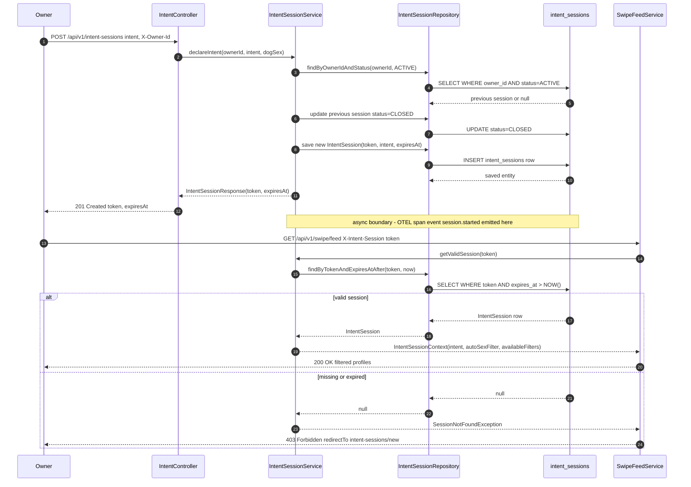

# Intent Declaration — Sequence Diagram

Feature: Intent Declaration (F-03)
Spec: `.kiro/specs/intent-declaration/`

## Intent Declaration & Swipe Feed Access (Happy Path)

```mermaid
sequenceDiagram
    autonumber
    participant Owner
    participant IntentController
    participant IntentSessionService
    participant IntentSessionRepository
    participant DB as intent_sessions
    participant SwipeFeedService

    Owner->>IntentController: POST /api/v1/intent-sessions intent, X-Owner-Id
    IntentController->>IntentSessionService: declareIntent(ownerId, intent, dogSex)
    IntentSessionService->>IntentSessionRepository: findByOwnerIdAndStatus(ownerId, ACTIVE)
    IntentSessionRepository->>DB: SELECT WHERE owner_id AND status=ACTIVE
    DB-->>IntentSessionRepository: previous session or null
    IntentSessionService->>IntentSessionRepository: update previous session status=CLOSED
    IntentSessionRepository->>DB: UPDATE status=CLOSED
    IntentSessionService->>IntentSessionRepository: save new IntentSession(token, intent, expiresAt)
    IntentSessionRepository->>DB: INSERT intent_sessions row
    DB-->>IntentSessionRepository: saved entity
    IntentSessionService-->>IntentController: IntentSessionResponse(token, expiresAt)
    IntentController-->>Owner: 201 Created token, expiresAt

    Note over IntentSessionService,DB: async boundary - OTEL span event session.started emitted here

    Owner->>SwipeFeedService: GET /api/v1/swipe/feed X-Intent-Session token
    SwipeFeedService->>IntentSessionService: getValidSession(token)
    IntentSessionService->>IntentSessionRepository: findByTokenAndExpiresAtAfter(token, now)
    IntentSessionRepository->>DB: SELECT WHERE token AND expires_at > NOW()
    alt valid session
        DB-->>IntentSessionRepository: IntentSession row
        IntentSessionRepository-->>IntentSessionService: IntentSession
        IntentSessionService-->>SwipeFeedService: IntentSessionContext(intent, autoSexFilter, availableFilters)
        SwipeFeedService-->>Owner: 200 OK filtered profiles
    else missing or expired
        DB-->>IntentSessionRepository: null
        IntentSessionRepository-->>IntentSessionService: null
        IntentSessionService-->>SwipeFeedService: SessionNotFoundException
        SwipeFeedService-->>Owner: 403 Forbidden redirectTo intent-sessions/new
    end
```
