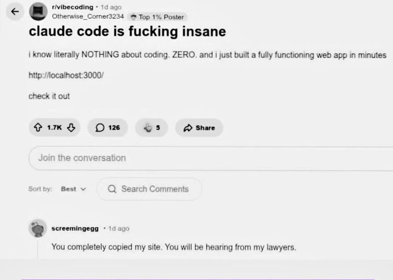

<!-- font_size: 2 -->

```
  ██████╗██╗      █████╗ ██╗   ██╗██████╗ ███████╗
 ██╔════╝██║     ██╔══██╗██║   ██║██╔══██╗██╔════╝
 ██║     ██║     ███████║██║   ██║██║  ██║█████╗
 ██║     ██║     ██╔══██║██║   ██║██║  ██║██╔══╝
 ╚██████╗███████╗██║  ██║╚██████╔╝██████╔╝███████╗
  ╚═════╝╚══════╝╚═╝  ╚═╝ ╚═════╝ ╚═════╝ ╚══════╝

  ██████╗ ██████╗ ██████╗ ███████╗
 ██╔════╝██╔═══██╗██╔══██╗██╔════╝
 ██║     ██║   ██║██║  ██║█████╗
 ██║     ██║   ██║██║  ██║██╔══╝
 ╚██████╗╚██████╔╝██████╔╝███████╗
  ╚═════╝ ╚═════╝ ╚═════╝ ╚══════╝
```

<!-- pause -->

```
  Deep Dive — Every Feature, Every Trick
  ──────────────────────────────────────
  March 2026  ·  CLI v1.0.33+
```

<!--
speaker_note: |
    “Alzate la mano se avete già usato un coding agent o un tool AI da terminale almeno una volta.”
    
    “Alzate la mano se lo usate già almeno una volta a settimana.”
    
    “Alzate la mano se nel vostro progetto avete già un file tipo README operativo, AI instructions, CLAUDE.md o qualcosa del genere.”
    
    “Alzate la mano se vi siete già detti: ‘questo tool è utile, però non deve assolutamente toccare certe cose’.”
    
    “Alzate la mano se almeno una volta avete copiato un comando trovato online senza leggerlo fino in fondo.”
    
    “Alzate la mano se avete mai chiesto a un tool AI qualcosa che avreste potuto cercare in 8 secondi nella doc.”
    
    “Alzate la mano se avete un alias shell che vi fa sembrare una persona organizzata.”
    
    “Alzate la mano se avete aperto Vim per sbaglio almeno una volta e avete vissuto un momento spirituale.”
    
    “Alzate la mano se avete mai usato Ctrl+C non per interrompere un processo, ma per interrompere le vostre scelte di vita.”
-->

<!-- end_slide -->



<!-- end_slide -->


<!-- end_slide -->
# Agenda

```
  01  CLAUDE.md          →  Persistent project memory
  02  Keyboard Shortcuts →  Every shortcut explained
  03  Slash Commands     →  Complete reference
  04  /btw               →  The March 2026 command
  05  Input Modes        →  /, !, @
  06  Vim Mode           →  Modal editing in the prompt
  07  Hooks              →  Deterministic automation
  08  Settings           →  Permissions & whitelists
  09  Skills             →  Intelligent workflows
  10  Custom Commands    →  Reusable slash commands
  11  Memory & Context   →  /memory, /compact, /cost
  12  Headless Mode      →  Scripting & CI/CD
  13  Plan Mode          →  Preview before writing
  14  Subagents          →  Parallelism & orchestration
  15  Cheatsheet         →  Quick reference
```

<!-- end_slide -->

# 01 · CLAUDE.md

```
  ┌──────────────────────────────────────────────────┐
  │  3-level hierarchy (most specific wins)          │
  │                                                  │
  │  ~/.claude/CLAUDE.md      ←  GLOBAL              │
  │    ↓ (override)                                  │
  │  <root>/CLAUDE.md         ←  PROJECT (in repo)   │
  │    ↓ (override)                                  │
  │  <subdir>/CLAUDE.md       ←  SUB-MODULE          │
  └──────────────────────────────────────────────────┘
```

<!-- pause -->

Read by Claude at **every session start**, before any prompt.
The project memory — a brief for the contractor
who starts fresh every morning.

<!-- pause -->

```
  ╔═══════════════════════════════════════════════╗
  ║  GOLDEN RULE                                  ║
  ║  Every line must be an action verb Claude     ║
  ║  can execute or violate.                      ║
  ║                                               ║
  ║  ✗  "Code quality is important"              ║
  ║  ✓  "Every public function must have         ║
  ║      at least one unit test"                  ║
  ╚═══════════════════════════════════════════════╝
```

<!--
speaker_note: |
  LIVE DEMO — ask Claude to regenerate CLAUDE.md from scratch:

    /init

  Claude reads the pom.xml and source tree → auto-detects Kotlin, Maven,
  Spring Boot 3, JUnit 5 + MockK + Testcontainers.

  Point out the "Never do" section in the actual CLAUDE.md:

    ! cat CLAUDE.md
-->

<!-- end_slide -->

# CLAUDE.md — Structure

```markdown
# Tinder for Dogs — CLAUDE.md

## Stack (non-negotiable)
- Kotlin (JVM 21) — never suggest Java
- Maven — never suggest Gradle
- Spring Boot 3.x, JPA, Flyway, PostgreSQL
- JUnit 5 + MockK + Testcontainers
- RFC 7807 ProblemDetail for ALL errors

## Commands
- Test:    `mvn test`
- Run:     `mvn spring-boot:run`
- Format:  `mvn spotless:apply`

## Hard rules
- NEVER: `git push` without explicit instruction
- NEVER: modify existing Flyway migrations
- NEVER: expose raw stack traces in API responses
- NEVER: modify this CLAUDE.md autonomously

## Commit format (Conventional Commits)
- <type>(<scope>): <description>
- Types: feat | fix | refactor | test | docs | chore
```

<!-- pause -->

```bash
# Let Claude write its own CLAUDE.md:
/init
```

<!--
speaker_note: |
  TALKING POINT

  The actual CLAUDE.md for this repo contains a hard rule that Liquibase
  migrations under db/changelog/ must never be modified:

    NEVER: modify existing Liquibase migrations

  This project uses Liquibase (not Flyway) — a great reminder that CLAUDE.md
  is a living document that must reflect your actual stack.

  Show the file live:

    ! cat CLAUDE.md
-->

<!-- end_slide -->

# CLAUDE.md — @-mention imports

Reference files anywhere — in CLAUDE.md or in any prompt:

```bash
# Inside CLAUDE.md:
# Architecture decisions: see @docs/ADR.md
# API conventions:        see @docs/openapi-conventions.md

# In a prompt — single file:
"Review @src/.../MatchingService.kt using the critique template"

# In a prompt — entire folder:
"Scan @src/test/ and identify missing tests"

# Combine multiple references:
"Compare @src/.../DogController.kt
     with @src/test/.../DogControllerTest.kt"
```

<!-- pause -->

```
  ╔══════════════════════════════════════════╗
  ║  Tab autocomplete works after @          ║
  ║  Works with files, folders, and URLs     ║
  ╚══════════════════════════════════════════╝
```

<!--
speaker_note: |
  LIVE DEMO — paste this prompt and hit Tab after @:

    "Review @src/main/kotlin/.../DogProfileController.kt
     and compare it with @src/test/kotlin/.../DogProfileControllerTest.kt"

  Tab autocomplete narrows down the path live as you type.

  For a folder scan:
    "Find missing tests in @src/main/kotlin/com/ai4dev/tinderfordogs/"
-->

<!-- end_slide -->

# 02 · Keyboard Shortcuts — Session Control

```
  ┌────────────────────┬──────────────────────────────────────┐
  │  SHORTCUT          │  ACTION                              │
  ├────────────────────┼──────────────────────────────────────┤
  │  Ctrl+C            │  Cancel current response             │
  │  Ctrl+F  (×2)      │  Kill ALL background agents  ★       │
  │  Ctrl+D            │  Exit Claude Code                    │
  │  Ctrl+L            │  Clear screen (keeps history)        │
  │  Esc Esc           │  Rewind — restore to previous point  │
  │  Ctrl+B            │  Background current task             │
  │  Ctrl+T            │  Toggle task list overlay            │
  └────────────────────┴──────────────────────────────────────┘
```

<!-- pause -->

```
  ╔══════════════════════════════════════════════════════════╗
  ║  ★  Ctrl+F is the most important shortcut               ║
  ║     you didn't know you needed.                         ║
  ║                                                         ║
  ║     Sub-agent stuck in a loop? Ctrl+F × 2.             ║
  ║     No repeated Ctrl+C. No waiting.                     ║
  ╚══════════════════════════════════════════════════════════╝
```

<!-- end_slide -->

# Keyboard Shortcuts — Input & Model

**Input and navigation:**

```
  ↑ / ↓        Scroll through prompt history (per-directory)
  Ctrl+R       Reverse fuzzy search through history
  Ctrl+G       Open $EDITOR for long/complex prompts
  Cmd+V        Paste images from clipboard (for debugging)
  Shift+Tab    Cycle modes: Normal → Plan → Auto-approve
```

<!-- pause -->

**Text editing in the input line:**

```
  Ctrl+K      Delete from cursor to end of line
  Ctrl+U      Delete entire line
  Ctrl+Y      Paste last deleted text
  Option+Y    Cycle through paste history
  Option+B    Move cursor back one word
  Option+F    Move cursor forward one word
```

<!-- pause -->

**Model and reasoning:**

```
  Option+P    Switch model mid-session (Sonnet ↔ Opus)
  Option+T    Toggle extended thinking
  Ctrl+O      Toggle verbose output (full tool call details)
```

<!-- pause -->

```
  ⚠  Option shortcuts require Meta key in your terminal.
     iTerm2 → Settings → Profiles → Keys
             → Left Option key: "Esc+"
```

<!-- end_slide -->

# Keyboard Shortcuts — Multiline Input

Four ways to write prompts across multiple lines:

```bash
# 1. Backslash + Enter (continues on next line)
List every issue in this file\
@src/main/kotlin/.../MatchingService.kt

# 2. Option+Enter (macOS) or Shift+Enter
#    Inserts newline without sending

# 3. Ctrl+J
#    Inserts newline in the input

# 4. Paste multiline text from clipboard
#    → automatically enters multiline mode
```

<!-- pause -->

```
  ╔══════════════════════════════════════════════════╗
  ║  For long, complex prompts:                     ║
  ║  Ctrl+G → opens $EDITOR (vim/nvim/code/nano)   ║
  ║  Write → save → close → prompt is sent         ║
  ╚══════════════════════════════════════════════════╝
```

<!-- end_slide -->

# 03 · Slash Commands — Session Management

```bash
  /clear              # Full history reset (+ per-dir command history)
  /compact [focus]    # Compress into summary — frees context window
  /compact "keep the API changes and test results"
  /resume             # Resume a previous session (interactive list)
  /fork               # Branch conversation into a new session
  /rename             # Rename the current session
  /rewind             # Undo the last turn
  /exit               # Exit Claude Code
  /add-dir            # Add a working directory to the session
```

<!-- pause -->

**Info & Diagnostics:**

```bash
  /cost               # Tokens used + estimated cost
  /context            # Colored grid of context window usage
  /diff               # Files changed in this session
  /doctor             # Diagnose env (API key, MCP, settings...)
  /stats              # Full session statistics
  /usage              # Plan limits and current usage
  /release-notes      # Latest version release notes
```

<!-- end_slide -->

# Slash Commands — Config & Tools

**Configuration:**

```bash
  /init               # Analyze project → generate CLAUDE.md
  /config             # Open settings (20+ options)
  /memory             # Edit persistent project memory
  /model              # Switch model (Opus / Sonnet / Haiku)
  /permissions        # Manage tool permissions
  /vim                # Toggle vim keybindings
  /theme              # Change syntax highlighting theme
  /keybindings        # Open/create keybindings config (JSON)
  /terminal-setup     # Configure terminal integration
```

<!-- pause -->

**Tools & Integrations:**

```bash
  /mcp                # Manage MCP server connections
  /hooks              # Manage automation hooks
  /ide                # Connect to IntelliJ / VSCode
  /chrome             # Connect Chrome for browser automation
  /plugin             # Manage installed plugins
  /skills             # View available skills
```

<!-- pause -->

**Collaboration & Agents:**

```bash
  /agents             # Manage running sub-agents
  /tasks              # View and manage task list
  /plan               # Enter planning mode
  /simplify           # 3-agent parallel code review  ★
  /security-review    # Audit current branch for vulnerabilities
  /pr-comments        # Fetch comments from a GitHub PR
```

<!-- end_slide -->

# 04 · /btw — The March 2026 Command

```
  ┌──────────────────────────────────────────────────────┐
  │  Announced: March 11, 2026  ·  2.2M views on X      │
  │  Author: Erik Schluntz (Claude Code team)            │
  └──────────────────────────────────────────────────────┘
```

<!-- pause -->

Ask a side question **without touching conversation history**.
Works **while Claude is still generating** a response.

```bash
# While Claude is mid-refactor of a large module:
/btw which test file covers the auth middleware?

# Quick clarification without polluting context:
/btw what's the diff between useEffect and useLayoutEffect?

# Verify something without derailing the current task:
/btw did we already update the error types in types.ts?
```

<!-- pause -->

**Constraints:**

```
  ✓  Single response only — no follow-ups in the /btw thread
  ✓  No tool access — answers from current context only
  ✓  Minimal cost — reuses the prompt cache
  ✓  Dismiss with: Space · Enter · Escape

  Mental model:
  sub-agent  =  full tool access,  empty context
  /btw       =  full context,      no tools
```

<!-- end_slide -->

# 05 · Input Modes — /, !, @

Three prefix characters that unlock different input modes:

<!-- pause -->

**`/` — Slash Commands and Skills**

```bash
  /compact     /model     /vim     /btw
  /dogs:add-endpoint     /kiro:spec-tasks
  # List filters as you type
```

<!-- pause -->

**`!` — Bash Mode**

Command runs in your shell. Output → Claude's context automatically.

```bash
  ! git status
  ! git log --oneline -5
  ! mvn test -q
  ! curl -s http://localhost:8080/api/dogs | head -c 200
  ! cat src/main/kotlin/.../MatchingService.kt
  # Tab autocomplete works on bash history
```

<!-- pause -->

**`@` — File & Directory Reference**

```bash
  "Review @src/main/.../MatchingService.kt"
  "Scan @src/test/ and identify missing tests"
  "Compare @DogController.kt with @DogControllerTest.kt"
  # Tab autocomplete on file paths
```

<!--
speaker_note: |
  LIVE DEMO — bash mode with this repo:

    ! mvn test -q
    ! git log --oneline -5
    ! curl -s http://localhost:8080/api/v1/dogs

  Each output lands in Claude's context automatically — no copy-paste.
  Follow up: "What do the failing tests tell you?"

  LIVE DEMO — @-mention with real files:

    "Review @src/.../DogProfileController.kt
     and compare with @src/.../DogProfileControllerTest.kt"
-->

<!-- end_slide -->

# 06 · Vim Mode

```bash
  # Enable:
  /vim

  # Disable:
  /vim   (again)
```

Not a stripped-down emulation. Full mode switching,
navigation, operators, and text objects.

<!-- pause -->

```
  ┌──────────────┬────────────────────────────────────────┐
  │  CATEGORY    │  COMMANDS                              │
  ├──────────────┼────────────────────────────────────────┤
  │  Modes       │  i  I  a  A  o  O  Esc                 │
  │  Navigate    │  h j k l   w b e   0 $ ^   gg G        │
  │  Char jump   │  f{c}  F{c}  t{c}  T{c}   ;  ,         │
  │  Edit        │  d dd D   c cc C   x  J  .   >> <<     │
  │  Text obj    │  iw aw iW aW   i" a"   i( a(  i{ a{    │
  │  Clipboard   │  y  yy   p  P                          │
  └──────────────┴────────────────────────────────────────┘
```

<!-- pause -->

```
  Persists for the duration of the session.
  Resets on restart.
```

<!-- end_slide -->

# 07 · Hooks — Deterministic Automation

```
  ┌─────────────────────────────────────────────────────────┐
  │  Not prompts. Shell scripts Claude cannot bypass.       │
  │  No amount of clever prompting can override a hook.     │
  │                                                         │
  │  CLAUDE.md →  polite request  (Claude can forget)      │
  │  Hook exit 2 →  hard block.  Full stop.                │
  └─────────────────────────────────────────────────────────┘
```

<!-- pause -->

```
  ┌──────────────┬───────────────────────────┬──────────────────────┐
  │  TYPE        │  FIRES WHEN               │  PRIMARY USE         │
  ├──────────────┼───────────────────────────┼──────────────────────┤
  │  PreToolUse  │  Before any tool call     │  Safety checks       │
  │  PostToolUse │  After any tool call      │  Auto-format, lint   │
  │  Notification│  Claude needs your input  │  Desktop alert       │
  │  Stop        │  Session ends             │  Log, task tracker   │
  └──────────────┴───────────────────────────┴──────────────────────┘
```

<!-- pause -->

**Exit code protocol (PreToolUse only):**

```bash
  exit 0  →  allow the tool call
  exit 2  →  BLOCK — Claude receives stdout as the error reason
  exit 1  →  non-blocking warning — tool proceeds
```

<!--
speaker_note: |
  TALKING POINT

  CLAUDE.md says: "NEVER modify existing Liquibase migrations."
  But Claude can forget that on a long session. A hook makes it a hard wall:

    matcher: Write(src/main/resources/db/changelog/**)
    exit 2  → blocked, no matter how clever the prompt

  Ask the audience: "What would you protect with a hook in YOUR repo?"
-->

<!-- end_slide -->

# Hooks — Configuration

```json
{
  "hooks": {
    "PreToolUse": [
      {
        "matcher": "Bash(git push*)",
        "hooks": [{ "type": "command",
          "command": "echo 'git push blocked. Ask for approval.' && exit 2" }]
      },
      {
        "matcher": "Write(src/main/resources/db/migration/V*)",
        "hooks": [{ "type": "command",
          "command": "echo 'Existing migrations are read-only.' && exit 2" }]
      }
    ],
    "PostToolUse": [
      {
        "matcher": "Write(*.kt)",
        "hooks": [{ "type": "command",
          "command": "cd $PROJECT_ROOT && mvn spotless:apply -q" }]
      }
    ],
    "Notification": [
      {
        "matcher": ".*",
        "hooks": [{ "type": "command",
          "command": "osascript -e 'display notification \"Claude needs you\" with title \"Claude Code\"'" }]
      }
    ]
  }
}
```

<!--
speaker_note: |
  LIVE DEMO — show the actual settings file:

    ! cat .claude/settings.json

  Then try to trigger the git push block:
    "Push the current branch to origin"

  Claude gets blocked immediately. The stdout message appears as the reason.

  PostToolUse: the Write(*.kt) hook runs mvn spotless:apply automatically
  after every Kotlin file write — zero manual formatting needed.
-->

<!-- end_slide -->

# Hooks — Matcher Patterns & File Locations

**Matcher patterns:**

```json
  "Bash"                    // all Bash calls
  "Write"                   // all file writes
  "Bash(git*)"              // any git command
  "Bash(mvn*)"              // any Maven command
  "Write(src/**/*.kt)"      // Kotlin files only
  "Write(.env*)"            // env files
  "Write(*.sql)"            // SQL files
  ".*"                      // everything (Notification/Stop)
```

<!-- pause -->

**Settings file hierarchy:**

```bash
  ~/.claude/settings.json              # Global (all projects)
  <root>/.claude/settings.json         # Project (in repo)
  <root>/.claude/settings.local.json   # Local (NOT in repo)
```

<!-- pause -->

```
  ╔═══════════════════════════════════════════╗
  ║  Most specific level wins.               ║
  ║  local > project > global               ║
  ╚═══════════════════════════════════════════╝
```

<!-- end_slide -->

# 08 · Settings — Permissions

```json
{
  "permissions": {
    "allow": [
      "Bash(mvn test)",
      "Bash(mvn spotless:apply)",
      "Bash(mvn spring-boot:run)",
      "Bash(git diff*)",
      "Bash(git log*)",
      "Bash(git status)",
      "Bash(curl localhost*)",
      "Read(**)",
      "Write(src/**)"
    ],
    "deny": [
      "Bash(git push*)",
      "Bash(rm -rf*)",
      "Write(.env*)",
      "Write(src/main/resources/db/migration/V*)"
    ]
  }
}
```

<!-- pause -->

```
  ╔════════════════════════════════════════════╗
  ║  deny ALWAYS takes precedence over allow. ║
  ╚════════════════════════════════════════════╝
```

<!-- end_slide -->

# 09 · Skills — Intelligent Workflows

```
  ┌────────────────────────────────────────────────────┐
  │  Skills = Markdown files with YAML frontmatter    │
  │  Invoked via NATURAL LANGUAGE                     │
  │  Claude decides automatically when to use them   │
  └────────────────────────────────────────────────────┘

  ~/.claude/skills/          ←  global
  .claude/skills/            ←  project
```

<!-- pause -->

```markdown
<!-- .claude/skills/kotlin-critique/SKILL.md -->
---
name: kotlin-critique
description: In-depth review of Kotlin/Spring Boot code.
             Use when asked to analyze, review, or critique
             any Kotlin code.
---

Analyze in this order:
1. **Correctness** (P0) — null safety, transactions
2. **Security**    (P0) — injection, hardcoded secrets
3. **Performance** (P1) — N+1 JPA, pagination
4. **Testability** (P1) — unmockable dependencies
5. **Conventions** (P2) — naming, KDoc, project patterns
```

<!-- pause -->

```bash
  # Claude uses the skill automatically:
  "Review MatchingService.kt"       ← auto-invoked
  "Critique this code"              ← auto-invoked

  # Explicit invocation:
  /kotlin-critique
```

<!--
speaker_note: |
  LIVE DEMO — trigger the skill with a natural language prompt:

    "Review @src/.../DogProfileService.kt"

  Claude auto-matches the description and runs the kotlin-critique checklist:
  P0 null safety → P0 security → P1 N+1 JPA risk → P1 testability → P2 conventions.

  Show the skill file:

    ! cat .claude/skills/kotlin-critique/SKILL.md
-->

<!-- end_slide -->

# 10 · Custom Commands

```
  ┌────────────────────────────────────────────────────┐
  │  Custom Commands = Markdown files under            │
  │  .claude/commands/  committed to the repo         │
  │  Invoked EXPLICITLY with /name                    │
  └────────────────────────────────────────────────────┘
```

```bash
  .claude/
  └── commands/
      ├── review.md               →  /review
      ├── kiro/
      │   ├── spec-init.md        →  /kiro:spec-init
      │   └── spec-tasks.md       →  /kiro:spec-tasks
      └── dogs/
          ├── add-endpoint.md     →  /dogs:add-endpoint
          └── migrate.md          →  /dogs:migrate
```

<!-- pause -->

```markdown
<!-- .claude/commands/dogs/add-endpoint.md -->
---
description: Scaffold a new REST endpoint for Tinder for Dogs
argument-hint: <resource-name> (e.g. "photos", "likes")
---

Scaffold a complete endpoint for the resource: $ARGUMENTS

1. Controller: @RestController + @RequestMapping("/api/$ARGUMENTS")
2. Service:    @Service @Transactional
3. Repository: JpaRepository<Entity, UUID>
4. Migration:  V{next}__create_{resource}.sql
5. Tests:      unit (MockK) + IT (@WebMvcTest + Testcontainers)

Then run `mvn test -q` and report results.
```

<!--
speaker_note: |
  LIVE DEMO — scaffold a new endpoint in one command:

    /dogs:add-endpoint matches

  Claude scaffolds all 5 artifacts for the matches resource:
    MatchController.kt · MatchService.kt · MatchRepository.kt
    + Liquibase migration + unit tests (MockK) + @WebMvcTest IT

  Then runs mvn test -q and reports results — all from a single command.

  Show the Kiro commands already in the repo:

    ! ls .claude/commands/kiro/
-->

<!-- end_slide -->

# Skills vs Custom Commands

```
  ┌────────────────────┬──────────────────┬───────────────────┐
  │                    │  SKILLS          │  CUSTOM COMMANDS  │
  ├────────────────────┼──────────────────┼───────────────────┤
  │  Invocation        │  Automatic       │  Explicit /name   │
  │  Trigger           │  Natural lang.   │  You type /cmd    │
  │  Arguments         │  No placeholder  │  $ARGUMENTS       │
  │  Location          │  .claude/skills/ │  .claude/commands/│
  │  In repo?          │  Optional        │  Yes — shared     │
  ├────────────────────┼──────────────────┼───────────────────┤
  │  Example           │  "review style"  │  /dogs:add-       │
  │                    │  always applied  │   endpoint photos  │
  └────────────────────┴──────────────────┴───────────────────┘
```

<!-- pause -->

```
  Rule of thumb:
  ──────────────────────────────────────────────
  Skills   →  behavior Claude should ALWAYS apply
  Commands →  repeatable workflows triggered ON-DEMAND
```

<!-- end_slide -->

# 11 · Memory & Context Management

```bash
  # View and edit persistent project memory:
  /memory
  # Opens editor. Saved at:
  # ~/.claude/memory/<project-hash>.md

  # Ask Claude to remember something:
  "Remember: DogRepository.findByBreed() has an N+1 risk.
   Always use JOIN FETCH. Add this to project memory."
```

<!-- pause -->

```
  ┌────────────────┬──────────────────┬────────────────────┐
  │                │  CLAUDE.md       │  /memory           │
  ├────────────────┼──────────────────┼────────────────────┤
  │  Scope         │  Team, in repo   │  Personal, local   │
  │  Contains      │  Team rules      │  Discoveries, notes│
  │  Updated by    │  You manually    │  You or Claude auto│
  └────────────────┴──────────────────┴────────────────────┘
```

<!-- pause -->

**Context commands:**

```bash
  /context                  # Colored grid of context usage
  /cost                     # Token count + estimated cost

  /compact                  # Compress (preserves decisions)
  /compact "focus on API"   # Compress with instructions

  /clear                    # Full reset (switching tasks)

  claude --continue         # Resume last session
  claude --resume           # Pick from session list
```

<!-- end_slide -->

# Context — When to Use What

```
  Long session, same task still in progress
  └─→  /compact  (reduces ~70% tokens, keeps key decisions)

  Switching to a completely different task
  └─→  /clear    (stale context will confuse Claude)

  Picking up yesterday's work
  └─→  claude --continue  (no re-briefing needed)

  Multiple sessions open in parallel
  └─→  claude --resume    (choose from interactive list)
```

<!-- pause -->

```
  ┌──────────────────────────────────────────────────┐
  │  Tip: run /compact every 30–45 minutes          │
  │  during long sessions — proactively,            │
  │  before the context window fills up.            │
  └──────────────────────────────────────────────────┘
```

<!-- end_slide -->

# 12 · Headless Mode

```bash
  # Basic non-interactive usage:
  claude -p "Which files in src/ have no corresponding test?"

  # With a specific model:
  claude --model claude-opus-4-6 \
    -p "Review @CLAUDE.md and suggest improvements"

  # JSON output (for scripting and piping):
  claude --output-format json \
    -p "List all @RestController classes with their mappings"

  # Pipe git diff — generate a commit message:
  git diff HEAD~1 | \
    claude -p "Write a conventional commit message for this diff"

  # Capture output to a file:
  claude -p "Generate SQL migration for a photos table" \
    | tee src/main/resources/db/migration/V007__photos.sql

  # Auto-approve everything (ONLY in trusted sandboxes!):
  claude --dangerously-skip-permissions \
    -p "Run mvn spotless:apply on all Kotlin files"
```

<!--
speaker_note: |
  LIVE DEMO — run directly from terminal:

  Find source files with no corresponding test:
    claude -p "Which files under src/main/kotlin/ have no corresponding test?"

  Generate a commit message from the last diff:
    git diff HEAD~1 | claude -p "Write a conventional commit message following CLAUDE.md"

  JSON output — list all REST endpoints:
    claude --output-format json \
      -p "List all @RestController classes with their request mappings"
-->

<!-- end_slide -->

# Headless — CI/CD Pipeline

```yaml
# .github/workflows/ai-review.yml
name: AI Code Review
on: [pull_request]

jobs:
  ai-review:
    runs-on: ubuntu-latest
    steps:
      - uses: actions/checkout@v4
        with:
          fetch-depth: 0

      - name: Install Claude Code
        run: npm install -g @anthropic-ai/claude-code

      - name: AI PR Review
        env:
          ANTHROPIC_API_KEY: ${{ secrets.ANTHROPIC_API_KEY }}
        run: |
          git diff origin/main...HEAD | \
          claude --dangerously-skip-permissions \
                 --output-format json \
                 -p "Review this Kotlin/Spring Boot diff.
                     Find: N+1 risks, security issues,
                     missing tests, RFC 7807 compliance.
                     JSON array: severity, file, line, fix." \
          > review.json
```

<!--
speaker_note: |
  TALKING POINT

  --dangerously-skip-permissions is safe in CI because:
    - ephemeral runner has no push access
    - branch protection rules are enforced by GitHub
    - worst case: the job fails, nothing is pushed

  For this repo the review prompt checks:
    - Liquibase conventions (no CREATE TABLE without a changelog entry)
    - RFC 7807 ProblemDetail in ALL error responses
    - Testcontainers integration tests for every new repository
    - Kotlin null-safety: no !! operators, no raw nullable casts
-->

<!-- end_slide -->

# 13 · Plan Mode

```
  ┌────────────────────────────────────────────────────────┐
  │  Claude produces a detailed plan and WAITS            │
  │  before touching any file.                            │
  └────────────────────────────────────────────────────────┘
```

```bash
  # CLI flag:
  claude --plan

  # Interactive toggle:
  Shift+Tab  →  Normal → Plan Mode → Auto-approve

  # Slash command:
  /plan
```

<!-- pause -->

**When to use it:**

```
  ✓  First task of any new feature
  ✓  Any task touching more than 3 files at once
  ✓  Security-sensitive changes (auth, permissions)
  ✓  When the spec is ambiguous

  ✗  Single-line fixes → unnecessary latency
```

<!-- pause -->

```
  Permission modes (Shift+Tab cycles through all three):
  ─────────────────────────────────────────────────────
  Normal       →  asks before any destructive action
  Plan Mode    →  plan → wait for approval → act
  Auto-approve →  everything auto (⚠ sandbox only)
```

<!--
speaker_note: |
  LIVE DEMO — plan mode before a multi-file feature:

    Shift+Tab → enter Plan Mode

    "Add a POST /api/v1/matches endpoint.
     Two dog owners match when both swipe right.
     Store match timestamp and compute compatibility score."

  Claude will list every artifact before touching a file:
    MatchController.kt · MatchService.kt · MatchRepository.kt
    Match.kt entity · Liquibase migration V002 · unit + IT tests

  Approve → executes. Reject → zero files touched.
  This is the CLAUDE.md rule: "show a plan and wait for explicit approval."
-->

<!-- end_slide -->

# 14 · Subagents

```
  Specialized Claude instances with their own context windows.
  Isolated context → no scope creep.
```

```bash
  # Trigger parallel tasks:
  "Implement these 3 tasks in parallel:
   - Task A: add Redis cache to MatchingService
   - Task B: write tests for DogController
   - Task C: update the OpenAPI spec"

  # Claude spawns 3 subagents, each with isolated scope
```

<!-- pause -->

```bash
  # Manage running sub-agents:
  /agents

  # View task list:
  /tasks
  Ctrl+T

  # Kill ALL background agents instantly:
  Ctrl+F (×2)
```

<!-- pause -->

```
  ╔══════════════════════════════════════════════════════╗
  ║  Background with Ctrl+B:                           ║
  ║  Claude keeps working in the background.           ║
  ║  You get your prompt back immediately.             ║
  ║  Output buffers and appears when you return.      ║
  ╚══════════════════════════════════════════════════════╝
```

<!--
speaker_note: |
  LIVE DEMO — parallel tasks on this repo:

    "Run these 3 tasks in parallel:
     - Task A: add GET /api/v1/dogs/{id}/compatible using DogMatcherService
     - Task B: write missing unit tests in DogMatcherServiceTest.kt
     - Task C: update the OpenAPI spec with the new compatible endpoint"

  Open Ctrl+T to watch 3 agents appear in the task list.
  Each has its own isolated context — no interference between tasks.
  If Task A gets stuck: Ctrl+F x2 kills all agents instantly.
-->

<!-- end_slide -->

# 15 · Cheatsheet

```
  SESSION
  ────────────────────────────────────────
  Ctrl+C          Cancel current response
  Ctrl+F × 2      Kill all background agents
  Ctrl+D          Exit
  Ctrl+L          Clear screen
  Esc Esc         Rewind / summary
  Ctrl+B          Background current task
  Ctrl+T          Toggle task list

  INPUT
  ────────────────────────────────────────
  ↑ / ↓           Scroll prompt history
  Ctrl+R          Fuzzy search history
  Ctrl+G          Open $EDITOR for prompt
  Shift+Tab       Cycle permission modes
  Option+P        Switch model
  Option+T        Toggle extended thinking
  Ctrl+K          Delete to end of line
  Ctrl+U          Delete entire line
```

<!-- end_slide -->

# Cheatsheet — Key Commands

```
  ESSENTIAL COMMANDS
  ────────────────────────────────────────
  /btw            Side question — no history pollution
  /compact        Compress context (with optional focus)
  /clear          Full reset
  /plan           Enter plan mode
  /cost           Token count + session cost
  /context        Colored context usage grid
  /diff           Files changed in this session
  /init           Generate CLAUDE.md for project
  /memory         Edit persistent memory
  /model          Switch model
  /mcp            Manage MCP servers
  /vim            Toggle vim mode
  /simplify       3-agent parallel code review
  /fork           Branch current session
  /security-review Security audit of current branch
  /bug            Report a bug (captures full context)
  /doctor         Diagnose environment

  CLI FLAGS
  ────────────────────────────────────────
  claude --plan                           Plan mode
  claude --continue                       Resume last session
  claude --resume                         Pick from session list
  claude -p "..."                         Headless mode
  claude --output-format json             JSON output
  claude --dangerously-skip-permissions   Auto-approve (sandbox only)
  claude --model claude-opus-4-6          Specify model
```

<!-- end_slide -->

<!-- font_size: 2 -->

```
  ████████╗██╗  ██╗ █████╗ ███╗   ██╗██╗  ██╗███████╗
     ██╔══╝██║  ██║██╔══██╗████╗  ██║██║ ██╔╝██╔════╝
     ██║   ███████║███████║██╔██╗ ██║█████╔╝ ███████╗
     ██║   ██╔══██║██╔══██║██║╚██╗██║██╔═██╗ ╚════██║
     ██║   ██║  ██║██║  ██║██║ ╚████║██║  ██╗███████║
     ╚═╝   ╚═╝  ╚═╝╚═╝  ╚═╝╚═╝  ╚═══╝╚═╝  ╚═╝╚══════╝
```

<!-- pause -->

```
  ─────────────────────────────────────────────────────────

  Docs      https://docs.anthropic.com/en/docs/claude-code
  Hooks     https://docs.anthropic.com/en/docs/claude-code/hooks
  Awesome   https://github.com/hesreallyhim/awesome-claude-code
  /btw ref  https://claudefa.st/blog/guide/mechanics/interactive-mode

  ─────────────────────────────────────────────────────────
```

<!-- pause -->

```
                    /btw  how do you pronounce it?
```
